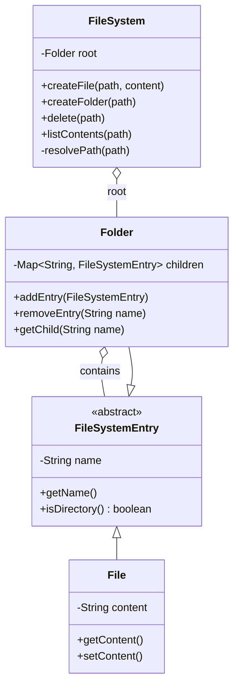

# 📁 Machine Coding: File System Low-Level Design

## 📝 Overview
An in-memory file system mimics standard operating system folder navigation, file creation, and movement, minus the disk. Because everything lives in RAM, this challenge allows you to focus purely on data structures, tree traversals, and object-oriented operations without worrying about persistence, caching, or I/O performance.

!!! info "Why This Challenge?"
    - **Tree Data Structures:** Tests your ability to model and traverse hierarchical structures efficiently.
    - **Design Patterns:** Evaluates your understanding of the Composite design pattern, uniting disparate objects under a shared interface.
    - **String Parsing:** Requires careful path resolution algorithms to navigate Unix-style string paths.

---

## 🏭 The Scenario & Requirements

### 😡 The Problem (The Villain)
Navigating a file system hierarchy typically involves messy conditional logic if files and folders are treated as completely separate concepts. When a system needs to scale to tens of thousands of deeply nested entries, poorly optimized path resolution and rigid data models lead to massive performance bottlenecks and unmaintainable code.

### 🦸 The System (The Hero)
A clean, object-oriented in-memory file system utilizing the Composite pattern. By establishing a shared abstraction for both files and folders, the system can gracefully execute recursive path resolution, seamless content retrieval, and modular file operations.

### 📜 Requirements & Constraints
1. **(Functional):** Must use a single root Unix-style hierarchy (e.g., `/home/user/file.txt`).
2. **(Functional):** Support core operations: create, delete, list contents, move, rename, and navigate paths to get contents.
3. **(Functional):** Files must store actual string content.
4. **(Technical):** Scale to support tens of thousands of entries while remaining responsive with deep folder hierarchies.
5. **(Technical):** Must throw specific exceptions so callers can handle different failure modes appropriately (e.g., missing parent folder, attempting to delete the root).
6. **(Out of Scope):** Permissions, timestamps, and symbolic links are explicitly excluded.

---

## 🏗️ Design & Architecture

### 🧠 Thinking Process
To structure this, we need to map the nouns to our core entities. 
*   **`File`** and **`Folder`**: Both share fundamental traits (they have a name and live inside a path), but they differ in behavior (files hold string content; folders hold collections of other entities).
*   **`FileSystemEntry`**: A shared abstraction (interface/base class) that unites files and folders so a parent folder can hold a collection of generic entries. 
*   **`FileSystem`**: The orchestrator. It holds the root folder and manages path resolution helpers to route commands (like `create`, `move`, `delete`) to the correct deep node.

### 🧩 Class Diagram
*(The Object-Oriented Blueprint. Who owns what?)*


### ⚙️ Design Patterns Applied
- **Composite Pattern:** `Folder` and `File` both inherit from `FileSystemEntry`. This allows a `Folder` to maintain a map of `FileSystemEntry` objects, treating individual files and nested sub-folders uniformly when calculating sizes, traversing paths, or deleting nodes.
- **Facade Pattern:** `FileSystem` acts as the single entry point. The client passes Unix paths as strings, and the orchestrator handles string splitting and path resolution without exposing the raw node traversal logic to the caller.

---

## 💻 Solution Implementation

???+ success "The Code Outline"
    ```python
    from typing import Dict, List

    class FileSystemEntry:
        def __init__(self, name: str):
            self.name = name

        def is_directory(self) -> bool:
            pass

    class File(FileSystemEntry):
        def __init__(self, name: str, content: str = ""):
            super().__init__(name)
            self.content = content

        def is_directory(self) -> bool:
            return False

    class Folder(FileSystemEntry):
        def __init__(self, name: str):
            super().__init__(name)
            self.children: Dict[str, FileSystemEntry] = {}

        def is_directory(self) -> bool:
            return True

        def add_entry(self, entry: FileSystemEntry):
            if entry.name in self.children:
                raise ValueError(f"Entry {entry.name} already exists.")
            self.children[entry.name] = entry

        def get_child(self, name: str) -> FileSystemEntry:
            return self.children.get(name)

    class FileSystem:
        def __init__(self):
            self.root = Folder("")

        def _resolve_parent_folder(self, path: str) -> Folder:
            # Helper to navigate down the tree
            if path == "/" or not path:
                return self.root
            
            parts = [p for p in path.split("/") if p]
            current = self.root
            
            for part in parts[:-1]:
                current = current.get_child(part)
                if not current or not current.is_directory():
                    raise ValueError(f"Path not found or not a directory.")
            return current

        def create_file(self, path: str, content: str):
            parts = [p for p in path.split("/") if p]
            if not parts:
                raise ValueError("Invalid file path")
                
            parent_folder = self._resolve_parent_folder(path)
            file_name = parts[-1]
            parent_folder.add_entry(File(file_name, content))

        def get_content(self, path: str) -> str:
            parts = [p for p in path.split("/") if p]
            parent_folder = self._resolve_parent_folder(path)
            file_node = parent_folder.get_child(parts[-1])
            
            if not file_node or file_node.is_directory():
                raise ValueError("File not found.")
            return file_node.content
    ```

### 🔬 Why This Works (Evaluation)
The true complexity of an in-memory file system lies in path resolution. Instead of duplicating traversal logic across `create`, `delete`, and `move` operations, the orchestrator abstracts tree traversal into a private `_resolve_parent_folder` helper. It elegantly utilizes string splitting on the `/` delimiter to drill down the `Folder` hierarchy in $O(D)$ time (where $D$ is the directory depth). Explicit type-checking (`is_directory()`) prevents files from being treated as folders, cleanly throwing exceptions as requested by the requirements. 

---

## ⚖️ Trade-offs & Limitations

| Decision | Pros | Cons / Limitations |
| :--- | :--- | :--- |
| **In-Memory Hash Maps for Children** | $O(1)$ lookups for entries within a specific directory layer. Highly responsive. | Memory footprint scales rapidly. Storing large string contents exclusively in RAM could trigger Out Of Memory (OOM) errors at high scale. |
| **String Path Parsing per Call** | Keeps the API strictly stateless; callers don't need to track directory handles. | $O(D)$ traversal overhead on every single operation. |

---

## 🎤 Interview Toolkit

- **Concurrency Probe:** *How would you make this file system thread-safe?*
  Implementing a global lock on the `FileSystem` ensures correctness but severely limits throughput. A better approach utilizes **Read-Write Locks** at the `Folder` level (fine-grained locking). Moving a file requires write-locking the source and destination directories, while readers can simultaneously traverse unrelated folders.
- **Extensibility:** *How would you add search functionality?*
  To search for files by name, you would implement a Depth-First Search (DFS) or Breadth-First Search (BFS) algorithm starting from the root folder (or a specific path), iterating over all `children` recursively and returning paths that match the target string. 

## 🔗 Related Challenges
- [Amazon Locker LLD](../amazon_locker/PROBLEM.md) — Another assignment focusing heavily on boundaries between an orchestrator and physical (or in this case, logical) compartments/folders.
- [Connect Four LLD](../../games/connect_four/PROBLEM.md) — Shares a focus on maintaining strict internal state boundaries and separating validation logic from core entity representations.
