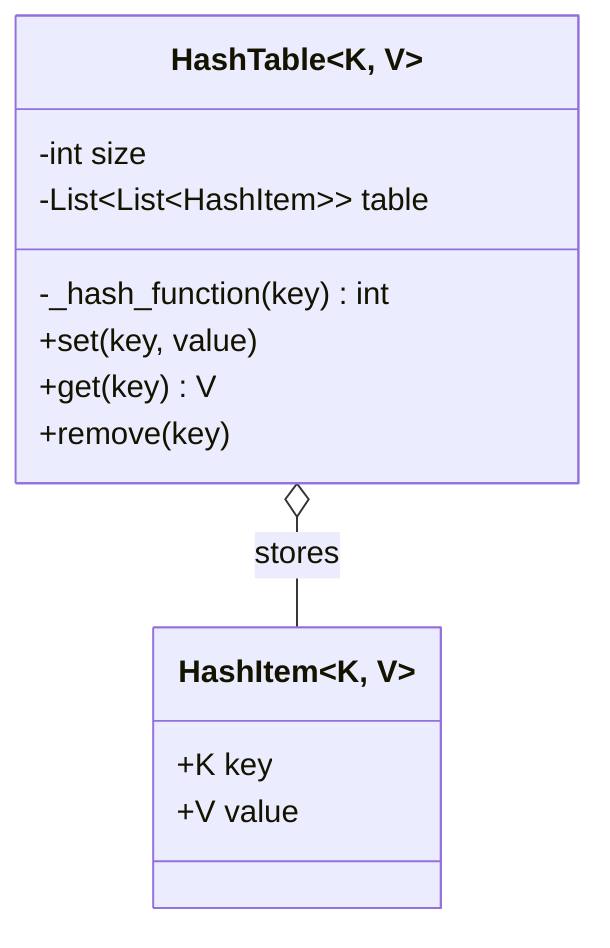

# 🗄️ Machine Coding: Hash Map (Dictionary)

## 📝 Overview
A custom, generic Hash Map implementation built entirely from scratch. It utilizes separate chaining to handle hash collisions, providing expected $O(1)$ time complexity for fundamental key-value operations.

!!! info "Why This Challenge?"
    - **Data Structure Fundamentals:** Tests your deep understanding of how underlying arrays and hashing functions power everyday dictionaries.
    - **Collision Resolution:** Evaluates your ability to safely handle edge cases where multiple keys evaluate to the exact same memory bucket.
    - **Generics & Typing:** Tests robust, reusable type design using Python's `Generic` and `TypeVar`.

---

## 🏭 The Scenario & Requirements

### 😡 The Problem (The Villain)
Modern programming languages provide dictionaries "out of the box," abstracting away the mathematical pitfalls of memory allocation. However, if you rely on a poorly designed hashing function or fail to manage hash collisions, $O(1)$ lookups silently degrade into agonizing $O(N)$ linear scans, crushing system performance under heavy load.

### 🦸 The System (The Hero)
A structured `HashTable` that allocates a fixed-size contiguous array of "buckets." By applying a modulo-based hashing function, it evenly distributes incoming keys. When two keys invariably fight for the same bucket, the system elegantly links them together (Separate Chaining), ensuring no data is ever overwritten or lost.

### 📜 Requirements & Constraints
1.  **(Functional):** System must allow users to `set(key, value)`, creating new pairs or updating existing ones.
2.  **(Functional):** System must allow users to `get(key)`, returning the value or throwing a `KeyError`.
3.  **(Functional):** System must allow users to `remove(key)`.
4.  **(Technical):** Must mathematically resolve hash collisions without data loss (using separate chaining).
5.  **(Technical):** Must be strongly typed and support generic key-value pairings.

---

## 🏗️ Design & Architecture

### 🧠 Thinking Process
To map any arbitrary key to a specific memory index, we need a mathematical translation.    
1.  **The Buckets:** We start with an empty 2D array: `[ [], [], [] ]`. The outer array is our fixed memory size. The inner arrays are our "chains" for collisions.     
2.  **The Hash Function:** We take an object, run it through a hashing algorithm, and apply the modulo (`%`) operator against our array size. This guarantees an index bound within our limits.     
3.  **The Entity:** We wrap the raw key and value into a `HashItem` object so we can explicitly check if `item.key == search_key` during a collision resolution scan.

### 🧩 Class Diagram
*(The Object-Oriented Blueprint. Who owns what?)*


### ⚙️ Design Patterns Applied

  - **Separate Chaining (Algorithmic Pattern):** Utilizing nested collections (lists/linked lists) inside the primary array indices to hold multiple items that hash to the same exact bucket.
  - **Generics (`TypeVar`):** Treating the data structure as a purely abstract container that is entirely agnostic to the exact data types of the keys or values.

-----

## 💻 Solution Implementation

???+ success "The Code"
    ```python
    --8<-- "machine_coding/systems/hash_map/hash_map.py"
    ```

### 🔬 Why This Works (Evaluation)

The system handles collisions gracefully via the `bucket = self.table[hash_index]` lookup. Instead of blindly overwriting the index, the `set()` and `get()` methods iterate through the chained `bucket`. By explicitly comparing the original `item.key == key`, it guarantees we are returning or modifying the correct value, even if 50 different keys hashed to the exact same bucket.

-----

## ⚖️ Trade-offs & Limitations

| Decision | Pros | Cons / Limitations |
| :--- | :--- | :--- |
| **Separate Chaining (Lists)** | Extremely simple to implement and theoretically never "fills up." | Poor cache locality compared to *Open Addressing* (Linear Probing). |
| **Fixed Size Array** | Fast, predictable memory footprint on initialization. | If the number of items exceeds the `size` (Load Factor $> 1$), performance rapidly degrades to $O(N)$. |
| **Built-in `hash()`** | Fast and leverages Python's optimized C-level hashing. | Not cryptographically secure on its own. |

-----

## 🎤 Interview Toolkit

  - **Scale Probe:** "As you add millions of items, your chained lists get very long and slow. How do you fix this?" -\> *(Implement dynamic resizing. Track the 'Load Factor' (Items / Size). When it exceeds \~0.75, allocate a new array twice the size and rehash every existing item into the new buckets).*
  - **Security Probe:** "How do you protect your web server against a Hash DoS attack, where a hacker intentionally sends millions of keys that they know will hash to the exact same bucket?" -\> *(Use a randomized hash seed. By salting the hash function randomly on server startup, the attacker cannot pre-compute the collisions).*
  - **Alternative Probe:** "Instead of lists/arrays for your separate chaining, what else could you use?" -\> *(A Linked List is standard. For extreme optimization, Java 8+ uses Self-Balancing Binary Search Trees for its hash chains when a bucket gets too large, improving worst-case lookups from $O(N)$ to $O(\log N)$).*

## 🔗 Related Challenges

  - [LRU Cache](../cache/PROBLEM.md) — Relies heavily on a Hash Map combined with a Doubly Linked List for $O(1)$ eviction.
  - [Key-Value Store (Distributed)](../../../system_design_hld/architectures/distributed_storage/KV_STORE.md) — The macro-architecture version of a Hash Map scaled across thousands of servers.
