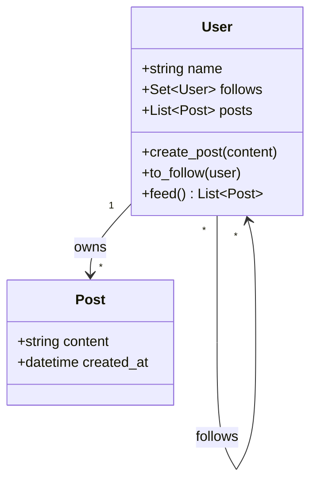

# 📸 Machine Coding: Instagram-Lite Social Feed

## 📝 Overview
Design a simplified **Social Media Feed** system. This challenge focuses on managing user relationships (following), content creation, and the algorithmic generation of a personalized, chronological feed of posts from multiple sources.

!!! info "Why This Challenge?"
    - **Scalable Event Propagation:** Evaluates your understanding of the "Fan-out" problem (Push vs Pull models) in social networking.
    - **Graph Relationship Management:** Tests your ability to model and traverse a "Following" graph to determine content visibility.
    - **Feed Aggregation:** Mastery of merging and sorting large datasets (posts) into a single, cohesive timeline in real-time.

---

## 🏭 The Scenario & Requirements

### 😡 The Problem (The Villain)
**"The Fan-out Explosion."** A celebrity with 1 million followers posts a photo. If your system tries to update 1 million follower feeds simultaneously using a "Push" model, your database locks up, the application crashes, and the system becomes unresponsive. Conversely, if 1 million followers "Pull" the feed at once, your read-latency spikes.

### 🦸 The System (The Hero)
**"The Optimized Feed Engine."** A system that separates content storage from user relationships. It efficiently aggregates posts from followed users, sorts them chronologically, and provides a "Hybrid" model that ensures low-latency feed generation for both regular users and celebrities.

### 📜 Requirements & Constraints
1.  **Functional:**
    -   **User Profiles:** Create users and manage their metadata.
    -   **Relationship Graph:** Support `follow()` and `unfollow()` actions (asymmetric relationships).
    -   **Content Creation:** Allow users to create `Post` objects with text content and timestamps.
    -   **Feed Generation:** Provide a `feed()` method that returns all posts from followed users, sorted by recency.
2.  **Technical:**
    -   **Chronological Integrity:** Posts must be strictly ordered from newest to oldest.
    -   **Graph Performance:** Relationship lookups (Who does $X$ follow?) must be $O(1)$ or $O(\text{degree})$.
    -   **Data Freshness:** Unfollowing a user should immediately remove their future posts from the follower's feed.

---

## 🏗️ Design & Architecture

### 🧠 Thinking Process
To build this, we model three primary entities:     
1.  **Post:** A value object containing content and a creation timestamp.   
2.  **User:** An entity that owns a list of its own `Post` objects and a `set` of other `User` objects it follows.  
3.  **Feed Manager (Logic):** Embedded within the `User` class (in this lite version) to aggregate and sort posts on-demand (Pull model).

### 🧩 Class Diagram


### ⚙️ Design Patterns Applied
- **Observer Pattern**: (Potential) To notify followers when a new post is created.
- **Iterator Pattern**: To traverse through a user's generated feed for pagination (important for UX).
- **Strategy Pattern**: (Potential) To swap between `ChronologicalFeed` and `InterestBasedFeed` ranking.

---

## 💻 Solution Implementation

???+ success "The Code"
    ```python
    --8<-- "machine_coding/systems/instagram/social_media_feed.py"
    ```

### 🔬 Why This Works (Evaluation)
The implementation uses a **Pull-on-Read** approach. When a user requests their `feed()`, the system iterates through their `follows` set, retrieves all posts from those users, and performs a global sort. Using a `set` for the following list ensures that `follow`/`unfollow` operations are $O(1)$ and prevents duplicate following.

---

## ⚖️ Trade-offs & Limitations

| Decision | Pros | Cons / Limitations |
| :--- | :--- | :--- |
| **Pull Model (On-demand Sort)** | Simple to implement; no storage overhead for redundant feed data. | Performance degrades as the number of followed users ($N$) or total posts ($P$) increases ($O(P \log P)$). |
| **In-memory Storage** | Extremely fast reads and writes. | Not persistent; all data is lost on server restart. |
| **Python `sorted()`** | Highly optimized Timsort ($O(N \log N)$) handles nearly-sorted data efficiently. | Global sort becomes a bottleneck for users following thousands of people. |

---

## 🎤 Interview Toolkit

- **Celebrity Problem:** How would you handle a user following 10,000 "celebrities"? (Mention a "Push" model for regular users and a "Pull" model for celebrities to optimize database load).
- **Pagination:** How do you return only the first 20 posts of a feed? (Use slicing after sorting, or a **Min-Heap** to merge $K$ sorted lists of posts in $O(P \log K)$).
- **Real-time Updates:** How would you notify Alice immediately when Bob posts? (Mention **WebSockets** or **Server-Sent Events**).

## 🔗 Related Challenges
- [Persistent Pub-Sub](../../distributed/pub_sub/PROBLEM.md) — For a more generic "Broadcast" infrastructure.
- [High-Performance Cache](../cache/PROBLEM.md) — For caching pre-computed feeds for high-traffic users.
