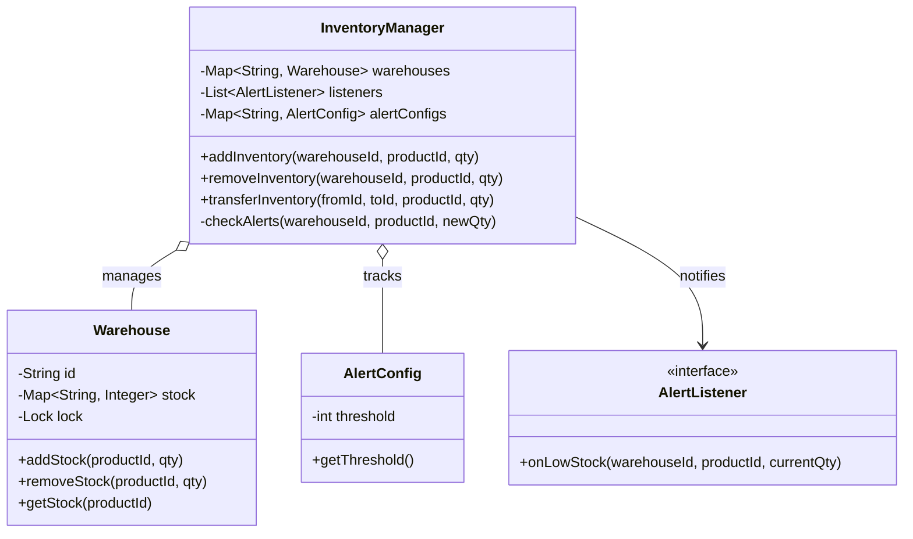

# 📦 Machine Coding: Inventory Management System

## 📝 Overview
An inventory management system tracks product stock across multiple warehouse locations. It acts as a reliable source of truth that records inventory as it arrives, deducts stock as orders ship, facilitates transfers between warehouses, and automatically alerts managers when supply runs low. 

!!! info "Why This Challenge?"
    - **Concurrency & Correctness:** Tests your ability to handle simultaneous read/write operations and atomic transfers without data corruption or deadlocks.
    - **Observer Pattern:** Evaluates your ability to implement pluggable, event-driven callbacks for thresholds and alerts.
    - **State Management:** Requires strict validation to prevent invalid states, such as negative inventory balances.

---

## 🏭 The Scenario & Requirements

### 😡 The Problem (The Villain)
In a high-volume retail environment, multiple processes are constantly interacting with the warehouse. One process might be receiving a shipment while another simultaneously fulfills an order for the exact same product. Without strict synchronization, race conditions occur, leading to phantom inventory, overselling, and catastrophic supply chain failures. 

### 🦸 The System (The Hero)
A robust, thread-safe inventory management engine. By encapsulating stock data within strongly isolated entities and utilizing strict locking mechanisms, the system guarantees atomic transactions, accurate stock counting, and instantaneous event-driven low-stock alerts.

### 📜 Requirements & Constraints
1. **(Functional):** The system must handle adding and removing inventory for products across a fixed set of warehouses configured at startup.
2. **(Functional):** The system must facilitate the transfer of stock between different warehouse locations.
3. **(Functional):** The system must trigger a callback interface when stock drops below a specific threshold. Thresholds are granular (per product, per warehouse).
4. **(Technical):** Operations must be strictly thread-safe to handle concurrent modifications.
5. **(Technical):** The system must reject invalid operations, such as removing more stock than is available (no negative inventory).
6. **(Out of Scope):** Product catalog management, order fulfillment orchestration, and payment processing are handled upstream and are out of scope. 

---

## 🏗️ Design & Architecture

### 🧠 Thinking Process
When determining the system's entities, we look for the nouns that maintain changing state, manage concurrent access, or enforce rules.
*   **`Warehouse`:** Represents a physical location. It encapsulates the map of product quantities and handles its own local thread synchronization to safely add or remove stock.
*   **`AlertConfig`:** A simple configuration entity that holds the threshold limits for specific products at specific warehouses.
*   **`AlertListener`:** An interface representing the pluggable callback mechanism invoked when a threshold is breached.
*   **`InventoryManager`:** The central orchestrator that coordinates transactions across multiple warehouses (like transfers) and triggers the alert listeners when a warehouse's stock dips too low.

### 🧩 Class Diagram
*(The Object-Oriented Blueprint. Who owns what?)*


### ⚙️ Design Patterns Applied
- **Observer Pattern:** The system uses `AlertListener` interfaces to decouple the core inventory logic from the notification delivery mechanisms (like emails or webhooks). 
- **Monitor Object / Lock Pattern:** Each `Warehouse` encapsulates a `Lock` (or mutex) to serialize concurrent access to its internal stock map, preventing race conditions.

---

## 💻 Solution Implementation

???+ success "The Code"
    ```python
    import threading
    from typing import Dict, List
    from abc import ABC, abstractmethod

    class AlertListener(ABC):
        @abstractmethod
        def on_low_stock(self, warehouse_id: str, product_id: str, current_qty: int):
            pass

    class EmailAlertListener(AlertListener):
        def on_low_stock(self, warehouse_id: str, product_id: str, current_qty: int):
            print(f"ALERT: Product {product_id} at {warehouse_id} is low! Current: {current_qty}")

    class Warehouse:
        def __init__(self, warehouse_id: str):
            self.warehouse_id = warehouse_id
            self.stock: Dict[str, int] = {}
            self.lock = threading.RLock() # Reentrant lock for thread safety

        def add_stock(self, product_id: str, qty: int) -> int:
            with self.lock:
                current = self.stock.get(product_id, 0)
                self.stock[product_id] = current + qty
                return self.stock[product_id]

        def remove_stock(self, product_id: str, qty: int) -> int:
            with self.lock:
                current = self.stock.get(product_id, 0)
                if current < qty:
                    raise ValueError(f"Insufficient stock for {product_id} at {self.warehouse_id}")
                self.stock[product_id] = current - qty
                return self.stock[product_id]

    class InventoryManager:
        def __init__(self, warehouses: List[Warehouse]):
            self.warehouses = {w.warehouse_id: w for w in warehouses}
            self.alert_configs: Dict[str, int] = {} # Key: "warehouseId_productId"
            self.listeners: List[AlertListener] = []

        def register_listener(self, listener: AlertListener):
            self.listeners.append(listener)

        def set_alert_threshold(self, warehouse_id: str, product_id: str, threshold: int):
            self.alert_configs[f"{warehouse_id}_{product_id}"] = threshold

        def add_inventory(self, warehouse_id: str, product_id: str, qty: int):
            if warehouse_id not in self.warehouses:
                raise ValueError("Invalid warehouse")
            new_qty = self.warehouses[warehouse_id].add_stock(product_id, qty)
            self._check_alerts(warehouse_id, product_id, new_qty)

        def remove_inventory(self, warehouse_id: str, product_id: str, qty: int):
            if warehouse_id not in self.warehouses:
                raise ValueError("Invalid warehouse")
            new_qty = self.warehouses[warehouse_id].remove_stock(product_id, qty)
            self._check_alerts(warehouse_id, product_id, new_qty)

        def transfer_inventory(self, from_id: str, to_id: str, product_id: str, qty: int):
            from_warehouse = self.warehouses.get(from_id)
            to_warehouse = self.warehouses.get(to_id)
            
            if not from_warehouse or not to_warehouse:
                raise ValueError("Invalid warehouse IDs")

            # Lock ordering to prevent deadlocks during concurrent transfers
            first_lock, second_lock = (from_warehouse, to_warehouse) if from_id < to_id else (to_warehouse, from_warehouse)

            with first_lock.lock:
                with second_lock.lock:
                    from_qty = from_warehouse.remove_stock(product_id, qty)
                    to_qty = to_warehouse.add_stock(product_id, qty)
            
            # Check alerts after releasing locks
            self._check_alerts(from_id, product_id, from_qty)
            self._check_alerts(to_id, product_id, to_qty)

        def _check_alerts(self, warehouse_id: str, product_id: str, current_qty: int):
            key = f"{warehouse_id}_{product_id}"
            threshold = self.alert_configs.get(key)
            if threshold is not None and current_qty <= threshold:
                for listener in self.listeners:
                    listener.on_low_stock(warehouse_id, product_id, current_qty)
    ```

### 🔬 Why This Works (Evaluation)
The most challenging part of this implementation is ensuring an atomic transfer between two warehouses without causing a deadlock. If Thread A transfers from `W1` to `W2`, and Thread B transfers from `W2` to `W1`, naïve locking would cause Thread A to lock `W1` and Thread B to lock `W2`, resulting in a permanent deadlock. We resolve this by enforcing a **strict lock acquisition order** based on the lexicographical order of the warehouse IDs (`first_lock, second_lock = (from, to) if from < to else (to, from)`). Furthermore, throwing a `ValueError` immediately upon detecting insufficient stock strictly enforces our business invariants.

---

## ⚖️ Trade-offs & Limitations

| Decision | Pros | Cons / Limitations |
| :--- | :--- | :--- |
| **Warehouse-Level Granularity Locking** | Simplifies code; extremely robust against deadlocks when transferring stock. | Concurrent updates to *different* products in the *same* warehouse are blocked, creating a throughput bottleneck at high scale. |
| **Synchronous Observer Callbacks** | Straightforward execution flow; guarantees the alert is triggered immediately. | If an `AlertListener` performs heavy I/O (like sending a real email), it blocks the `InventoryManager` thread. Production systems would push this to an async message queue. |

---

## 🎤 Interview Toolkit

- **Concurrency Probe:** *How would you increase throughput if warehouse-level locks become a bottleneck?*
  Instead of locking the entire `Warehouse`, you can implement fine-grained locking using a `ConcurrentHashMap` or by assigning a distinct `Lock` to each individual `Product` inside the warehouse. 
- **Extensibility:** *How do you prevent overselling when orders are in progress?*
  Introduce the concept of "Allocated" or "Reserved" stock. When an order is placed, instead of immediately deducting physical stock, you increment a `reserved_qty`. The `available_qty` becomes `total_qty - reserved_qty`. The stock is only physically deducted when the package actually ships.
- **Extensibility:** *How would you handle inventory that's being shipped between warehouses?*
  You cannot teleport items instantly in the real world. You would introduce a virtual `InTransitWarehouse`. A transfer removes stock from `Warehouse A` and adds it to `InTransitWarehouse`. When the truck arrives days later, a second operation moves it from `InTransitWarehouse` to `Warehouse B`.

## 🔗 Related Challenges
- [Rate Limiter LLD](../../distributed/rate_limiter/PROBLEM.md) — Shares the requirement for highly concurrent, thread-safe mathematical operations.
- [Amazon Locker LLD](../amazon_locker/PROBLEM.md) — Deals with robust physical state allocation and enforcing strict rules before executing commands.
