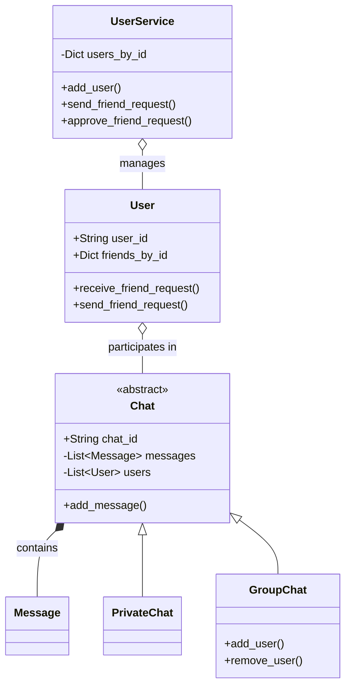

# 💬 Machine Coding: Online Chat System

## 📝 Overview
A foundational backend framework for a real-time messaging application like WhatsApp or Discord. It handles user management, friend request workflows, and routes messages across both 1-on-1 private chats and multi-user group chats.

!!! info "Why This Challenge?"
    - **Entity Relationships:** Tests your ability to handle complex, many-to-many relationships (users to chats, users to friends).
    - **Polymorphism:** Evaluates how well you can abstract communication channels so the system treats Private and Group chats interchangeably.
    - **State Management:** Requires cleanly mapping lifecycle transitions, such as friend requests moving from `UNREAD` to `ACCEPTED`.

---

## 🏭 The Scenario & Requirements

### 😡 The Problem (The Villain)
**"The Spaghetti Network."** Chat applications quickly become unmaintainable when `User` objects are allowed to directly mutate each other's states. If User A adds User B as a friend, but the operation crashes halfway through, User A thinks they are friends while User B does not. Furthermore, if group chats and private chats are built as entirely separate systems, message routing logic becomes horribly duplicated.

### 🦸 The System (The Hero)
**"The Unified Router."** A centralized `UserService` acts as the orchestrator, guaranteeing transactional safety when connecting users. The system relies on an abstract `Chat` base class, allowing messages to be pushed to a single friend or broadcasted to a room of 50 people using the exact same `add_message()` pipeline.

### 📜 Requirements & Constraints
1.  **(Functional):** Users can send, receive, and approve/reject friend requests.
2.  **(Functional):** The system must support both Private (1-on-1) and Group (1-to-N) chats.
3.  **(Functional):** Users can add or remove other users from Group chats.
4.  **(Technical):** Chat history (`Message` objects) must be encapsulated safely within the `Chat` objects, not stored raw on the `User`.

---

## 🏗️ Design & Architecture

### 🧠 Thinking Process
To prevent tight coupling, we need to separate the *participants*, the *medium*, and the *manager*:     
1.  **The Atomic Unit:** `Message` (ID, text, timestamp).   
2.  **The Medium:** An abstract `Chat` class holding a list of Users and Messages. This is subclassed into `PrivateChat` (strictly 2 users) and `GroupChat` (dynamic user list).    
3.  **The Participant:** `User`, holding their own friend lists and pending requests, but forbidden from modifying *other* users.   
4.  **The Orchestrator:** `UserService`. It coordinates complex interactions, like establishing a friendship by cross-updating two distinct `User` objects simultaneously.

### 🧩 Class Diagram
*(The Object-Oriented Blueprint. Who owns what?)*


### ⚙️ Design Patterns Applied

  - **Mediator Pattern (via `UserService`):** Acts as a mediator for complex multi-user interactions. Instead of `UserA.add_friend(UserB)`, they ask the `UserService`, which orchestrates the state changes for both, preventing corrupted states.
  - **Template / Strategy Pattern (via `Chat` Polymorphism):** Both `PrivateChat` and `GroupChat` expose the same core mechanism (`add_message`), hiding the underlying complexity of how many users are actually in the room.

-----

## 💻 Solution Implementation

???+ success "The Code"
    ```python
    --8<-- "machine_coding/systems/online_chat/online_chat.py"
    ```

### 🔬 Why This Works (Evaluation)

The architecture heavily leverages the **Dependency Inversion Principle**. By making `User` interact with the abstract `Chat` class, adding new features—like 'Announcement Channels' or 'Voice Rooms'—requires absolutely zero changes to the `User` entity. Furthermore, routing friend requests through `UserService` ensures that the two-way binding of a friendship (A adds B, B adds A) happens synchronously in one controlled environment.

-----

## ⚖️ Trade-offs & Limitations

| Decision | Pros | Cons / Limitations |
| :--- | :--- | :--- |
| **In-Memory Dictionaries** | Extremely fast $O(1)$ lookups for users, friends, and chats. | Data is completely wiped on server restart; cannot scale horizontally across multiple machines. |
| **Two-way Friendship Binding** | Instant $O(1)$ check to see if two users are friends. | Requires transactional safety (if storing A in B's list succeeds, but B in A's list fails, the database is corrupted). |
| **Appending Messages to a List** | Simple to implement for a local prototype. | In production, an unbounded list of millions of messages will cause catastrophic memory exhaustion (Out of Memory Error). |

-----

## 🎤 Interview Toolkit

  - **Scale Probe:** "How do you fetch the last 50 messages of a Group Chat with 10 million total messages without crashing the server?" -\> *(Do not load the `messages` list into memory. Implement Pagination or Cursor-based fetching, querying the database with `WHERE chat_id = X AND message_id < {cursor} ORDER BY timestamp DESC LIMIT 50`).*
  - **Concurrency Probe:** "What happens if two users click 'Accept' on the same friend request at the exact same millisecond?" -\> *(Implement idempotency and optimistic locking. The `RequestStatus` should only update if the DB reads `current_status == UNREAD`. If it's already `ACCEPTED`, the second thread's transaction is ignored).*
  - **System Design Pivot:** "If we move this LLD to a distributed microservice architecture, how do users actually receive new messages in real-time?" -\> *(Clients maintain persistent WebSockets connected to an API Gateway. When a message is sent, a Pub/Sub message broker like Kafka routes the payload to the specific server node holding the recipient's active WebSocket).*

## 🔗 Related Challenges

  - [Socket Chat App](../../../infrastructure_challenges/socket_chat_app/PROBLEM.md) — For the low-level infrastructure and networking side of real-time bidirectional communication.
  - [Instagram Feed](../instagram/PROBLEM.md) — For handling complex User-to-User following logic and generating aggregated feeds.
