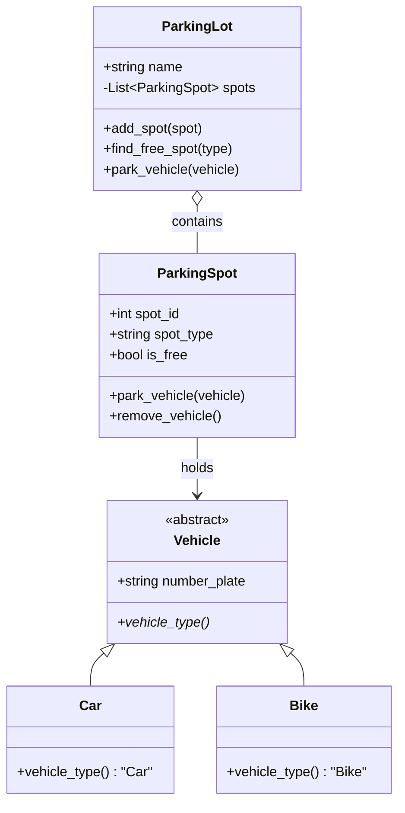

# 🅿️ Machine Coding: High-Concurrency Parking Lot

## 📝 Overview
Design and implement a robust **Multi-Floor Parking Lot** system. This challenge focuses on efficient resource allocation, specialized spot management for different vehicle types, and maintaining thread-safe operations in a high-traffic environment with multiple entry/exit gates.

!!! info "Why This Challenge?"
    - **Resource Allocation Mastery:** Evaluates your ability to match diverse resources (spots) with varied requests (vehicle types) optimally.
    - **Concurrency & Synchronization:** Tests your ability to use locks or thread-safe collections to prevent "double-booking" of spots.
    - **Clean Domain Modeling:** Mastery of representing physical entities (Floors, Spots, Vehicles, Tickets) as a clean, interacting object hierarchy.

---

## 🏭 The Scenario & Requirements

### 😡 The Problem (The Villain)
**"The Double-Booker Gridlock."** Two cars enter a busy parking lot from different gates at the exact same millisecond. Without synchronization, the system assigns "Spot #101" to both. They collide at the spot, causing a literal gridlock and manual ticket voiding. Meanwhile, a truck is circling because the system assigned it a "Bike-only" spot.

### 🦸 The System (The Hero)
**"The Thread-Safe Allocator."** A centralized parking engine that uses synchronized methods or atomic checks to ensure every spot is granted to exactly one valid vehicle. It intelligently filters spots based on vehicle type and proximity to the entry gate, ensuring smooth flow and accurate billing.

### 📜 Requirements & Constraints
1.  **Functional:**
    -   **Hierarchical Management:** Manage multiple floors with a configurable number of spots.
    -   **Vehicle Diversity:** Handle Motorcycles, Cars, and Trucks, each requiring specific spot types.
    -   **Entry/Exit Workflow:** Automatically find/reserve a spot on entry and free it on exit.
    -   **Billing (Optional):** Calculate fees based on the duration of stay and vehicle type.
2.  **Technical:**
    -   **Thread Safety:** The `park_vehicle` operation must be atomic across multiple entry gates.
    -   **Efficiency:** Finding an available spot should be $O(1)$ or $O(N)$ (where $N$ is the number of spots per floor).
    -   **Encapsulation:** Vehicles should not be able to "claim" a spot without going through the `ParkingLot` manager.

---

## 🏗️ Design & Architecture

### 🧠 Thinking Process
To handle these requirements, we adopt a bottom-up modeling approach:
1.  **Vehicle (Abstract):** Base class for `Car`, `Bike`, etc., defining the required spot type.
2.  **ParkingSpot:** Represents a single unit of storage with a fixed type and availability state.
3.  **ParkingLot:** The orchestrator that contains a list of `ParkingSpot` objects and manages the allocation logic.

### 🧩 Class Diagram


### ⚙️ Design Patterns Applied
- **Factory Pattern**: (Potential) To create the correct `Vehicle` object from a license plate scan.
- **Strategy Pattern**: For implementing different "Spot Finding" algorithms (e.g., nearest-to-gate, cheapest-floor).
- **Singleton Pattern**: Ensures only one `ParkingLot` instance exists to manage the global state.

---

## 💻 Solution Implementation

???+ success "The Code"
    ```python
    --8<-- "machine_coding/systems/parking_lot/parking_lot.py"
    ```

### 🔬 Why This Works (Evaluation)
The implementation follows the **Open/Closed Principle**. By using an abstract `Vehicle` base class, we can add new vehicle types (like `ElectricCar` or `Truck`) without modifying the `ParkingLot` or `ParkingSpot` logic. The `find_free_spot` method acts as a simple but effective dispatcher, ensuring type-safe allocation.

---

## ⚖️ Trade-offs & Limitations

| Decision | Pros | Cons / Limitations |
| :--- | :--- | :--- |
| **Linear Search for Spots** | Simple to implement and debug for small/medium lots. | Becomes slow ($O(N)$) for massive parking structures with 10,000+ spots. |
| **Simple Flag for `is_free`** | Minimal memory overhead. | No history or "reserved but not yet occupied" state. |
| **Global Lock (Implicit)** | Prevents all race conditions. | Can cause a bottleneck if 100 entry gates are all trying to park at once. |

---

## 🎤 Interview Toolkit

- **Concurrency Probe:** How would you handle 10 entry gates simultaneously? (Use a `threading.Lock` around the `find_free_spot` and `park_vehicle` methods).
- **Scalability:** How would you optimize finding a spot for 1 million spots? (Use a **Min-Heap** or **Bitmask** per floor to track available indices in $O(1)$).
- **Dynamic Pricing:** How would you implement "Surge Pricing" during peak hours? (Inject a `PricingStrategy` into the exit logic).

## 🔗 Related Challenges
- [Multi-Elevator Dispatcher](../elevator/PROBLEM.md) — For another resource-matching challenge with moving targets.
- [High-Performance Cache](../cache_system/PROBLEM.md) — For managing a fixed-capacity resource pool with eviction/release logic.
