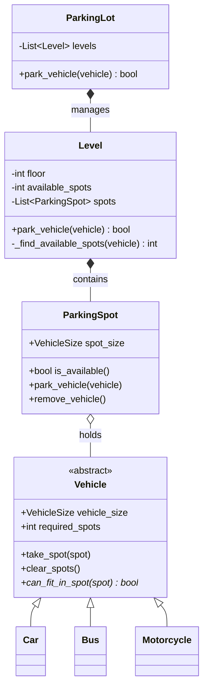

# 🅿️ Machine Coding: Multi-Level Parking Lot

## 📝 Overview
Design and implement a robust **Multi-Floor Parking Lot** system. This challenge focuses on efficient hierarchical resource allocation, specialized spot management for different vehicle sizes, and handling complex spatial constraints (like assigning consecutive spots for large vehicles).

!!! info "Why This Challenge?"
    - **Resource Allocation Mastery:** Evaluates your ability to match diverse resources (spots) with varied physical requests (vehicle sizes).
    - **Spatial/Array Logic:** Tests your algorithmic approach to finding contiguous blocks of available memory/spots (e.g., parking a Bus).
    - **Clean Domain Modeling:** Mastery of representing physical entities (`ParkingLot`, `Level`, `ParkingSpot`, `Vehicle`) as a cleanly interacting, composite object hierarchy.

---

## 🏭 The Scenario & Requirements

### 😡 The Problem (The Villain)
**"The Double-Booker & The Bus Problem."** A naive parking system assigns cars strictly to the first open spot. However, a motorcycle can technically fit anywhere, a car needs a compact or large spot, and a bus needs *five consecutive large spots*. A poorly modeled system will either reject the bus or attempt to park its 5 sections in random, non-contiguous spots across the lot, causing a physical impossibility.

### 🦸 The System (The Hero)
**"The Hierarchical Allocator."** A centralized parking engine that models the physical world perfectly. It cascades requests down from the `ParkingLot` to individual `Level`s. Each Level intelligently scans its array of `ParkingSpot`s to find valid, contiguous blocks that satisfy the specific `VehicleSize` and `required_spots` polymorphic rules of the incoming vehicle.

### 📜 Requirements & Constraints
1.  **(Functional):** Manage multiple floors/levels, each with a configurable number of spots of varying sizes (Motorcycle, Compact, Large).
2.  **(Functional):** Handle distinct vehicle types:
    -   *Motorcycles:* Can park in any spot.
    -   *Cars:* Can park in Compact or Large spots.
    -   *Buses:* Can ONLY park in 5 *consecutive* Large spots.
3.  **(Functional):** Automatically find/reserve a spot on entry and free it seamlessly on exit without leaving orphaned memory pointers.
4.  **(Technical):** Finding an available block of spots must be resolved efficiently without scanning the entire lot if a level is already full.

---

## 🏗️ Design & Architecture

### 🧠 Thinking Process
To handle these physical constraints, we must adopt a strict composite approach:    
1.  **Vehicle (Abstract):** Base class defining the `VehicleSize` and the number of `required_spots`. It delegates the exact fitting logic (`can_fit_in_spot`) to its concrete subclasses.  
2.  **ParkingSpot:** Represents a single unit of storage with a fixed size category and an availability state.  
3.  **Level:** Represents a single floor. It manages the array of spots and contains the sliding-window logic required to find contiguous empty spaces. 
4.  **ParkingLot:** The global orchestrator containing a list of `Level` objects.

### 🧩 Class Diagram
*(The Object-Oriented Blueprint. Who owns what?)*


### ⚙️ Design Patterns Applied

  - **Composite Pattern (Conceptual)**: Cascading the `park_vehicle` request down the structural tree (`ParkingLot` $\rightarrow$ `Level` $\rightarrow$ `ParkingSpot`).
  - **Strategy / Polymorphism**: Resolving the spatial rules. Instead of the `ParkingSpot` writing massive `if/else` checks for every vehicle type, it asks the vehicle itself: `vehicle.can_fit_in_spot(self)`.

---

## 💻 Solution Implementation

???+ success "The Code"
    ```python
    --8<-- "machine_coding/systems/parking_lot/parking_lot.py"
    ```

### 🔬 Why This Works (Evaluation)

The system is highly robust because of the **Polymorphic Fitting Logic** and **Contiguous Scanning**.   
When a `Bus` arrives, the `Level` does not just check `available_spots >= 5`. It iterates through its spot array using a sliding counter. Because a `Bus` overrides `can_fit_in_spot()` to strictly require `VehicleSize.LARGE`, the `Level` will only return an index if it finds 5 consecutive spots that all return `True` to the Bus's size checks.

---

## ⚖️ Trade-offs & Limitations

| Decision | Pros | Cons / Limitations |
| :--- | :--- | :--- |
| **Array Scanning for Contiguous Spots** | Perfectly models the physical constraints of parking a massive vehicle. | $O(N)$ time complexity per level. Can be slow for a level with 10,000 spots. |
| **Storing Spots inside the Vehicle** | $O(1)$ cleanup. The vehicle knows exactly which spots to clear when leaving. | Creates a circular reference (`Spot` knows `Vehicle`, `Vehicle` knows `Spot`). |
| **Greedy Allocation (First-Fit)** | Fast assignment without complex sorting. | Can lead to fragmentation (e.g., parking a motorcycle in a large spot prevents a bus from parking later). |

---

## 🎤 Interview Toolkit

  - **Optimization Probe:** "Your Level scanning is $O(N)$ to find 5 consecutive spots. How would you optimize this?" -> *(Maintain a free-list or a Segment Tree / Max-Heap that tracks the lengths of available contiguous blocks. This allows $O(\log N)$ lookups).*
  - **Concurrency Probe:** "How would you handle 10 entry gates simultaneously trying to park cars?" -> *(Place a `threading.Lock` at the `Level` class. Granular locking per level prevents the entire lot from halting while one car parks, massively increasing throughput).*
  - **Edge Case:** "What happens to fragmentation if a Motorcycle parks in the middle of 5 Large spots?" -> *(The system allows it currently. To fix it, you should enforce strict sizing or sort spots by size so small vehicles fill small spots first).*

## 🔗 Related Challenges

  - [Elevator Management System](../elevator/PROBLEM.md) — For another resource-matching challenge with strict physical capacity limits.
  - [High-Performance Cache](../cache/PROBLEM.md) — For managing a fixed-capacity resource pool with programmatic eviction logic.

---


<!-- 
from abc import ABC, abstractmethod

# -----------------------------
# Abstract Base Class for Vehicles
# -----------------------------
class Vehicle(ABC):
    def __init__(self, number_plate):
        self.number_plate = number_plate

    @abstractmethod
    def vehicle_type(self):
        pass


class Car(Vehicle):
    def vehicle_type(self):
        return "Car"


class Bike(Vehicle):
    def vehicle_type(self):
        return "Bike"


# -----------------------------
# Parking Spot
# -----------------------------
class ParkingSpot:
    def __init__(self, spot_id, spot_type):
        self.spot_id = spot_id
        self.spot_type = spot_type  # e.g., "Car" or "Bike"
        self.is_free = True
        self.vehicle = None

    def park_vehicle(self, vehicle):
        if not self.is_free:
            raise Exception("Spot already occupied")
        if vehicle.vehicle_type() != self.spot_type:
            raise Exception("Wrong vehicle type for this spot")
        self.vehicle = vehicle
        self.is_free = False

    def remove_vehicle(self):
        if self.is_free:
            raise Exception("Spot is already empty")
        self.vehicle = None
        self.is_free = True


# -----------------------------
# Parking Lot
# -----------------------------
class ParkingLot:
    def __init__(self, name):
        self.name = name
        self.spots = []

    def add_spot(self, spot):
        self.spots.append(spot)

    def find_free_spot(self, vehicle_type):
        for spot in self.spots:
            if spot.is_free and spot.spot_type == vehicle_type:
                return spot
        return None

    def park_vehicle(self, vehicle):
        spot = self.find_free_spot(vehicle.vehicle_type())
        if not spot:
            print(f"No free spot available for {vehicle.vehicle_type()}")
            return
        spot.park_vehicle(vehicle)
        print(f"{vehicle.vehicle_type()} parked at spot {spot.spot_id}")

    def remove_vehicle(self, number_plate):
        for spot in self.spots:
            if not spot.is_free and spot.vehicle.number_plate == number_plate:
                spot.remove_vehicle()
                print(f"Vehicle {number_plate} removed from spot {spot.spot_id}")
                return
        print("Vehicle not found.")


# -----------------------------
# Demo Usage
# -----------------------------
if __name__ == "__main__":
    lot = ParkingLot("TechPark")

    # Add spots
    lot.add_spot(ParkingSpot(1, "Car"))
    lot.add_spot(ParkingSpot(2, "Car"))
    lot.add_spot(ParkingSpot(3, "Bike"))

    # Vehicles
    car1 = Car("KA-01-HH-1234")
    bike1 = Bike("KA-09-BB-4321")

    lot.park_vehicle(car1)
    lot.park_vehicle(bike1)
    lot.remove_vehicle("KA-01-HH-1234")
 -->