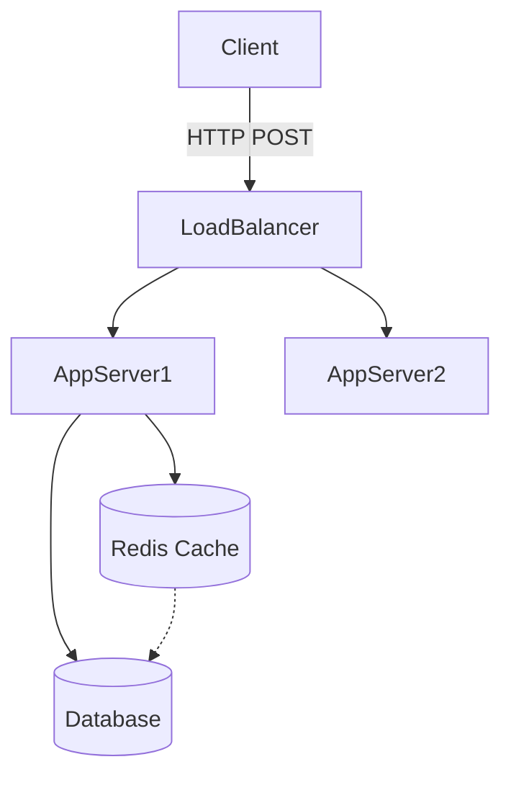

# (Icon) System Design: (System Name)

## 📝 Overview
(Brief, 2-sentence description of the system. e.g., "A distributed URL shortener service like Bitly that handles massive read/write volumes.")

!!! abstract "Core Concepts"
    - **(Concept 1):** (e.g., Base62 Encoding)
    - **(Concept 2):** (e.g., Read-Heavy vs Write-Heavy workloads)
    ...

---

## 🏭 The Scenario & Requirements

### 😡 The Problem (The Villain)
(Describe the problem without this system. e.g., "URLs are too long to fit in an SMS, and typing them manually is impossible.")

### 🦸 The Solution (The Hero)
(The conceptual goal. e.g., "A highly available service that maps long URLs to short aliases and redirects users instantly.")

### 📜 Requirements
- **Functional Requirements:**
    1. (e.g., Users can generate a short URL from a long URL.)
    2. (e.g., Clicking the short URL redirects to the original URL.)
    ...
- **Non-Functional Requirements:**
    1. (e.g., High Availability - system cannot go down.)
    2. (e.g., Low Latency - redirection must happen in < 50ms.)
    ...
...

!!! info "Capacity Estimation (Back-of-the-envelope)"
    - **Traffic:** (e.g., 100M writes/month, 1B reads/month -> 10:1 Read/Write ratio)
    - **Storage:** (e.g., 100M * 500 bytes * 12 months * 5 years = ~30TB)
    - **Memory/Cache:** (e.g., Cache 20% of reads -> ~20GB of RAM needed)
    ...

---

## 📊 API Design & Data Model

*(Use MkDocs tabs to cleanly separate the API contracts from the Database schema)*

=== "REST APIs"
    - **`POST /api/v1/shorten`**
        - **Request:** `{ "long_url": "https://..." }`
        - **Response:** `{ "short_url": "https://sho.rt/xyz" }`
    - **`GET /{alias}`**
        - **Response:** `301 Redirect` to `long_url`
    ...

=== "Database Schema"
    - **Table:** `urls` (NoSQL / Key-Value Store)
        - `hash` (String, PK) - e.g., "xyz123"
        - `original_url` (String)
        - `created_at` (Timestamp)
        - `expiration_date` (Timestamp)
        ...
    ...

---

## 🏗️ High-Level Architecture

### Architecture Diagram
*(The 10,000-foot view of how components interact)*

### Component Walkthrough
1. **Load Balancer:** (Why it's there)
2. **App Servers:** (Stateless or stateful?)
3. **Cache:** (Eviction policy? e.g., LRU)
...

---

## 🔬 Deep Dive & Scalability

### Handling Bottlenecks
*(How do we scale this system when traffic 100x's?)*
- **Database Scaling:** (e.g., Sharding based on the first character of the hash.)
- **Caching Strategy:** (e.g., Write-around cache since URLs are read-heavy.)
...

### ⚖️ Trade-offs
| Decision | Pros | Cons / Limitations |
| :--- | :--- | :--- |
| (e.g., Base62 vs MD5) | Base62 is shorter, collision-free if using counters. | Requires a centralized counter (Zookeeper). |
| (e.g., NoSQL vs SQL) | Horizontally scales natively. | No JOINs (not needed here anyway). |

---

## 🎤 Interview Toolkit

- **Scale Question:** (What happens if a specific URL goes viral? -> *Cache Hotkeys*)
- **Failure Probe:** (What happens if the primary database dies?)
- **Edge Case:** (How do you handle malicious URLs or infinite loops?)
...

## 🔗 Related Architectures
- [Related Architecture 1](#) — (e.g., "Pastebin" - very similar read-heavy storage architecture)
...
