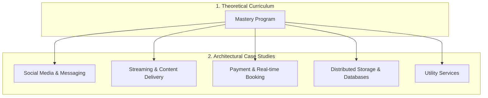

# 🗺️ System Design Roadmap

A guide to mastering High-Level Design (HLD) for large-scale distributed systems.

## 📘 Theoretical Curriculum
*   [🎓 System Design Mastery Program](./mastery_program/index.md) — 4 Phases, 20 Modules covering Foundations to GenAI.

## 📊 Topic Progress

1. **Social Media & Messaging**
    * [WhatsApp](./architectures/social_media/WHATSAPP.md)
    * [Facebook Capacity](./architectures/social_media/FACEBOOK_CAPACITY.md)
2. **Streaming & Content Delivery**
    * [Netflix](./architectures/streaming/NETFLIX.md)
3. **Payment & Real-time Booking**
    * [Uber Global](./architectures/payment_systems/UBER_HLD.md)
4. **Distributed Storage & Databases**
    * [S3 Lite](./architectures/distributed_storage/S3_LITE.md)
    * [Key-Value Store](./architectures/distributed_storage/KV_STORE.md)
5. **Utility Services**
    * [URL Shortener](./architectures/utilities/URL_SHORTENER.md)
    * [API Rate Limiter](./architectures/utilities/RATE_LIMITER.md)
    * [Ticket Booking](./architectures/utilities/TICKET_BOOKING.md)

Refer to [repo_index.md](../repo_index.md) for more details.
