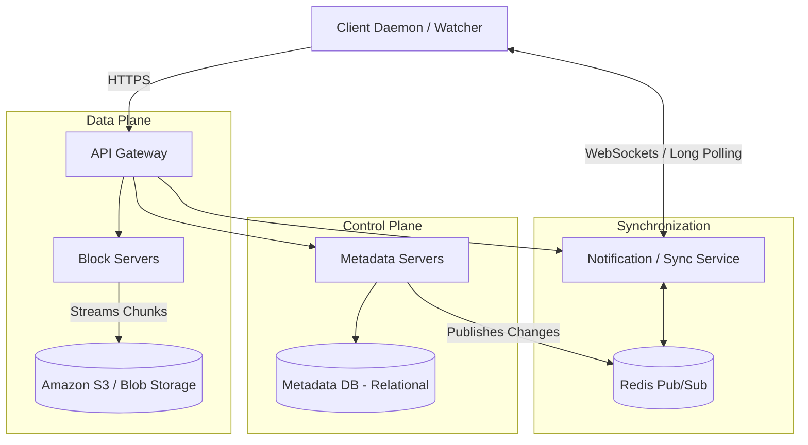

# ☁️ System Design: Dropbox / Google Drive

## 📝 Overview
A collaborative, cross-device cloud file storage system designed to seamlessly synchronize massive datasets across multiple clients. It solves the complex distributed systems challenge of keeping local file systems perfectly mirrored in the cloud without consuming all of a user's network bandwidth or the company's storage capacity.

!!! abstract "Core Concepts"
    - **Block-Level Chunking:** Splitting large files into strictly sized blocks (e.g., 4MB) to enable granular uploads and downloads.
    - **Delta Sync:** Calculating the exact bytes changed in a file and transmitting *only* the modified chunks over the network, rather than the entire file.
    - **Data Deduplication:** Using cryptographic hashes (SHA-256) to identify and store only one physical copy of identical chunks across the entire global user base.

---

## 🏭 The Scenario & Requirements

### 😡 The Problem (The Villain)
If a user edits a single line of text in a 500MB video editing project file, uploading the entire 500MB file to the cloud again is a catastrophic waste of time, device battery, and server bandwidth. Furthermore, if a user has three devices (Phone, Laptop, Desktop), keeping the file states perfectly synchronized without creating conflicting versions or overwriting data is a severe concurrency challenge.

### 🦸 The Solution (The Hero)
A decoupled architecture where the heavy lifting of raw binary data (Data Plane) is separated from the lightweight coordination of file structure (Control Plane). By breaking files into small hashed chunks, the system can perform Delta Syncs—uploading only the 4MB block that changed. If multiple users upload the exact same file, global deduplication ensures the system only saves the physical bytes once, pointing both users' metadata to the same stored chunk.

### 📜 Requirements
- **Functional Requirements:**
    1. Users can upload, download, delete, and modify files from any device.
    2. Changes made on one device must automatically synchronize to all other connected devices.
    3. The system must support file versioning to recover from accidental overwrites or deletions.
- **Non-Functional Requirements:**
    1. **High Durability:** Files must never be lost (requires high replication in object storage).
    2. **Bandwidth Efficiency:** Must aggressively minimize network usage for both the client and the server.
    3. **Strong Consistency (Metadata):** If a file is renamed or moved, the new state must be strictly consistent to prevent corruption across synced devices.

!!! info "Capacity Estimation (Back-of-the-envelope)"
    - **Symmetry:** Unlike social media (where read:write is 100:1), cloud storage is highly symmetrical with a Read:Write ratio of nearly **1:1**.
    - **Traffic:** 100 Million Daily Active Users (DAU). With an average of 3 devices per user, the system must maintain **~1 Million active WebSocket/Long-Polling connections per minute** for real-time synchronization.
    - **Storage:** Assuming 200 files per user and a 100KB average file size, the system stores **100 billion files**, requiring **10 PB of total active storage** (before factoring in historical versions and replication).

---

## 📊 API Design & Data Model

=== "REST APIs"
    - **`POST /api/v1/files/upload/init`**
        - **Request:** `{ "filename": "video.mp4", "total_size": 10485760, "chunk_hashes": ["abc1", "def2", "ghi3"] }`
        - **Response:** `{ "upload_id": "u123", "missing_chunks": ["def2"] }` *(Server tells client which chunks it doesn't already have)*
    - **`POST /api/v1/files/upload/chunk`**
        - **Request:** `Multipart/form-data` (Raw 4MB binary + `upload_id` + `chunk_hash`)
        - **Response:** `200 OK`
    - **`POST /api/v1/files/commit`**
        - **Request:** `{ "upload_id": "u123", "parent_folder_id": "f456" }`
        - **Response:** `{ "file_id": "file789", "version": 2 }`

=== "Database Schema"
    - **Table:** `file_metadata` (RDBMS for ACID compliance)
        - `file_id` (UUID, PK)
        - `parent_id` (UUID, FK - for folder hierarchy)
        - `owner_id` (String, Indexed)
        - `filename` (String)
        - `version` (Int)
    - **Table:** `file_chunks` (NoSQL / Wide-Column)
        - `file_id` (UUID, PK)
        - `version` (Int, PK)
        - `chunk_order` (Int, PK)
        - `chunk_hash` (String)
    - **Table:** `chunk_storage` (NoSQL / KV Store)
        - `chunk_hash` (String, PK) - e.g., "def2"
        - `s3_object_key` (String) - Path to the physical bytes
        - `reference_count` (Int) - For garbage collection

---

## 🏗️ High-Level Architecture

### Architecture Diagram

### Component Walkthrough

1.  **Client Watcher:** A background daemon process running on the user's OS. It monitors the local Dropbox/Drive folder for file system events (add, edit, delete), calculates hashes locally, and determines delta chunks.
2.  **Block Servers:** Stateless workers handling the heavy network I/O. They receive 4MB chunks from clients, encrypt them, and stream them directly into persistent Blob Storage (S3).
3.  **Metadata Servers:** Manage the directory structure, file-to-chunk mappings, user permissions, and version histories. They utilize a relational database to ensure strict ACID consistency for file tree operations (e.g., moving a folder must be atomic).
4.  **Synchronization Service:** Maintains persistent connections (WebSockets or HTTP Long Polling) with all active client devices. When a file is updated on the Metadata Server, an event is pushed via Redis Pub/Sub to the Sync Service, which instantly alerts the user's other devices to download the new metadata and missing chunks.

-----

## 🔬 Deep Dive & Scalability

### Handling Bottlenecks: Chunking & Deduplication

Uploading an entire file upon every small edit is impossible at scale. Files are strictly divided into 4MB chunks. Each chunk is passed through a hashing algorithm (SHA-256) to generate a unique Chunk ID.

**Data Deduplication Strategy**
If two users upload the exact same file (or if a user copies a file), the system calculates the SHA-256 hash and checks the `chunk_storage` table. If the hash exists, the system simply points the metadata to the existing physical chunk, saving massive amounts of space.

### ⚖️ Trade-offs

| Decision | Pros | Cons / Limitations |
| :--- | :--- | :--- |
| **Inline Deduplication (Synchronous)** | Saves massive ingress bandwidth. Client asks the server "Do you have this hash?" before uploading. If yes, the 4MB upload is skipped entirely. | Introduces a database lookup latency penalty during the initial upload phase before bits even hit the wire. |
| **Post-Process Deduplication (Asynchronous)** | Initial uploads are blazing fast. The server accepts all data and deduplicates it in the background via batch jobs. | Wastes network bandwidth (client uploads identical data) and temporarily wastes disk space until cleanup. |
| **Relational DB vs NoSQL for Metadata** | RDBMS natively guarantees ACID for complex folder moves and permissions, ensuring strict consistency. | Harder to scale horizontally compared to a NoSQL datastore (requires complex database sharding by `owner_id`). |

-----

## 🎤 Interview Toolkit

  - **Scale Question:** "How do you handle a user editing a file while offline, and then coming back online?" -\> *The Client Watcher queues the local changes. Upon reconnection, it attempts to commit the new version. If another device updated the file in the meantime, the Metadata DB rejects the commit using Optimistic Concurrency Control (OCC) based on the `version` number. The client must then download the latest version and either merge the changes or save a "Conflicted Copy".*
  - **Failure Probe:** "A user is uploading a 10GB file and their internet drops at 99%. What happens?" -\> *Because the file is chunked, the client simply resumes the upload of the exact 4MB chunk that failed once the connection returns. The previous 99% of chunks are already safely sitting in the Block Servers/S3.*
  - **Edge Case:** "How do you securely delete a file when chunks might be shared across multiple users due to deduplication?" -\> *You never delete a chunk directly when a user deletes a file. Instead, you decrement the `reference_count` in the `chunk_storage` table. A background Garbage Collection job routinely sweeps the database, physically deleting only the chunks in S3 where `reference_count == 0`.*

## 🔗 Related Architectures

  - [System Design: S3 Lite](./S3_LITE.md) — To understand the underlying blob storage tier where the chunks actually live.
  - [System Design: Distributed KV Store](./KV_STORE.md) — For deep-diving into the chunk hash lookup mechanics.
  - [Machine Coding: Cache System](../../../machine_coding/systems/cache_system/PROBLEM.md)
