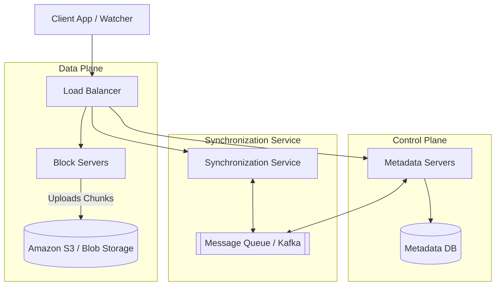

# Design: Dropbox / Google Drive (Cloud File Storage)

Designing a collaborative, cross-device file storage system involves solving the complex challenges of synchronizing massive files efficiently without consuming all of a user's network bandwidth.

---

## 1. Capacity Estimation & Symmetry

*   **Symmetry:** Unlike social media (where read:write is 100:1), cloud storage is a **symmetrical system** with a Read:Write ratio of nearly **1:1**.
*   **Traffic:** 100 Million Daily Active Users (DAU). With an average of **3 devices per user**, the system must maintain **1 Million active connections per minute**.
*   **Storage:** Assuming **200 files per user** and a **100KB average file size**, the system stores **100 billion files**, requiring **10 PB of total storage**.

---

## 2. Core Optimizations: Chunking & Delta Sync

Uploading an entire **500MB video file** every time a user changes a **1KB metadata tag** is inefficient. To solve this, the system uses **Chunking**.

*   **Chunking:** Files are strictly divided into **4MB chunks**. The exact optimal size is statically calculated based on the Backend Storage IOPS, Network Bandwidth, and Average File Size.
*   **Hashing:** Each chunk is passed through a hashing algorithm (e.g., **SHA-256**) to generate a unique **Chunk ID**. The entire file is reconstructed using a **manifest of these Chunk IDs**.
*   **Delta Sync:** When a user modifies a file, the client calculates which specific 4MB chunks were changed. Only the **modified chunks** are transmitted over the network.
*   **Deduplication:** If two users upload the exact same file (or chunk), the system recognizes the identical SHA-256 hash and simply points both users' metadata to the **same physical chunk in storage**, saving massive amounts of space.
*   **Failure Resiliency:** If an upload fails, the system only needs to retry the failing chunk rather than the entire file.

---

## 3. Data Deduplication Strategy

Data deduplication eliminates duplicate copies of data to improve storage utilization and reduce bandwidth. When the system processes a chunk, it calculates a cryptographic hash (e.g., SHA-256) to determine if it already exists.

There are two primary approaches to handling this calculation, dictating the system's performance trade-offs:

### A. Inline Deduplication (Synchronous)

The hash is calculated by the client and checked against the database before the upload completes.

**Pros:**
- Saves massive amounts of ingress bandwidth.
- Provides optimal storage usage immediately, as duplicate chunks are never transmitted across the network.

**Cons:**
- Introduces an IOPS and latency penalty during the upload phase.
- The client and server must wait for the hash calculation and database lookup to complete before the data can be successfully stored.

### B. Post-Process Deduplication (Asynchronous)

All new chunks are immediately stored on the backend storage device. Later, a background process analyzes the data to look for duplicates and remove them.

**Pros:**
- Ensures no degradation in initial storage performance or user latency.

**Cons:**
- Wasted network bandwidth (the client transmits the entire chunk even if identical).
- Temporary storage waste until background cleanup phases remove the duplicate.

---

## 3. High-Level Architecture

The architecture decouples the heavy lifting of **binary data** (Data Plane) from the lightweight coordination of **metadata** (Control Plane).

### Component Breakdown
*   **Client Watcher:** A daemon process on the user's OS that monitors local workspace folders for file system events (add, edit, delete).
*   **Block Servers:** Handle the heavy network I/O. They encrypt, compress, and transmit **4MB chunks** to object storage (e.g., S3).
*   **Metadata Servers:** Manage the directory structure, file-to-chunk mappings, sharing permissions, and version histories.
*   **Synchronization Service:** Ensures all devices are updated in real-time. Clients establish a **Long Polling or WebSocket** connection with this service to receive pushes.

---

## 4. Data Modeling (Metadata DB)

The Metadata Database manages the logical structure of the file system and maps it to physical storage.

| Entity | Key Fields | Description |
| :--- | :--- | :--- |
| **User** | UserID, Name, RootFolderID | Stores user account and quota info. |
| **FileMetadata** | FileID, Name, ParentID, Version, Hash | Logical file info and current version. |
| **FileChunkMapping**| FileID, ChunkID, OrderIndex | Reconstructs the file from chunks. |
| **ChunkStorage** | ChunkID, S3Bucket, S3Key, Hash | Physical location of the raw bytes. |

---

## Practical Implementation

Explore low-level implementations of cloud storage, chunking, and metadata management:

* [System Design: S3 Lite](./S3_LITE.md)
* [System Design: Distributed KV Store](./KV_STORE.md)
* [Machine Coding: Cache System](../../../machine_coding/systems/cache_system/PROBLEM.md)
