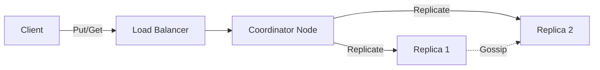
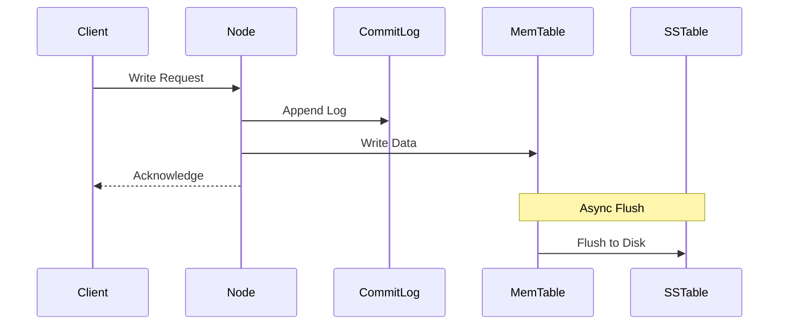

# Dynamo and Cassandra: Distributed Key-Value Stores

## Dynamo Architecture
Dynamo is a highly available, key-value store developed by Amazon. It prioritizes availability and partition tolerance (AP) over strong consistency, utilizing an "always writeable" design.

### Core Components
*   **Consistent Hashing**: Distributes data across nodes using a ring topology.
*   **Vector Clocks**: Captures causality between different versions of the same object to handle conflicts.
*   **Sloppy Quorum**: Allows writes to proceed even if the preferred nodes are unavailable, storing data on temporary nodes (Hinted Handoff).
*   **Merkle Trees**: Used for anti-entropy to detect and repair data inconsistencies in the background.

### Conflict Resolution
Dynamo uses vector clocks `[Node, Counter]` to track version history.
*   If `Clock A < Clock B`, A is an ancestor; overwrite A.
*   If concurrent, return both versions to the client for semantic reconciliation.

## Apache Cassandra
Cassandra combines Dynamo's distributed nature with BigTable's data model. It is a wide-column store optimized for high write throughput.

### Write Path
1.  **Commit Log**: Data is appended to a log on disk for durability.
2.  **MemTable**: Data is written to an in-memory structure (sorted).
3.  **SSTable**: When MemTable is full, it is flushed to disk as an immutable Sorted String Table (SSTable).

### Read Path
1.  **Bloom Filter**: Checks if the key exists in the SSTable.
2.  **Key Cache**: Checks for the key's offset.
3.  **Partition Index**: Locates the partition on disk.
4.  **SSTable Scan**: Reads the data.

### Comparison

| Feature | Dynamo | Cassandra |
| :--- | :--- | :--- |
| **Data Model** | Key-Value | Wide-Column |
| **Conflict Resolution** | Vector Clocks (Client-side) | Last-Write-Wins (LWW) |
| **Storage Engine** | Pluggable (BDB, MySQL) | LSM Tree (SSTables) |
| **Consistency** | Tunable (N, R, W) | Tunable (N, R, W) |
## 4. Practical Implementation

Explore low-level implementations of distributed storage and conflict resolution:

* [System Design: NoSQL Internals](./NOSQL_INTERNALS.md)
* [System Design: Conflict Resolution](./CONFLICT_RESOLUTION.md)
* [Machine Coding: Kafka Lite](../../../machine_coding/distributed/pub_sub/PROBLEM.md)
