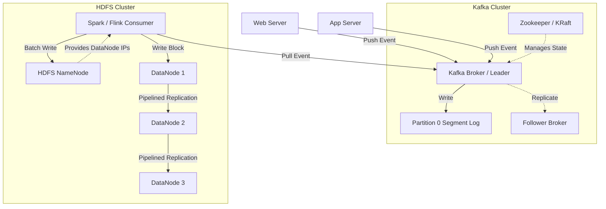

# 📨 System Design: Distributed Messaging & Storage (Kafka & HDFS)

## 📝 Overview
Apache Kafka and HDFS (Hadoop Distributed File System) are foundational distributed systems designed to handle massive volumes of sequential data. While Kafka focuses on high-throughput, low-latency event streaming acting as a distributed commit log, HDFS is optimized for securely storing petabytes of batch data across commodity hardware.

!!! abstract "Core Concepts"
    - **Distributed Commit Log (Kafka):** An ordered, immutable, and append-only sequence of records partitioned across multiple servers.
    - **Zero-Copy (Kafka):** A performance optimization that bypasses user-space buffers, transferring data directly from the OS page cache to the network socket.
    - **Master-Worker Architecture (HDFS):** A central NameNode managing filesystem metadata while horizontally scaled DataNodes store the actual massive 128MB data blocks.

---

## 🏭 The Scenario & Requirements

### 😡 The Problem (The Villain)
Point-to-point synchronous communication between dozens of microservices creates a brittle, tightly coupled architecture that instantly collapses under sudden load spikes. Meanwhile, storing the petabytes of resulting analytics, logs, and event data on traditional specialized SAN/NAS hardware is financially ruinous and introduces catastrophic single points of failure.

### 🦸 The Solution (The Hero)
Decoupling service communication using a highly available message broker (Kafka) that buffers events durably on disk, utilizing extreme sequential I/O optimizations to absorb massive traffic spikes. For permanent, large-scale historical storage, this data is continuously flushed into a distributed file system (HDFS) that automatically chunks and triple-replicates data across clusters of cheap, commodity drives.

### 📜 Requirements
- **Functional Requirements:**
    1. **Messaging:** Producers can publish messages to topics, and consumers can subscribe to and process them at their own pace.
    2. **File Storage:** Clients can write massive files reliably, and read them concurrently.
- **Non-Functional Requirements:**
    1. **High Throughput:** Must sustain gigabytes of ingress/egress per second.
    2. **Durability:** Data must survive hardware failures without loss.
    3. **Decoupling:** Producers and consumers must be completely unaware of each other's state or existence.

!!! info "Capacity Estimation (Back-of-the-envelope)"
    - **Kafka Throughput:** 1 Million messages/sec globally. Average message size = 1 KB. 
    - **Kafka Bandwidth:** 1M * 1 KB = **1 GB/sec** sustained ingress.
    - **Kafka Storage:** 1 GB/sec * 86400 seconds = **~86 TB/day**. If Kafka retains logs for 7 days, the cluster needs **~600 TB** of active SSD/NVMe storage.
    - **HDFS Storage:** The 86 TB of daily Kafka data is flushed to HDFS for permanent storage. With HDFS's default 3x replication, this consumes **~258 TB/day** of cheap HDD storage (growing to ~94 PB/year).

---

## 📊 API Design & Data Model

=== "Kafka APIs (Logical)"
    - **`PRODUCE /topic/{topic_name}`**
        - **Payload:** `{ "key": "user_123", "value": "click_event_data" }`
        - **Response:** `ACK` (Based on `acks=all`, `1`, or `0`)
    - **`CONSUME /topic/{topic_name}`**
        - **Request:** `{ "consumer_group": "analytics_team", "offset": 1045 }`
        - **Response:** `[ { "offset": 1046, "value": "..." }, ... ]`

=== "Kafka Storage Model"
    - **Segment Files:** Data is not stored in a database. It is stored on disk in raw log segments (e.g., `00000000000000000000.log`).
    - **Index Files:** Sparse indexes (e.g., `.index` and `.timeindex`) map logical message offsets and timestamps to exact physical byte positions in the `.log` file, allowing $O(1)$ disk seeks.

=== "HDFS Architecture Model"
    - **NameNode (RAM):** Maintains the file tree and metadata. Maps `Filename.txt` -> `[Block1, Block2]`. Maps `Block1` -> `[DataNode A, DataNode B, DataNode C]`.
    - **DataNode (Disk):** Stores raw blocks of data (default **128 MB** each). Sends periodic heartbeats and block reports to the NameNode.

---

## 🏗️ High-Level Architecture

### Architecture Diagram
*(A typical Big Data pipeline: Microservices -> Kafka -> HDFS)*

### Component Walkthrough

1.  **Kafka Producers:** Applications pushing data. They use the message `key` to deterministically route related events to the same Partition (guaranteeing order).
2.  **Kafka Brokers:** The servers holding the Partitions. They blindly append incoming bytes to the end of the segment log files on disk.
3.  **Zookeeper (Legacy) / KRaft (Modern):** Manages the cluster metadata, tracks which brokers are alive, and elects new partition Leaders if a broker crashes.
4.  **HDFS NameNode:** The master controller of the file system. It holds the entire namespace in RAM for lightning-fast lookups but is a single point of failure (mitigated by Standby NameNodes).
5.  **HDFS DataNodes:** Slave nodes that store the massive 128MB chunks of data. They replicate data to each other in a pipeline to minimize client network bottlenecks.

-----

## 🔬 Deep Dive & Scalability

### Handling Bottlenecks

**Kafka's Extreme Throughput (Zero-Copy & Sequential I/O)**
Standard databases suffer from random disk seeks. Kafka completely avoids this. It treats the disk strictly as an append-only log. Sequential disk I/O on modern drives can hit gigabytes per second, rivaling RAM speeds.
Furthermore, when a consumer pulls data, Kafka utilizes the OS-level `sendfile()` system call (Zero-Copy). Instead of reading data from disk into kernel space, copying it to application space, and copying it back to the network socket, Kafka instructs the OS to stream the data directly from the disk cache to the network interface, bypassing the CPU and JVM memory entirely.

**HDFS Write Pipeline**
When writing a 128MB block to HDFS, forcing the client to send the same 128MB payload three separate times to three different DataNodes would crush the client's bandwidth.
Instead, HDFS uses a **Replication Pipeline**. The client streams the block to DataNode 1. As DataNode 1 receives the bytes, it immediately streams them to DataNode 2, which streams to DataNode 3. This utilizes the internal datacenter backbone bandwidth rather than the client's uplink.

**Kafka Replication & The High-Water Mark**
Kafka replicates partitions for durability. The leader broker receives the write, and follower brokers fetch the new data. The **High-Water Mark** is the offset of the last message that has been successfully replicated to *all* in-sync replicas (ISRs). Consumers are strictly prohibited from reading messages beyond the High-Water Mark to ensure that if the leader crashes, the consumer doesn't process a message that subsequently disappears during a failover.

### ⚖️ Trade-offs

| Decision | Pros | Cons / Limitations |
| :--- | :--- | :--- |
| **Pull vs Push Consumers (Kafka)** | **Pull Model:** Consumers pull data at their own pace, preventing the broker from overwhelming slow consumers. Allows aggressive batching. | Consumers must constantly poll the broker, potentially wasting CPU cycles if the topic is empty (mitigated by long-polling). |
| **Kafka vs RabbitMQ** | Kafka's append-only log allows "time-travel" (replaying events). Millions of msgs/sec throughput. | RabbitMQ offers complex routing topologies and per-message acknowledgments, which Kafka's strict sequential partition model cannot do natively. |
| **HDFS 128MB Blocks vs Standard 4KB Blocks** | Drastically reduces the metadata footprint stored in the NameNode's RAM. Optimizes disk seek-to-read ratios. | Terrible for storing millions of tiny files (the "Small File Problem" will crash the NameNode's memory). |

-----

## 🎤 Interview Toolkit

  - **Scale Question:** "A Kafka consumer group is falling behind, and lag is increasing. How do you scale it?" -\> *You can only have as many active consumers in a group as there are Partitions in the topic. If a topic has 10 partitions and you have 10 consumers, adding an 11th consumer does nothing; it will sit idle. You must fundamentally increase the number of partitions on the broker first, then scale the consumer instances.*
  - **Failure Probe:** "The HDFS NameNode server catches fire. Is the data lost?" -\> *The raw data still exists on the DataNodes, but it is completely inaccessible because the NameNode's RAM held the 'map' of which blocks belong to which files. To survive this, HDFS uses a highly available Standby NameNode that continuously replays the Active NameNode's edit logs from a shared Journal, allowing instant failover.*
  - **Edge Case:** "How does Kafka prevent a producer from causing duplicate messages on a network retry?" -\> *Idempotent Producers. The producer assigns a unique Sequence Number and Producer ID to every batch. If the broker successfully writes the batch but the ACK is lost in the network, the producer retries. The broker sees the identical Sequence Number and safely ignores the duplicate write.*

## 🔗 Related Architectures

  - [System Design: NoSQL Internals](../../deep_dives/NOSQL_INTERNALS.md) — For deep dives into append-only logs and LSM Trees.
  - [Machine Coding: Kafka Lite](../../../machine_coding/distributed/pub_sub/PROBLEM.md) — Build your own sequential log storage.
  - [System Design: Distributed Storage (GFS)](../../deep_dives/GFS.md) — The Google precursor that heavily inspired HDFS.
