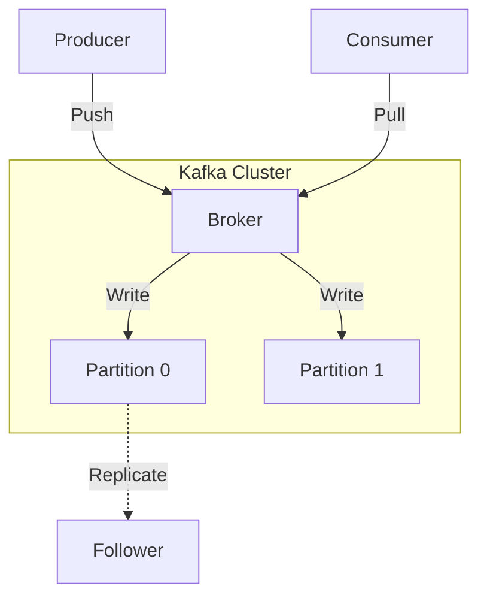
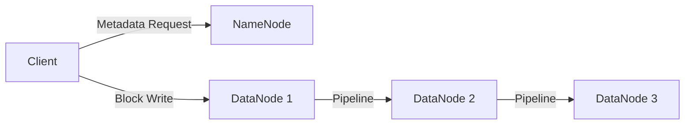

# Kafka and HDFS: Messaging and Storage

## Apache Kafka
Kafka is a distributed streaming platform designed for high-throughput, low-latency log processing. It functions as a distributed commit log.

### Architecture
*   **Topic**: A category of messages.
*   **Partition**: An ordered, immutable sequence of records.
*   **Broker**: A Kafka server hosting partitions.
*   **Zookeeper**: Manages cluster metadata and leader election.

### Log Storage
Kafka stores messages in segment files.
*   **Sequential I/O**: Maximizes disk throughput.
*   **Zero-Copy**: Uses `sendfile` to transfer data directly from disk to network socket.
*   **High-Water Mark**: The offset of the last message successfully replicated to all sync replicas. Consumers can only read up to this point.

## Hadoop Distributed File System (HDFS)
HDFS is a master-slave architecture designed to store vast amounts of data on commodity hardware.

### Components
*   **NameNode (Master)**: Manages the file system namespace (metadata, file tree). Single point of failure (mitigated by standby nodes).
*   **DataNode (Slave)**: Stores the actual data blocks. Sends heartbeats and block reports to NameNode.

### Data Flow
Files are split into large blocks (e.g., 128MB) and replicated (default 3x).

### GFS vs. HDFS

| Feature | GFS (Google File System) | HDFS |
| :--- | :--- | :--- |
| **Architecture** | Master/ChunkServer | NameNode/DataNode |
| **Block Size** | 64 MB | 128 MB (default) |
| **Write Model** | Append-only focus | Write-once, Read-many |
| **Consistency** | Relaxed | Stronger (checksums) |
## 4. Practical Implementation

Explore low-level implementations of distributed logs and large-scale file storage:

* [System Design: NoSQL Internals](./NOSQL_INTERNALS.md)
* [Machine Coding: Kafka Lite](../../../machine_coding/distributed/pub_sub/PROBLEM.md)
