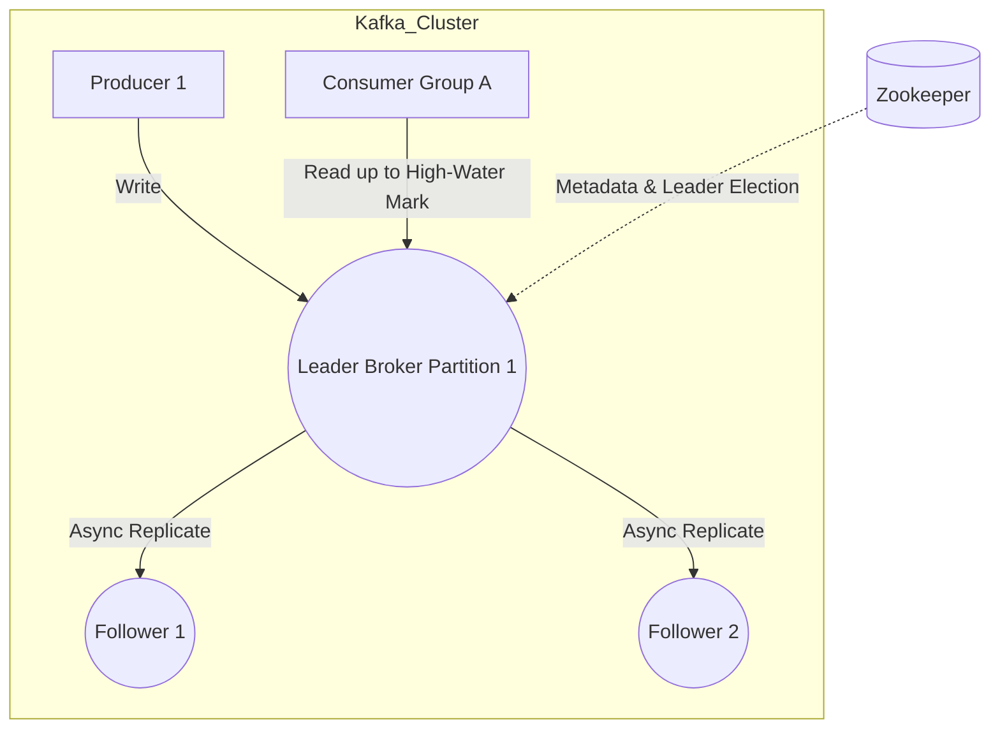

# Deep Dive: Kafka and HDFS Architectures

This document details the internal architecture of **Apache Kafka** (distributed streaming and messaging platform) and the **Hadoop Distributed File System (HDFS)**, focusing on how they achieve massive throughput and fault tolerance.

---

## 1. Apache Kafka: Event Streaming Architecture

Kafka operates as a **distributed commit log**, functioning as both a **message queue** and a **publish-subscribe system**. It is heavily optimized for **sequential disk I/O**.

### Core Abstractions

- **Topics & Partitions**: Messages are categorized into topics. Topics are split into **partitions**, each being an **ordered, immutable sequence of messages**.
- **Segmented Logs**: Partitions are split into smaller files called **Segments** to avoid performance bottlenecks during purging.
- **Consumer Groups**: Only a **single consumer** reads messages from a partition in a consumer group, allowing **parallel processing**.

### Leader-Follower Replication & Consistency

- Each partition has **one Leader broker** and multiple **Follower brokers**.
- **High-Water Mark**: Tracks the largest offset that all **In-Sync Replicas (ISRs)** share. Consumers read messages **up to this mark** to ensure consistency.
- **Split-Brain Resolution**: Kafka uses an **Epoch Number** stored in **Zookeeper** to detect and ignore zombie controllers.

### Architecture Overview

## 2. Hadoop Distributed File System (HDFS)

HDFS is designed to **store massive, unstructured files** (terabytes) and **stream them at high bandwidth** to user applications, optimized for the **MapReduce paradigm**.

### Architecture Mechanics

- **DataNodes & Blocks**: Files are split into **128MB Blocks**. DataNodes store blocks as normal Linux files.
- **NameNode (Control Plane)**: Master server managing filesystem metadata. Maintains the **directory tree** and **file-to-block mapping** in memory.
- **Decoupled Data Flow**: Clients query the NameNode **only for metadata**. Data transfer happens directly between **Client → DataNodes**.

### NameNode Fault Tolerance

- The NameNode is a **Single Point of Failure (SPOF)**; HDFS uses **Active-Standby configuration**.
- **EditLog**: Write-Ahead Log storing metadata mutations.
- **FsImage**: Point-in-time snapshot of filesystem metadata.
- **QJM (Quorum Journal Manager)**: Shared storage cluster syncing the EditLog between Active & Standby NameNodes.

### GFS vs. HDFS Comparison

| Feature | Google File System (GFS) | Hadoop Distributed File System (HDFS) |
| :--- | :--- | :--- |
| Storage Node | ChunkServer | DataNode |
| File Part Size | 64 MB (Chunk) | 128 MB (Block) |
| Concurrency | Multiple concurrent writers & readers | Write-once, read-many (No concurrent writers) |
| Garbage Collection | Lazy deletion (renamed to hidden folder) | Lazy deletion (renamed to hidden folder) |
| Caching | Clients cache metadata | Clients do not cache file data; DataNodes use off-heap caching |

## 3. Practical Implementation

Explore low-level code implementations of publish/subscribe mechanisms:

* [Machine Coding: Kafka Lite](../../../machine_coding/distributed/pub_sub/PROBLEM.md)
