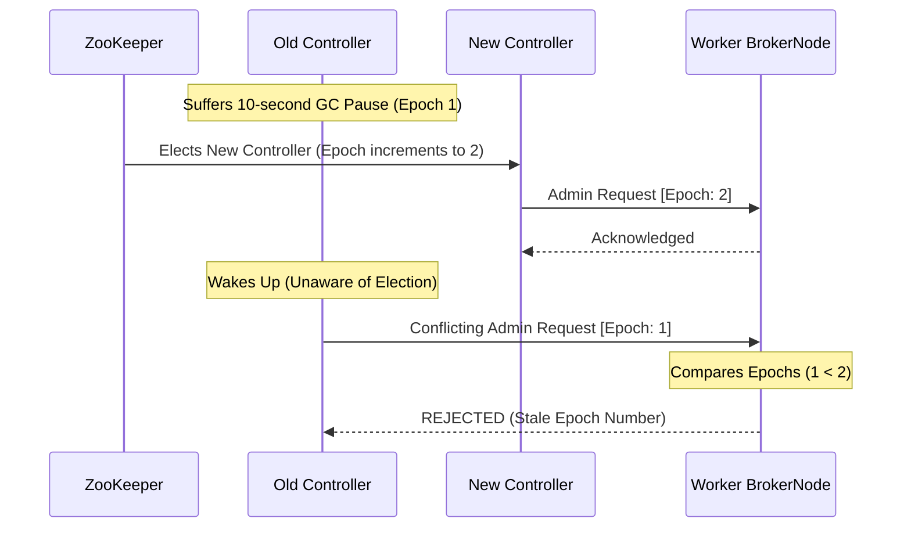

# Deep Dive: Kafka Controller Split-Brain & Epoch Numbers

Apache Kafka relies on a central coordinating node to manage cluster state. This introduces the risk of a "Split-Brain" scenario, where the cluster loses consensus on which node is actually in charge, potentially leading to catastrophic data inconsistency.

## 1. The Controller Broker

Within a Kafka cluster, one specific broker is elected via ZooKeeper to act as the Controller.

**Responsibilities:** The Controller handles critical administrative operations, including creating/deleting topics, assigning partition leaders, and monitoring the health of all other brokers.

**Failover:** If the Controller fails to receive a heartbeat from a broker, it initiates a failover and communicates the new partition leader assignments to the rest of the cluster.

## 2. The Split-Brain Scenario (Zombie Controllers)

A split-brain scenario arises not from a permanent crash, but from an intermittent failure.

**The Pause:** The active Controller experiences a temporary network disruption or a severe "stop-the-world" Garbage Collection (GC) pause.

**The New Election:** Because the cluster cannot definitively determine if the leader is permanently down or just paused, ZooKeeper drops the Controller's session and the cluster elects a new Controller.

**The Zombie Awakens:** The original Controller recovers from its GC pause. It is completely unaware that it was replaced and that another broker has assumed its responsibilities. It acts as a Zombie Controller.

**The Conflict:** The cluster now has two active controllers operating in parallel, issuing conflicting administrative commands to the broker nodes.

## 3. The Solution: Generation Clocks (Epoch Numbers)

To prevent brokers from obeying a Zombie Controller, Kafka utilizes a generation clock, implemented as an Epoch Number.

**Mechanism:** The Epoch Number is a monotonically increasing integer securely maintained within ZooKeeper.

**Incrementing:** When the cluster elects a new Controller, the epoch number is incremented (e.g., from Epoch 1 to Epoch 2).

**The Request Contract:** The active Controller is strictly required to include this epoch number in every single administrative request it sends to the other brokers.

**The Rejection Flow:**  
Because the epoch number is strictly increasing, receiving brokers use it to seamlessly differentiate between the legitimate Controller and the stale zombie.

By strictly trusting and accepting commands only from the Controller with the highest known epoch number, brokers automatically drop and reject any conflicting commands issued by a zombie controller operating with an outdated generation clock.

## 3. Practical Implementation

Explore the low-level implementations of epoch-based consensus and distributed logs:

* [System Design: Kafka Deep Dive](./KAFKA_DEEP_DIVE.md)
* [Machine Coding: Kafka Lite](../../../machine_coding/distributed/pub_sub/PROBLEM.md)
