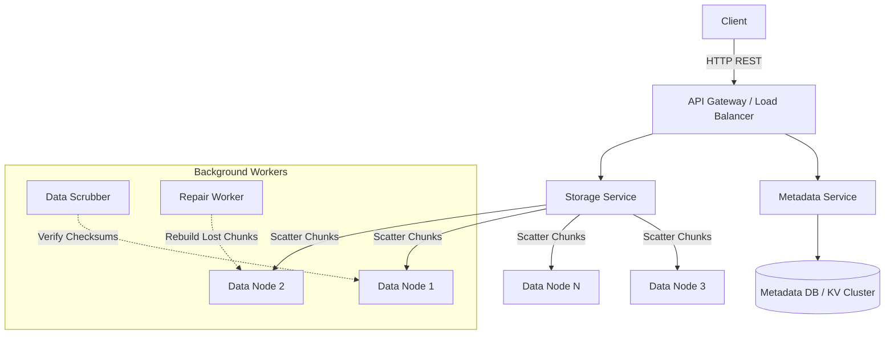

# 📦 System Design: S3 Lite (Object Storage)

## 📝 Overview
A distributed object store (like Amazon S3) is a massively scalable, flat-namespace storage architecture designed to hold exabytes of unstructured data (blobs) ranging from tiny text files to massive 5TB video archives. It is engineered for extreme durability, ensuring that data remains intact even across catastrophic hardware and datacenter failures.

!!! abstract "Core Concepts"
    - **Metadata Separation:** Decoupling the lightweight object metadata (name, size, permissions) from the heavy raw binary data to allow both layers to scale independently.
    - **Erasure Coding:** A mathematical method of breaking data into fragments and expanding it with redundant parity data, achieving higher durability than standard replication while using significantly less disk space.
    - **Multipart Uploads:** Chunking massive files at the client level to upload them in parallel, ensuring resilience against network drops.

---

## 🏭 The Scenario & Requirements

### 😡 The Problem (The Villain)
"Bit Rot" and hardware failures. If you store 10 Petabytes of data across thousands of spinning magnetic hard drives, it is a statistical certainty that several drives will permanently fail every single day. Furthermore, over a 10-year span, bits on healthy drives will randomly flip from `0` to `1` (silent data corruption). If you rely on a single monolithic database or file system, entire datasets will be irrecoverably lost.

### 🦸 The Solution (The Hero)
A decoupled architecture where metadata is managed by a high-speed Key-Value cluster, and the raw binary blobs are chunked, Erasure Coded, and scattered across a massive fleet of dumb "Data Nodes." A fleet of background "Scrubber" processes continuously reads the disks, verifies checksums to detect bit rot, and automatically repairs damaged fragments before permanent loss occurs.

### 📜 Requirements
- **Functional Requirements:**
    1. Users can upload, download, and delete objects using a REST API.
    2. Objects are logically grouped into "Buckets."
    3. The system supports Multipart Uploads for massive files.
- **Non-Functional Requirements:**
    1. **Extreme Durability:** **99.999999999%** (11 nines) – data must never be lost.
    2. **High Availability:** **99.99%** uptime – the system must be reachable globally.
    3. **Infinite Scalability:** Must scale horizontally to handle trillions of objects and Exabytes of capacity without hitting namespace bottlenecks.

!!! info "Capacity Estimation (Back-of-the-envelope)"
    - **Traffic:** 10 Million Active Users uploading an average of 100MB per day $\rightarrow$ **1 PB of new data ingested per day**.
    - **Storage Scale:** Over 5 years, this results in roughly **1.8 Exabytes** of raw data.
    - **Bandwidth:** 1 PB / 86400 seconds = **~11.5 GB/sec** of sustained ingress bandwidth globally. Egress (reads) is typically 2x to 10x higher depending on the use case (e.g., serving assets to a CDN).

---

## 📊 API Design & Data Model

=== "REST APIs"
    - **`PUT /api/v1/{bucket_name}/{object_key}`**
        - **Headers:** `Content-Length: 1048576`, `Content-MD5: ...`
        - **Payload:** Raw binary blob.
        - **Response:** `200 OK` (Indicates the object is safely replicated/coded on disk).
    - **`GET /api/v1/{bucket_name}/{object_key}`**
        - **Response:** `200 OK` + Binary payload stream.
    - **`POST /api/v1/{bucket_name}/{object_key}?uploads`**
        - **Response:** `{ "upload_id": "xyz123" }` *(Initiates a multipart upload session).*

=== "Database Schema"
    - **Metadata Store (Cassandra / DynamoDB):**
        - `object_id` (String, PK) - e.g., `bucket_name/path/to/image.jpg`
        - `size_bytes` (BigInt)
        - `content_hash` (String) - MD5 or SHA-256 for integrity checks
        - `chunk_manifest` (JSON) - Maps the logical object to the physical Data Node IPs and chunk IDs.
        - `creation_date` (Timestamp)
    - **Data Nodes (Raw File System):**
        - Does not use a relational database. Stores data directly on XFS/ext4 filesystems as large contiguous blocks, addressable by a unique `ChunkID`.

---

## 🏗️ High-Level Architecture

### Architecture Diagram

### Component Walkthrough

1.  **API Gateway:** Authenticates requests, handles rate limiting, and routes API calls based on whether they are metadata operations (like listing a bucket) or data operations (uploading bytes).
2.  **Metadata Service & DB:** A highly available, low-latency Key-Value store. It holds the namespace (bucket and object names) and the critical mapping of where the raw bytes physically live.
3.  **Storage Service:** The heavy lifter. It receives the binary payload, calculates checksums, performs Erasure Coding, and orchestrates the parallel writing of data chunks to the underlying Data Nodes.
4.  **Data Nodes:** Dumb, commodity servers packed with massive hard drives. They simply save chunks to disk and serve them when requested.
5.  **Data Scrubbers & Repair Workers:** Asynchronous daemon processes that constantly read chunks from Data Nodes, verify them against the `content_hash` stored in the Metadata DB, and reconstruct any chunks that are corrupted or residing on failed drives.

-----

## 🔬 Deep Dive & Scalability

### Handling Bottlenecks

**Durability at Scale: Erasure Coding vs. 3x Replication**
If you use standard 3x Replication for 1 Exabyte of user data, you must purchase and power 3 Exabytes of physical hard drives. This is financially unscalable.

  - *The Fix (Erasure Coding):* The Storage Service breaks an object into a set of Data Chunks (e.g., 8 chunks) and computes Parity Chunks (e.g., 4 chunks) using Reed-Solomon mathematics. These 12 chunks are scattered across 12 different physical servers. The system can lose *any* 4 servers simultaneously and still perfectly reconstruct the original file. This provides higher durability than 3x replication while only requiring 1.5x storage overhead (1.5 Exabytes instead of 3).

**Uploading Massive Files: Multipart Uploads**
If a user attempts to upload a 5TB video file in a single HTTP stream, any minor network drop at 99% completion will force the entire 5TB upload to restart.

  - *The Fix:* The client software breaks the 5TB file into smaller, 100MB chunks. It calls the `?uploads` endpoint to get an `upload_id`, and then uploads the 100MB parts in parallel. If part \#42 fails, only part \#42 is retried. Once all parts are uploaded, the client sends a `CompleteMultipartUpload` request. The Storage Service simply updates the `chunk_manifest` in the Metadata DB to logically stitch them together; no actual data copying is required on the backend.

**The Metadata Hot-path (Listing a Bucket)**
If a user requests a list of all 1 Billion files inside a bucket, querying the raw Data Nodes is impossible.

  - *The Fix:* This is why Metadata is separated. The `Metadata DB` is optimized for prefix/range scans. The API Gateway routes the `LIST` request strictly to the Metadata Service, which rapidly returns the logical keys from the KV store without ever touching the slow, disk-bound Data Nodes.

### ⚖️ Trade-offs

| Decision | Pros | Cons / Limitations |
| :--- | :--- | :--- |
| **Erasure Coding vs 3x Replication** | Saves massive amounts of disk space (e.g., 50% storage savings). | High CPU overhead to calculate parity. Rebuilding a lost chunk requires pulling data from multiple nodes over the network, causing heavy East-West traffic. |
| **Separating Metadata from Data** | Allows the metadata database (Cassandra) to be tuned for low-latency queries, while Data Nodes are optimized for bulk sequential I/O. | Introduces system complexity. You must handle edge cases where a chunk is successfully written to a Data Node, but the Metadata DB update fails (leaving an orphaned "dark" chunk on disk). |
| **Eventual vs Strong Consistency** | S3 originally used Eventual Consistency for overwrites, allowing blazing-fast Availability (AP). | Led to confusing bugs where users overwrote a file, immediately read it back, and got the old version. (Note: AWS S3 moved to Strong Read-After-Write consistency in 2020 by implementing complex cache invalidation and locking). |

-----

## 🎤 Interview Toolkit

  - **Scale Question:** "How do you handle a single 'hot' object, like an iOS update file, being downloaded millions of times a minute?" -\> *S3 is not a CDN. The internal network will bottleneck. You must place a Content Delivery Network (e.g., CloudFront) in front of the object store to cache the file at Edge locations, absorbing 99% of the read traffic before it hits the Storage Service.*
  - **Failure Probe:** "A rack switch dies, taking 40 Data Nodes offline simultaneously. Does the user notice?" -\> *If using our 8+4 Erasure Coding scheme and the chunks were strictly distributed across different racks (Fault Domains), the system can survive the loss of an entire rack. The Storage Service mathematically rebuilds the missing chunks on-the-fly from the surviving racks and returns the file to the user with a slight latency penalty.*
  - **Edge Case:** "What happens if a user deletes an object while another user is currently downloading it?" -\> *The Metadata Service immediately deletes the mapping (or marks it with a tombstone), preventing new downloads. However, the raw chunks on the Data Nodes are kept alive as long as the active TCP download stream holds a reference to them. Once the stream closes, a background Garbage Collection worker physically deletes the orphaned chunks.*

## 🔗 Related Architectures

  - [System Design: Distributed KV Store](KV_STORE.md) — Deep dive into the Cassandra/Dynamo-style databases used for the Metadata layer.
  - [System Design: Distributed Storage (GFS)](../../deep_dives/GFS.md) — The precursor to modern object stores, focusing heavily on master-node chunk allocation.
  - [Machine Coding: Cache System](../../../machine_coding/systems/cache/PROBLEM.md) — Understanding the caching layers often placed in front of object storage.
