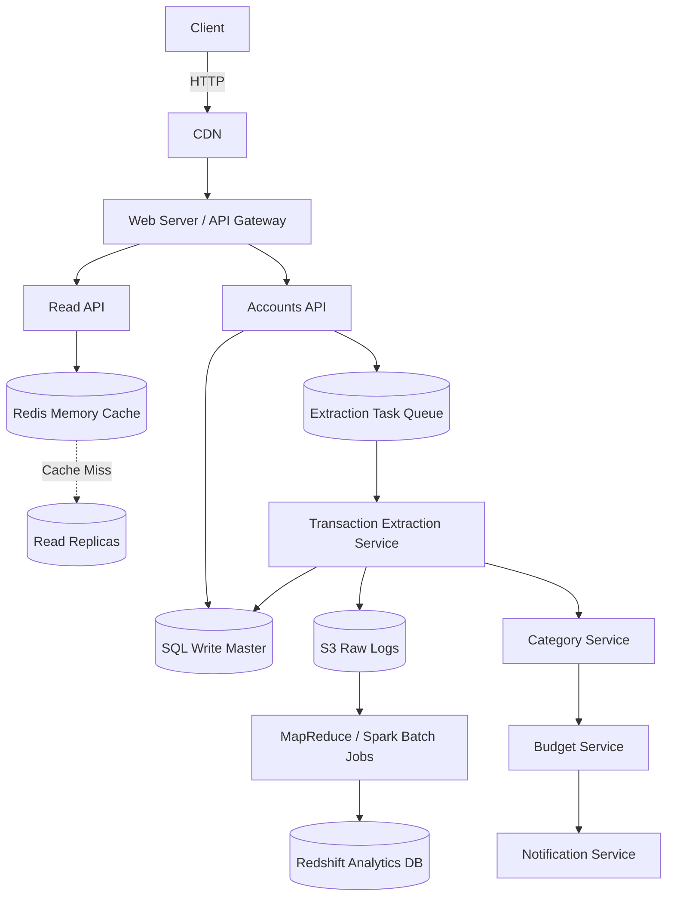

# 🏦 System Design: Mint.com (Personal Finance Dashboard)

## 📝 Overview
Mint is a personal financial management service that securely connects to users' bank accounts, automatically ingests and categorizes daily transactions, and provides budgeting insights. The system is characterized by an unusual **write-heavy** workload driven by massive daily batch extractions from third-party financial institutions.

!!! abstract "Core Concepts"
    - **Asynchronous Data Ingestion:** Utilizing message queues (SQS/RabbitMQ) to decouple slow, unpredictable third-party bank API scrapes from the core application.
    - **MapReduce Aggregation:** Offloading heavy monthly spending calculations from the primary transactional database to distributed batch processing jobs over raw logs.
    - **Crowdsourced Categorization:** Leveraging manual user overrides to dynamically build a predictive category mapping for unknown sellers using an $O(1)$ Top-K heap approach.

---

## 🏭 The Scenario & Requirements

### 😡 The Problem (The Villain)
Managing finances across multiple banks and credit cards is manual, fragmented, and tedious. Users must log into a dozen different portals, manually export CSVs, and categorize line items in spreadsheets to understand if they are adhering to their budget.

### 🦸 The Solution (The Hero)
A highly available, automated aggregation engine. The system syncs with bank accounts daily (for active users), asynchronously extracts transactions, intelligently categorizes them, and provides immediate, cross-account budgeting insights and threshold alerts.

### 📜 Requirements
- **Functional Requirements:**
    1. Users can connect third-party financial accounts.
    2. Service automatically extracts transactions daily for users active in the past 30 days.
    3. Service automatically categorizes transactions (users can manually override categories).
    4. Service recommends budgets and calculates aggregate monthly spending by category.
    5. Users receive asynchronous notifications when nearing or exceeding budgets.
- **Non-Functional Requirements:**
    1. **High Availability:** The frontend read-path must remain highly available.
    2. **Eventual Consistency:** Budget notifications and aggregate updates do not need to be instantly real-time.
    3. **Scalability:** Must comfortably handle intense backend write-heavy batch processing.

!!! info "Capacity Estimation (Back-of-the-envelope)"
    - **Traffic:** 10 Million users. 30 Million financial accounts.
    - **Workload:** 5 Billion transactions/month. 500 Million read requests/month. $\rightarrow$ **10:1 Write/Read ratio** (highly unusual; users make transactions daily, but visit the app infrequently).
    - **Throughput:** ~2,000 transaction writes/sec average. ~200 read requests/sec average.
    - **Storage (Transactions):** `user_id` (8B) + `created_at` (5B) + `seller` (32B) + `amount` (5B) = **~50 bytes per transaction**.
    - **Total Storage:** 50 bytes * 5 Billion/month = **250 GB/month**. $\rightarrow$ **~9 TB of raw transaction data in 3 years**.

---

## 📊 API Design & Data Model

=== "REST APIs"
    - **`POST /api/v1/account`**
        - **Request:** `{ "user_id": "123", "account_url": "chase.com", "account_login": "user", "account_password": "encrypted_blob" }`
        - **Response:** `202 Accepted`
    - **`GET /api/v1/spending/summary`**
        - **Query Params:** `?user_id=123&month_year=2023-10`
        - **Response:** `[ {"category": "Housing", "amount": 1200.00}, {"category": "Food", "amount": 350.00} ]`
    - **`POST /api/v1/transaction/{tx_id}/category`**
        - **Request:** `{ "new_category": "BUSINESS_EXPENSE" }`

=== "Database Schema"
    - **Table:** `accounts` (SQL RDBMS)
        - `id` (Int, PK)
        - `user_id` (Int, FK, Indexed)
        - `account_url` (Varchar 255)
        - `account_credentials` (Encrypted Blob)
        - `last_update` (Datetime)
    - **Table:** `transactions` (SQL or Wide-Column NoSQL)
        - `id` (Int, PK)
        - `user_id` (Int, FK, Indexed)
        - `seller` (Varchar 32)
        - `amount` (Decimal)
        - `created_at` (Datetime, Indexed)
    - **Table:** `monthly_spending` (SQL / Data Warehouse)
        - `id` (Int, PK)
        - `user_id` (Int, FK, Indexed)
        - `month_year` (Date)
        - `category` (Varchar 32)
        - `amount` (Decimal)
    - **Table:** `budget_overrides` (SQL)
        - *Note: To save space, we generate default budgets dynamically (e.g., Housing = Income * 40%) and only store explicit user overrides.*

---

## 🏗️ High-Level Architecture

### Architecture Diagram

### Component Walkthrough

1.  **Accounts API & Queue:** Handles linking accounts and triggering daily updates. Because scraping bank APIs is slow and prone to timeouts, tasks are immediately pushed to a Message Queue (SQS/RabbitMQ).
2.  **Transaction Extraction Service:** Asynchronous worker nodes pull tasks from the queue, scrape the bank data, and dump the raw logs directly into an Object Store (S3) to prevent data loss.
3.  **Category Service:** Intercepts raw transactions and assigns them a category (e.g., "Target" $\rightarrow$ "SHOPPING") before writing to the database.
4.  **MapReduce & Analytics DB:** Instead of running heavy aggregation queries on the transactional DB, MapReduce jobs process the raw S3 logs to calculate `monthly_spending` rollups, pushing results to a Data Warehouse (Amazon Redshift).
5.  **Memory Cache:** Sits in front of the Read API to absorb the 200 QPS of user traffic, serving pre-calculated monthly dashboards in $O(1)$ time.

-----

## 🔬 Deep Dive & Scalability

### Handling Bottlenecks

**Bottleneck: 2,000 Write QPS Overload**
A sustained 2,000 writes/sec (with much higher peak spikes during early morning automated batch runs) will overwhelm a single SQL Write Master.

  - **Solution A:** Employ SQL scaling patterns like **Sharding** (partitioning the `transactions` table by `user_id`) to distribute write load.
  - **Solution B:** Migrate the `transactions` table entirely to a natively distributed **NoSQL Database** (like Cassandra), which excels at write-heavy workloads.

**Heavy Analytics on Transactional Data**
Generating monthly spending reports requires summing millions of rows. Doing this on the primary SQL DB will cause lock contention and slow down active transaction insertions.

  - **Solution:** Move the aggregation to a separate **Analytics Database**. Use MapReduce on the raw log files (e.g., parsing `user_id \t timestamp \t seller \t amount`) to pre-compute the totals and insert them into the `monthly_spending` table.

### Categorization Strategy

Seeding a default map for 50,000 known sellers only takes \~12 MB of memory (`{"Exxon": "GAS"}`). However, new sellers appear constantly.

  - **Crowdsourcing Engine:** We maintain a secondary map of user manual overrides. We use a **Max-Heap** to quickly track and look up the top manual override category for unknown sellers in $O(1)$ time, dynamically updating our global categorization rules.

### ⚖️ Trade-offs

| Decision | Pros | Cons / Limitations |
| :--- | :--- | :--- |
| **Async Polling via Queues** | Protects internal systems from slow/failing 3rd-party bank APIs. | Increased system complexity. Users must wait to see new transactions after linking an account. |
| **SQL vs NoSQL for Transactions** | SQL offers strict ACID guarantees (crucial for finance). | Harder to scale horizontally for the 2,000+ Write QPS workload. |
| **Dynamic Budget Generation** | Massively reduces storage (avoids storing 100M static budget rows). | Requires runtime CPU cycles to calculate `Income * Category%` on the fly. |

-----

## 🎤 Interview Toolkit

  - **Scale Question:** "How do you handle the 3 AM traffic spike when the system attempts to sync 10 million bank accounts simultaneously?" -\> *Use the Message Queue as a shock absorber (Back Pressure). The API instantly enqueues 10 million tasks, and a horizontally scaled auto-scaling group of Extraction Workers processes them at a safe, controlled rate over several hours.*
  - **Failure Probe:** "What happens if the Categorization Service goes down during a batch extraction?" -\> *Implement Graceful Degradation. The Extraction Service catches the exception, labels the transactions as 'UNCATEGORIZED', saves them to the DB, and pushes a task to a Retry Queue to re-evaluate them once the Category Service recovers.*
  - **Edge Case:** "A user manually changes a transaction's category from 'FOOD' to 'BUSINESS'. How does the system update?" -\> *The API updates the `transactions` table and triggers an event. A targeted MapReduce or background job recalculates the `monthly_spending` aggregates for that specific `user_id` and `month_year` to reflect the change.*

## 🔗 Related Architectures

  - [System Design: E-Commerce Order System](../../../machine_coding/real_world_systems/e_commerce_order_system/PROBLEM.md) — Another highly asynchronous architecture relying heavily on Message Queues for third-party integrations.
  - [Architecture Patterns: MapReduce](../../pillars/ARCHITECTURE_PATTERNS.md) — Deep dive into how raw logs are transformed into aggregated analytics databases.
