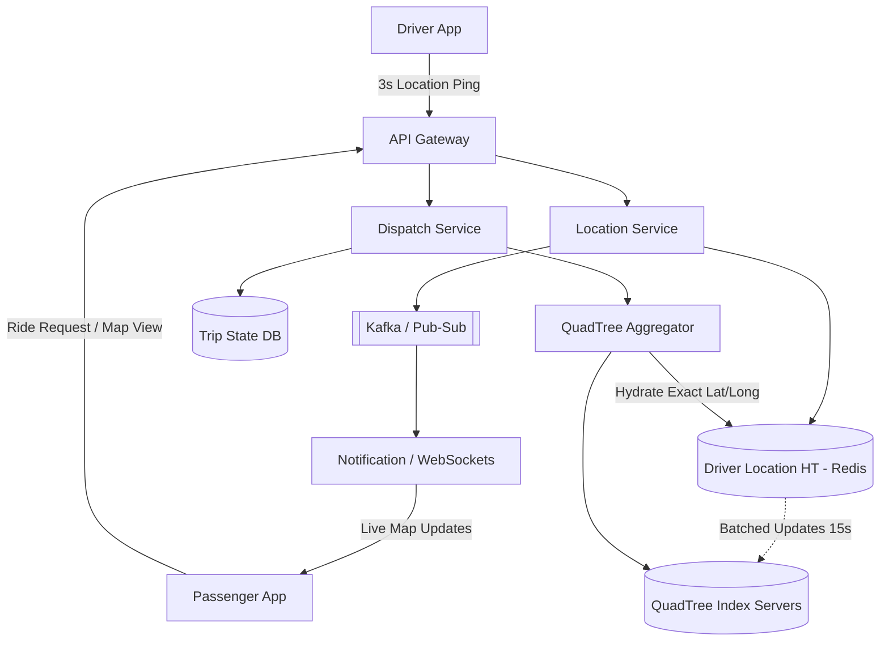

# 🚖 System Design: Uber (Ride-Hailing & Geospatial)

## 📝 Overview
Uber is a real-time dispatch and ride-hailing platform that connects passengers with nearby active drivers. The architecture revolves around solving complex geospatial querying at scale, managing stateful trip lifecycles, and absorbing massive, continuous write-heavy workloads from millions of moving vehicles.

!!! abstract "Core Concepts"
    - **Geospatial Indexing:** Using memory-efficient data structures (like QuadTrees or Uber's H3 Hexagonal Hierarchical Spatial Index) to perform rapid proximity searches.
    - **Read/Write Decoupling:** Shielding the complex spatial search trees from the relentless onslaught of 3-second driver location pings.
    - **Real-Time Pub/Sub:** Broadcasting live driver movements to passengers via persistent connections (WebSockets/Server-Sent Events).

---

## 🏭 The Scenario & Requirements

### 😡 The Problem (The Villain)
Storing locations in a standard relational database (Lat, Long) and querying via a bounding box (`WHERE lat BETWEEN X AND Y`) is extremely slow at scale because it requires intersecting massive datasets in memory. Furthermore, active drivers are constantly moving, pinging their coordinates every 3 seconds. If you update a complex distributed spatial index synchronously with every ping, the system experiences "tree thrashing" (constant node splitting and merging) and melts down under the write amplification.

### 🦸 The Solution (The Hero)
An in-memory **QuadTree** index used *strictly* for spatial read queries, shielded by a high-throughput **Driver Location Hash Table (Redis)** that absorbs the rapid 3-second writes. The QuadTree is only updated asynchronously in batches, decoupling the heavy write path from the heavy read path.

### 📜 Requirements
- **Functional Requirements:**
    1. Drivers can continuously broadcast their current location.
    2. Passengers can see nearby drivers in real-time on a map.
    3. Passengers can request a ride, and the system matches them with the optimal driver.
- **Non-Functional Requirements:**
    1. **Low Latency:** Driver matching must occur in milliseconds.
    2. **High Write Throughput:** The system must absorb millions of location pings per second.
    3. **Consistency:** Trip state transitions (Requested -> Accepted -> In-Progress -> Completed) must be strictly consistent to avoid double-booking a driver.

!!! info "Capacity Estimation (Back-of-the-envelope)"
    - **Traffic (Writes):** 1 Million active drivers pinging every 3 seconds = **~333,000 writes/sec**.
    - **Storage (QuadTree Memory):** 1M drivers * 24 bytes (DriverID + Lat/Long) = **~24 MB**. *The entire global driver state easily fits in the RAM of a single machine, but is sharded for compute throughput and high availability.*
    - **Storage (Hash Table):** 1M * 35 bytes (DriverID, Old/New Lat/Long) = **~35 MB**.
    - **Bandwidth (Egress):** If 500K active customers subscribe to the live locations of 5 nearby drivers, the system manages 2.5M active subscriptions. Pushing 19 bytes per driver every 3 seconds requires **~47.5 MB/s** of egress bandwidth.

---

## 📊 API Design & Data Model

=== "REST APIs"
    - **`POST /api/v1/driver/location`** *(Often sent via UDP or MQTT to save overhead)*
        - **Request:** `{ "driver_id": "d123", "lat": 37.7749, "lng": -122.4194 }`
        - **Response:** `202 Accepted`
    - **`GET /api/v1/passengers/nearby-drivers`**
        - **Query Params:** `?lat=37.77&lng=-122.41&radius_km=5`
        - **Response:** `[ { "driver_id": "d123", "lat": 37.7749, "lng": -122.4194, "eta_mins": 3 }, ... ]`
    - **`POST /api/v1/trips/request`**
        - **Request:** `{ "passenger_id": "p987", "pickup": {...}, "dropoff": {...} }`
        - **Response:** `{ "trip_id": "t456", "status": "SEARCHING" }`

=== "Database Schema"
    - **DriverLocationHT (Redis):**
        - `Key:` `driver:{driver_id}`
        - `Value:` `{ "lat": 37.7749, "lng": -122.4194, "timestamp": 1634567890 }`
    - **Trip DB (Cassandra / Postgres):**
        - `trip_id` (UUID, PK)
        - `passenger_id` (String, Indexed)
        - `driver_id` (String, Indexed)
        - `status` (Enum: REQUESTED, DISPATCHED, IN_PROGRESS, COMPLETED)
        - `fare` (Decimal)

---

## 🏗️ High-Level Architecture

### Architecture Diagram

### Component Walkthrough

1.  **Location Service:** A massive ingest pipeline built to absorb hundreds of thousands of concurrent writes per second.
2.  **Driver Location HT (Redis):** The absolute source of truth for the *current* coordinates of any driver.
3.  **QuadTree Index Servers:** In-memory spatial index. A tree where each node represents a geographical region. If a region contains too many points (e.g., \> 500 drivers), it splits into four quadrants (NW, NE, SW, SE).
4.  **QuadTree Aggregator:** Since the QuadTree is often sharded by region, this service queries multiple tree shards to gather results for a wide search radius, merges them, and returns the best matches.
5.  **Dispatch Service:** Executes the business logic of matching. It queries the Aggregator for nearby drivers, filters out those currently on a trip via the Trip DB, and sends push notifications to drivers proposing the fare.

-----

## 🔬 Deep Dive & Scalability

### Handling Bottlenecks

**Static vs. Dynamic Geospatial Indexing (Yelp vs. Uber)**
For a static service like Yelp, physical places (restaurants) do not move. The structural integrity of the QuadTree is stable, and it can be updated in nightly batches.
Uber's active drivers move constantly. Updating the QuadTree synchronously with every 3-second ping would melt the system down as drivers crossing grid boundaries trigger computationally expensive node insertions, deletions, partitions, and merges.

**The Fix: Decoupling & Batched Updates**
Uber decouples the rapid location updates from the spatial index using Redis. The Location Service writes the exact coordinates to Redis instantly. However, it only notifies the QuadTree servers at a slower, asynchronous cadence (e.g., every 15 seconds), or *only* if the driver has physically crossed a significant QuadTree boundary.

**Grid Cushioning**
To further mitigate the risk of tree thrashing (continuous partitioning and merging of grids due to drivers hovering directly on a boundary line), Uber implements a dynamic "cushion." Grids are allowed to temporarily grow or shrink by an extra 10% beyond their predefined limit (e.g., holding 550 drivers instead of the strict 500 limit) before a structural partition or merge is strictly enforced.

### ⚖️ Trade-offs

| Decision | Pros | Cons / Limitations |
| :--- | :--- | :--- |
| **QuadTrees vs Google S2 / Uber H3** | QuadTrees are intuitive and easy to implement. | Rectangular grids distort near the poles. Uber's H3 (Hexagons) provides uniform adjacency, making radius calculations vastly superior. |
| **Sharding QuadTrees by Region** | All nearby drivers are on the same server. Radius queries are blazing fast. | Massive hotspots. The Manhattan shard will melt during rush hour, while rural shards sit completely idle. |
| **Sharding QuadTrees by DriverID** | Perfectly distributes write and memory load across all servers. No hotspots. | Scatter-Gather read penalty. A dispatch query must hit *every single shard* to find all drivers in Manhattan. |

-----

## 🎤 Interview Toolkit

  - **Scale Question:** "It's New Year's Eve in New York. The Manhattan QuadTree shard is overwhelmed by read/write requests. How do you fix it?" -\> *Do not shard the spatial index purely by region. Use a hybrid approach or shard by `DriverID` to distribute the massive write load of moving drivers, absorbing the Scatter-Gather read penalty because the read clusters can be horizontally scaled and cached easier than a hot-write shard.*
  - **Failure Probe:** "A QuadTree server crashes. How do you recover the spatial index?" -\> *Because the QuadTree is entirely in-memory and ephemeral, you don't back it up to disk. The recovering server simply queries the persistent Driver Location HT (Redis) for all drivers currently assigned to its region and rebuilds the tree in memory in a few seconds.*
  - **Edge Case:** "Two passengers request a ride at the exact same millisecond, and the Dispatch Service assigns them the same driver. How do you handle this?" -\> *Use Optimistic Concurrency Control (OCC) or a distributed lock (Redis/ZooKeeper) on the `driver_id`. The Trip DB will reject the second transaction, forcing the Dispatch Service to silently retry and find the second passenger a different driver.*

## 🔗 Related Architectures

  - [Machine Coding: Ride Sharing Service](../../../machine_coding/real_world_systems/ride_sharing_service/PROBLEM.md)
  - [Infrastructure: Redis Rate Limiter](../../../infrastructure_challenges/redis_rate_limiter/PROBLEM.md)
  - [System Design: WhatsApp Lite](../social_media/WHATSAPP.md) — For deep dives into the persistent WebSocket connections used to track drivers.
