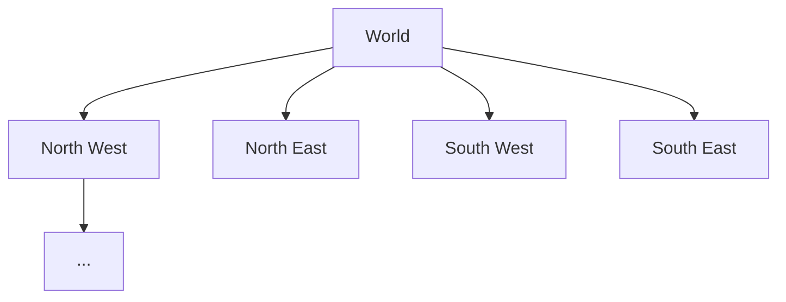
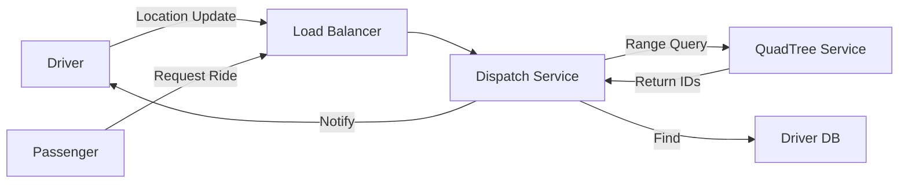

# Designing Uber (Ride-Hailing System)

## System Overview
The system connects passengers with nearby drivers. It requires real-time location tracking, efficient geospatial querying, and high consistency for trip management.

## Core Components
*   **Driver Location Service**: Receives location updates (every 3 seconds) from active drivers.
*   **Passenger Service**: Handles ride requests and payment.
*   **Trip Service**: Manages the state of a ride (Requested, Accepted, In-Progress, Completed).

## Geospatial Indexing: QuadTrees
To efficiently find drivers within a radius, we use a QuadTree.
*   **Structure**: A tree where each node represents a geographical region. If a region contains too many points (drivers), it splits into four quadrants.
*   **Dynamic Updates**: Drivers move constantly. Updating the QuadTree for every movement is expensive.
    *   *Optimization*: Update the data structure only if the driver moves across a grid boundary.
    *   *Hash Table*: Keep latest lat/long in a Hash Table for quick lookup; use QuadTree for range queries.



## Architecture



## Aggregator Service
Since QuadTrees might be sharded, an Aggregator Service queries multiple QuadTree servers to gather results for a wide search radius, merges them, and returns the best matches to the Dispatch Service.

## Data Sharding
*   **Sharding by City/Region**: Good for local queries but can cause hotspots (e.g., Manhattan vs. rural area).
*   **Sharding by DriverID**: Distributes load evenly but requires querying all shards to find nearby drivers.
*   **Hybrid**: Use H3 or S2 geometry libraries (Google) for uniform cell-based indexing.


Design: Uber & Yelp (Geospatial Architectures)

Designing geospatial architectures requires solving fundamentally different problems based on the volatility of the data. This document outlines the differences between designing for static proximity services (Yelp) versus highly dynamic ride-hailing backends (Uber).

## 1. The Spatial Indexing Challenge

Storing locations in a standard relational database (Lat, Long) and querying via a bounding box (`BETWEEN X1 AND X2`) is extremely slow at scale because it requires intersecting massive datasets in memory.

### The Base Solution: QuadTrees

A QuadTree is a memory-efficient tree data structure where each node represents a geospatial region.

- **Node Capacity:** A node splits into 4 child quadrants (NW, NE, SW, SE) when it contains more than a specific threshold (e.g., 500 locations).
- **Memory Footprint:** Storing 500 million places/drivers requires just 24 bytes per record (LocationID + Lat/Long).  
  `500M * 24 bytes = 12 GB`, easily fitting entirely in RAM.

---

## 2. Yelp: Static Workloads

For a static service like Yelp, the QuadTree works perfectly.

- **Stability:** Because physical places (restaurants, monuments) do not move, the structural integrity of the QuadTree is highly stable.
- **Off-Peak Batching:** Even for dynamic attributes like a place's popularity or rating, Yelp actively avoids updating the QuadTree in real-time, as doing so consumes significant CPU resources and degrades search throughput. Instead, updates are batched and applied once or twice a day during off-peak hours.

---

## 3. Uber: High-Frequency Dynamic Workloads

Uber's active drivers are constantly moving, pinging their exact coordinates every 3 seconds.

If Uber updated the distributed QuadTree synchronously with every 3-second ping, the system would melt down. Drivers crossing grid boundaries would constantly trigger computationally expensive node insertions, deletions, partitions, and merges.

### Decoupling via DriverLocationHT

To prevent overwhelming the QuadTree, Uber decouples the rapid location updates from the spatial index using a distributed hash table.

- **DriverLocationHT (Redis):** The system stores the absolute latest driver positions in this hash table. It holds a highly compact record (35 bytes) for each driver:
  - DriverID (3B)
  - Old Lat/Long (16B)
  - New Lat/Long (16B)

- **Real-time Broadcasting:** The servers holding this Hash Table immediately broadcast the new locations to any customers actively subscribed to a driver's journey.

- **Asynchronous QuadTree Updates:** The Driver Location servers batch the updates and notify the QuadTree servers at a slower, asynchronous cadence (e.g., every 10 to 15 seconds). This drastically reduces the write load on the tree structure.

### Grid Cushioning

To further mitigate the risk of tree thrashing (continuous partitioning and merging of grids due to drivers hovering on a boundary), Uber implements a dynamic "cushion."

Grids are allowed to temporarily grow or shrink by an extra 10% beyond their predefined limit (e.g., 550 drivers instead of 500) before a structural partition or merge is strictly enforced.

```mermaid
graph TD
    Driver[Driver App] -->|Lat/Long every 3s| API[API Gateway]
    API --> DHT[(DriverLocationHT - Redis)]
    
    DHT -.->|Batched Updates (10-15s)| QT[(QuadTree Servers)]
    
    Customer[Customer App] -->|Request Ride| Agg[Aggregator Service]
    Agg --> QT
    QT -->|Returns Nearby Drivers| Agg
    Agg --> DHT
    DHT -->|Fetches exact current coords| Agg
    Agg -->|Dispatches| Driver
```

---

## 4. Real-Time Notification Service

Once a customer opens the app, they must see the cars moving in real-time.

- **Publisher/Subscriber Model:** The customer subscribes to the 5–10 closest drivers.
- **Bandwidth Estimate:** If 500K active customers subscribe to 5 drivers each, the system manages **2.5M active subscriptions**. Broadcasting **19 bytes** of data per driver every 3 seconds requires approximately **47.5 MB/s of egress bandwidth**.

---

## Practical Implementation

Explore the low-level system implementations of this architecture within the repository:

* [Machine Coding: Ride Sharing Service](../../../machine_coding/real_world_systems/ride_sharing_service/PROBLEM.md)
* [Infrastructure: Redis Rate Limiter](../../../infrastructure_challenges/redis_rate_limiter/PROBLEM.md)
