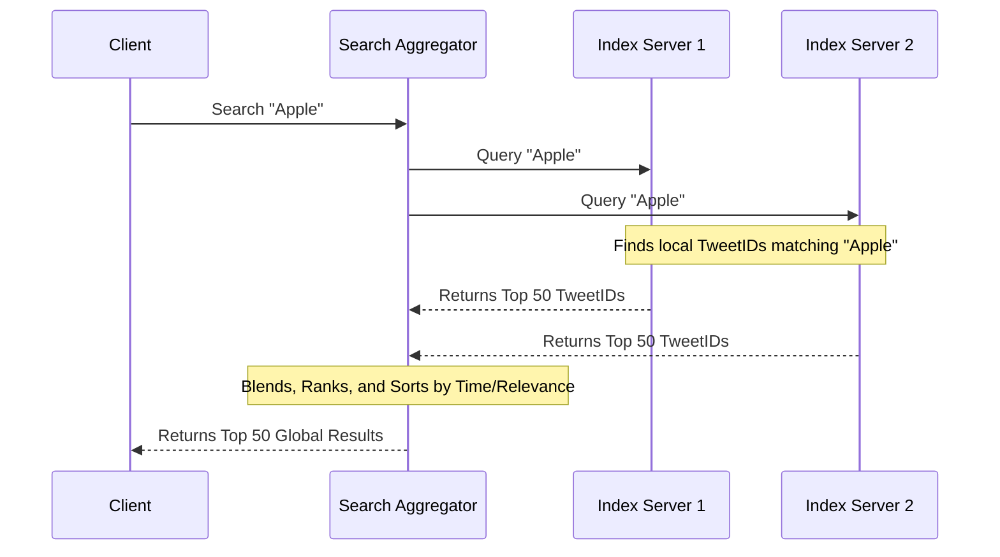

# 🔍 System Design: Twitter Search (Real-time Indexing)

Designing a real-time search engine for Twitter requires indexing hundreds of millions of daily tweets and retrieving them instantly based on dynamic queries. The system must support sub-second latency for billions of users while managing a massive, constantly growing inverted index.

---

## 1. Capacity Estimation & Scale

*   **Traffic:** ~400 Million new tweets/day; ~500 Million search queries/day.
*   **Storage (Tweets):** 300 bytes/tweet * 400M = **120 GB/day**. Over 5 years, this requires ~220 TB (or ~600 TB with 3x replication).
*   **Inverted Index Size:** Assuming 15 searchable words per tweet and storing 2 years of history (~292 billion tweets), the index requires approximately **21 TB of RAM** (spanning ~150 servers with 144GB each) to maintain real-time performance.

---

## 2. Inverted Index & Sharding

An **inverted index** maps a search word (e.g., "Apple") to a sorted list of `TweetIDs` (postings list) that contain that word. Given the 21 TB scale, the index must be sharded across a cluster of servers.

### Sharding Approaches
*   **Sharding by Word:** Specific words are assigned to specific servers (e.g., "Apple" on Server 1, "Banana" on Server 2).
    *   **Flaw:** If a topic trends (e.g., a "SuperBowl" event), the server holding that word becomes a massive hotspot, potentially crashing while others remain idle.
*   **Sharding by TweetID:** Tweets are distributed evenly across all servers. Every server maintains a local inverted index of the tweets it stores.
    *   **Benefit:** Even load distribution and simple horizontal scaling.
    *   **Trade-off:** Every search query must be broadcast to all shards (Scatter-Gather).

---

## 3. Query Execution: Scatter-Gather

Because the index is sharded by `TweetID`, the **Search Aggregator** must query every index server simultaneously.

### Optimization: Late Materialization
*   **Early Materialization:** Retrieving full 300-byte tweet objects during the scatter-gather phase wastes massive internal bandwidth.
*   **Late Materialization:** Index servers return **only the TweetIDs**. The Aggregator sorts and ranks these IDs. Once the final Top 50 results are determined, the Aggregator performs a single secondary query to a high-speed KV store (like Redis or Memcached) to fetch the full content for only those 50 IDs.

---

## 4. Ranking & Fault Tolerance

*   **Ranking Engine:** Results are ranked based on a combination of **Recency** (chronological order is critical for Twitter), **Relevance** (keyword density), and **Engagement** (likes, retweets).
*   **Fault Tolerance:** If an index server crashes, rebuilding its 144GB RAM index from the source database could take hours.
*   **Replication:** Each shard is replicated (Active-Passive). **ZooKeeper** monitors the cluster health and triggers instant failover to a replica if a master index server becomes unresponsive.

---

## Practical Implementation

Explore related concepts and practical applications of search and indexing:

* [Machine Coding: Twitter Feed](../social_media/TWITTER_HLD.md)
* [DSA: Design Twitter (Heap Merger)](../../../dsa/09_heap_priority_queue/design_twitter/PROBLEM.md)
* [System Design: Typeahead Suggestion](./TYPEAHEAD_SUGGESTION.md)
