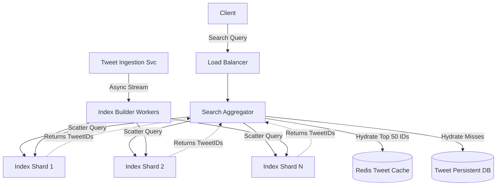

# 🔍 System Design: Twitter Search (Real-time Indexing)

## 📝 Overview
Designing a real-time search engine for Twitter requires indexing hundreds of millions of daily tweets and retrieving them instantly based on dynamic user queries. The system must support sub-second latency for billions of users while managing a massive, constantly growing inverted index that updates in real-time.

!!! abstract "Core Concepts"
    - **Inverted Index:** A core data structure mapping search terms (words/hashtags) to the specific Document IDs (TweetIDs) that contain them.
    - **Scatter-Gather:** A distributed query pattern where a central aggregator broadcasts a search request to multiple shards and merges their responses.
    - **Late Materialization:** Delaying the retrieval of the full tweet payload until the final ranked list of TweetIDs is determined, saving immense internal network bandwidth.

---

## 🏭 The Scenario & Requirements

### 😡 The Problem (The Villain)
Searching through billions of short text payloads in real-time is impossible with traditional relational database queries (e.g., `LIKE '%keyword%'`). Furthermore, if a trending topic explodes (like a global sporting event), a poorly partitioned search index will create massive localized hotspots, crashing individual servers and bringing the entire search infrastructure to a halt.

### 🦸 The Solution (The Hero)
A massively distributed, memory-resident **Inverted Index** sharded by `TweetID` rather than by word. By broadcasting queries to all shards (Scatter-Gather) and only fetching the full text for the absolute top results (Late Materialization), the system completely neutralizes hotkeys and guarantees sub-second latency.

### 📜 Requirements
- **Functional Requirements:**
    1. Users can search for tweets using keywords and hashtags.
    2. Search results must be sortable by chronological recency or algorithmic relevance.
    3. The search index must reflect new tweets within seconds of them being posted (Real-time indexing).
- **Non-Functional Requirements:**
    1. **Low Latency:** Search queries must return results in < 500ms.
    2. **High Availability:** The search infrastructure must survive node failures without data loss or downtime.
    3. **Scalability:** Must effortlessly handle sudden, massive spikes in search volume for viral keywords.

!!! info "Capacity Estimation (Back-of-the-envelope)"
    - **Traffic:** ~400 Million new tweets/day; ~500 Million search queries/day.
    - **Storage (Tweets):** 300 bytes/tweet * 400M = **~120 GB/day**. Over 5 years, this requires ~220 TB (or ~600 TB with 3x replication).
    - **Memory/Cache (Inverted Index):** Assuming 15 searchable words per tweet and storing 2 years of history (~292 billion tweets), the index requires approximately **21 TB of RAM** (spanning ~150 servers with 144GB each) to maintain real-time performance.

---

## 📊 API Design & Data Model

=== "REST APIs"
    - **`GET /api/v1/search`**
        - **Query Params:** `?q=apple&sort=latest&limit=50`
        - **Response:** `[ { "tweet_id": "1847293", "text": "I love Apple!", "author_id": "u45" }, ... ]`
    - **`POST /api/internal/index`** *(Internal API triggered by the Tweet Ingestion Service)*
        - **Request:** `{ "tweet_id": "1847293", "text": "I love Apple!" }`
        - **Response:** `200 OK`

=== "Database Schema"
    - **Table:** `inverted_index` (In-Memory / Custom Lucene Engine)
        - `term` (String, Key) - e.g., "apple"
        - `postings_list` (List<BigInt>) - e.g., `[1847293, 1847294, 1849999]`
    - **Table:** `tweet_store` (NoSQL / Key-Value Store)
        - `tweet_id` (BigInt, PK)
        - `text` (String)
        - `created_at` (Timestamp)
        - `metrics` (JSON - likes, retweets)

---

## 🏗️ High-Level Architecture

### Architecture Diagram

### Component Walkthrough

1.  **Search Aggregator:** The orchestrator of the system. It receives the user's query, broadcasts it to all Index Shards simultaneously, merges the returned IDs, ranks them, and fetches the final text payloads.
2.  **Index Shards:** High-performance, memory-resident servers that maintain the inverted index. They map tokenized keywords to lists of `TweetID`s.
3.  **Index Builder Workers:** Background streaming consumers (e.g., reading from Kafka) that parse incoming tweets, tokenize the text, filter out stop-words, and update the Index Shards in near real-time.
4.  **Tweet Cache/DB:** The persistent storage layer holding the actual 300-byte tweet payloads, utilized solely during the Late Materialization phase.

-----

## 🔬 Deep Dive & Scalability

### Handling Bottlenecks

**The Inverted Index & Sharding Strategy**
An inverted index maps a search word (e.g., "Apple") to a sorted list of `TweetIDs` (postings list) that contain that word. Given the 21 TB scale, the index must be sharded across a cluster of servers.

  - **Sharding by Word (The Flaw):** Specific words are assigned to specific servers (e.g., "Apple" on Server 1). If a topic trends (e.g., a "SuperBowl" event), the single server holding that word becomes a massive hotspot, crashing under the load while other servers remain entirely idle.
  - **Sharding by TweetID (The Fix):** Tweets are distributed evenly across all servers. Every server maintains a local inverted index of the tweets *it* stores. This guarantees perfectly even load distribution for writes and reads, regardless of what topics are trending globally.

**Query Execution: Scatter-Gather & Late Materialization**
Because the index is sharded by `TweetID`, the Search Aggregator must query *every single* index server simultaneously (the Scatter-Gather pattern).
To optimize this massive network fan-out, the system employs **Late Materialization**. If the Aggregator requests "Apple", the Index Shards do *not* return the full text of the tweets. They only return the lightweight `TweetID`s and basic ranking metrics (like engagement score). The Aggregator merges these thousands of IDs, selects the absolute Top 50, and performs a single `MGET` (Multi-Get) against the Redis Cache to retrieve the final 300-byte text payloads for the user.

### ⚖️ Trade-offs

| Decision | Pros | Cons / Limitations |
| :--- | :--- | :--- |
| **Sharding by TweetID vs Sharding by Word** | Completely eliminates hotkey issues during trending events. Scales writes perfectly. | Requires querying *every* server for every search (Scatter-Gather network overhead). |
| **Late Materialization vs Early Materialization** | Saves massive amounts of internal network bandwidth and memory during aggregation. | Requires a secondary network hop to the Cache/DB to fetch the final tweet payloads. |
| **In-Memory Indexing vs Disk-Based Indexing** | Sub-millisecond lookup times, which is strictly required for real-time social media search. | Extremely expensive (21 TB of RAM). Requires ZooKeeper and strict Active-Passive replication to prevent hours of downtime if a node fails. |

-----

## 🎤 Interview Toolkit

  - **Scale Question:** "How do you handle pagination if the user scrolls to the 10,000th result?" -\> *Deep pagination is notoriously expensive in Scatter-Gather because the Aggregator must fetch and sort 10,000 IDs from every shard. You must implement hard limits (e.g., only show the top 1,000 results) or use a cursor-based approach where each shard returns the next batch based on the last seen `TweetID`/timestamp.*
  - **Failure Probe:** "If an Index Server with 144GB of RAM crashes, how do you recover it?" -\> *Rebuilding a 144GB index from the persistent database takes hours. You cannot rely on cold recovery. You must use ZooKeeper to monitor heartbeats and instantly failover to a hot Standby/Replica node that has been actively ingesting the exact same message queue and maintaining the identical in-memory index.*
  - **Edge Case:** "How do you handle 'stop words' (e.g., 'the', 'is', 'and')?" -\> *Filter them out entirely during the ingestion and tokenization phase. They provide nearly zero search value and will bloat the inverted index massively, wasting valuable RAM.*

## 🔗 Related Architectures

  - [Machine Coding: Twitter Feed](../social_media/TWITTER_HLD.md)
  - [System Design: Typeahead Suggestion](./TYPEAHEAD_SUGGESTION.md) — The autocomplete system that powers the search bar.
  - [DSA: Design Twitter (Heap Merger)](../../../dsa/09_heap_priority_queue/design_twitter/PROBLEM.md)
