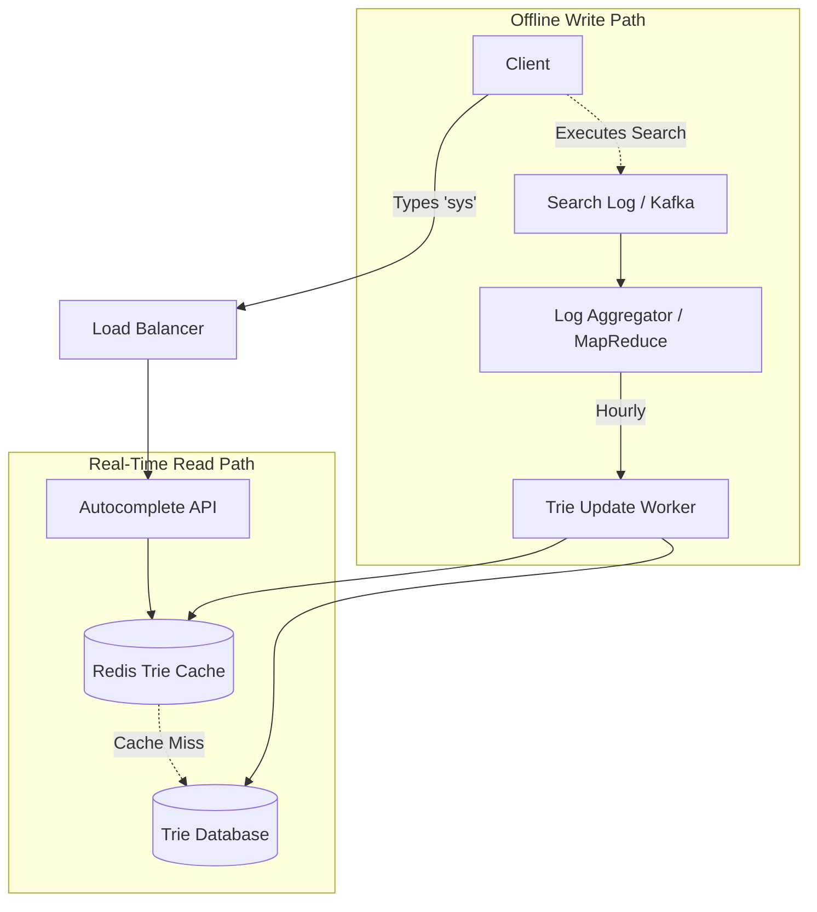

# Design: Typeahead Suggestion (Search Autocomplete)

Designing a search autocomplete system requires predicting the top $K$ queries a user might type based on a few initial characters. The system must operate with extreme speed (under 200ms) while handling billions of daily queries.

---

## 1. Capacity Estimation & Constraints

*   **Traffic:** 5 Billion searches/day $\approx$ 60,000 queries per second (QPS).
*   **Latency:** Suggestions must appear in real-time within **200ms**.
*   **Storage (Index):** Assuming 100 million unique terms (the top 20% of unique queries) averaging 30 bytes each, the base index is ~3 GB. Accounting for growth, a one-year index requires **~25 GB**.

---

## 2. Core Data Structure: The Trie

Standard database `LIKE 'prefix%'` queries are far too slow for real-time autocomplete. The entire system is built upon an in-memory **Trie (Prefix Tree)**.

### Structure
Each node in the Trie represents a character. Moving down a path spells out a prefix. Leaf nodes (or specifically marked nodes) store the full search term and its cumulative frequency.

### Optimization: Pre-computed Top K
Traversing a deep Trie and sorting the frequencies of all potential leaf nodes at runtime is too slow (O(N) where N is the number of nodes in the branch).

**The Solution:** Every single node in the Trie caches the **top 10 most frequent search terms** that branch from it.
*   **Result:** Fetching top suggestions for a prefix becomes an **O(1)** read operation once the prefix node is reached.

---

## 3. Architecture & Data Flow

Because the Trie must remain highly optimized for reads, we separate the real-time query path from the heavy-duty data update path.

### Read Path (Client Optimizations)
*   **Debouncing:** The client application waits for **50ms of user inactivity** before hitting the server to prevent redundant calls.
*   **Browser Caching:** The client caches previous suggestions locally (e.g., in `localStorage`) so hitting **Backspace** doesn't trigger a network call.
*   **Low-Latency Protocols:** For high-performance requirements, **UDP** or persistent **WebSockets** can reduce TCP handshake overhead.

### Offline Write Path (Data Aggregation)
1.  **Logging:** Every completed search is dumped into an append-only log (e.g., **Apache Kafka**).
2.  **Aggregation:** An offline job (e.g., **MapReduce**) runs periodically to aggregate search frequencies and filter out infrequent or inappropriate terms.
3.  **Update:** The **Trie Update Worker** rebuilds/updates the Trie nodes with new Top 10 terms. **Zookeeper** coordinates between replicas to ensure zero-downtime during the switch.

---

## 4. Practical Implementation

Explore the underlying data structure powering autocomplete systems in the repository:

- **Algorithm & Data Structure:** [DSA: Implement Trie (Prefix Tree)](../../../dsa/08_tries/implement_trie/PROBLEM.md)
