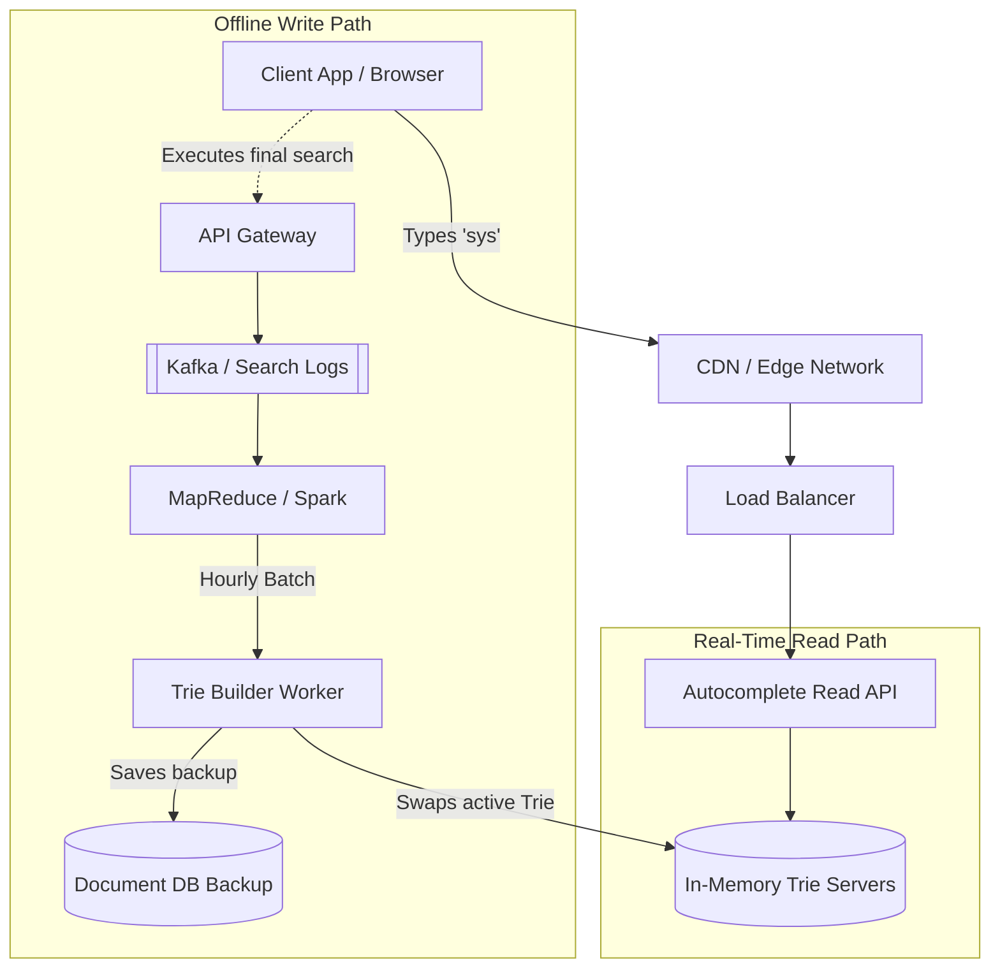

# ⌨️ System Design: Typeahead Suggestion (Search Autocomplete)

## 📝 Overview
A real-time search autocomplete system predicts and suggests the top $K$ queries a user might type based on a few initial characters. It is fundamentally optimized for extreme read speeds, utilizing an in-memory prefix tree to serve suggestions in single-digit milliseconds while handling massive global read volume.

!!! abstract "Core Concepts"
    - **Trie (Prefix Tree):** The foundational data structure optimized for incredibly fast prefix-based string retrieval.
    - **Pre-computed Top-K:** Caching the most frequent complete search terms at every node in the Trie to guarantee $O(1)$ read performance after traversing the prefix.
    - **Read/Write Decoupling:** Strictly separating the ultra-low latency read path from the heavy offline log aggregation and update pipeline.

---

## 🏭 The Scenario & Requirements

### 😡 The Problem (The Villain)
Traditional relational databases using `LIKE 'prefix%'` or standard inverted indices are far too slow for real-time keystroke prediction. A user typing "sys" expects instantaneous suggestions. If the system has to scan millions of text records and sort them by frequency for every single keystroke across millions of concurrent users, the database will instantly lock up and crash.

### 🦸 The Solution (The Hero)
An in-memory Trie data structure where every single node caches its top 10 most popular descendant queries. By pairing this highly optimized data structure with client-side request debouncing and an asynchronous, offline MapReduce pipeline to update frequencies, the system can effortlessly serve autocomplete suggestions instantly without touching a traditional database on the read path.

### 📜 Requirements
- **Functional Requirements:**
    1. Given a prefix, the system must return the top 10 search suggestions.
    2. Suggestions must be ranked by historical search frequency/popularity.
    3. The system must absorb new search queries and update the rankings periodically.
- **Non-Functional Requirements:**
    1. **Ultra-Low Latency:** Suggestions must appear in real-time (total round trip < 200ms, API latency < 50ms).
    2. **High Availability:** The autocomplete feature is critical for user experience and must remain highly available.
    3. **Scalability:** Must handle extreme read throughput (spikes of 100,000+ QPS).

!!! info "Capacity Estimation (Back-of-the-envelope)"
    - **Traffic:** 5 Billion daily searches $\rightarrow$ ~60,000 QPS average. If each search involves 5 keystrokes on average that trigger an API call, the autocomplete API must handle **~300,000 QPS**.
    - **Storage:** 100 million unique terms (assuming we only index the top 20% most popular queries to save space) averaging 30 bytes each $\rightarrow$ **~3 GB** base index. With 1 year of growth, the index requires **~25 GB**.
    - **Memory/Cache:** The entire 25 GB Trie structure easily fits into the RAM of a single modern server, but it will be heavily replicated across a global cluster for high availability and load distribution.

---

## 📊 API Design & Data Model

=== "REST APIs"
    - **`GET /api/v1/autocomplete`**
        - **Query Params:** `?q=sys&limit=5`
        - **Response:** ```json
        {
          "prefix": "sys",
          "suggestions": [
            "system design",
            "systemctl",
            "syslog",
            "system32",
            "system requirements"
          ]
        }
        ```

=== "Data Structure (In-Memory Trie)"
    - **TrieNode Object:**
        - `char` (String) - e.g., 's'
        - `is_word` (Boolean)
        - `children` (HashMap<Character, TrieNode>)
        - `top_k` (List<String>) - Pre-computed top 5-10 suggestions for this specific node.
    - **Persistent Backup (Document DB / MongoDB):**
        - `prefix` (String, PK) - e.g., "sys"
        - `top_suggestions` (Array of Objects: `{term: "system design", weight: 950}`)

---

## 🏗️ High-Level Architecture

### Architecture Diagram


### Component Walkthrough

1.  **Autocomplete Read API:** A lightweight, highly scaled fleet of stateless servers that receive the keystroke prefix and route it to the nearest Trie cache.
2.  **In-Memory Trie Servers:** Dedicated servers (or Redis clusters) holding the Trie structure entirely in RAM to guarantee sub-millisecond retrieval.
3.  **Kafka (Search Logs):** Captures the finalized search query only *after* the user hits "Enter" or clicks the search button.
4.  **Log Aggregator (Spark / MapReduce):** An offline analytics pipeline that runs hourly or daily. It counts the frequencies of all queries, filters out spam or profanity, and outputs an updated dataset of prefix weights.
5.  **Trie Builder Worker:** Consumes the aggregated data, builds a brand new Trie in the background, and seamlessly swaps it into the production Read Servers.

-----

## 🔬 Deep Dive & Scalability

### Handling Bottlenecks

**Trie Operations & Pre-computing Top $K$**
Traversing a deep Trie and sorting the frequencies of all potential leaf nodes at runtime is far too slow ($O(N)$ where $N$ is the number of nodes in the branch).

  - *The Optimization:* Every single node in the Trie permanently caches the **top 10 most frequent search terms** that branch from it. Fetching top suggestions for a prefix becomes an $O(1)$ read operation once the user's prefix node is reached. The heavy lifting of sorting and ranking is shifted entirely to the offline MapReduce build phase.

**Client-Side Optimizations**
Serving 300,000 QPS is expensive. We must reduce the load before it even reaches the server.

  - **Debouncing:** The client application waits for **50ms of user inactivity** before firing an API call. If the user types "s-y-s" rapidly, the server only receives one request for "sys" instead of three separate requests.
  - **Local Browser Caching:** The client caches previous suggestions in memory or `localStorage`. If the user types "syst", deletes the 't', and goes back to "sys", the browser instantly renders the cached results without making a network call.

**Updating the Trie (Zero Downtime)**
Updating node weights in a live, highly concurrent Trie introduces locking and severe latency.

  - *The Solution:* The system uses a **Double Buffering** (or Blue/Green) approach. The Trie Builder Worker creates a completely new, updated Trie on a separate server or isolated memory space. Once the new Trie is fully constructed, a ZooKeeper-coordinated signal simply flips a pointer, routing all new read traffic to the updated Trie. The old Trie is then garbage collected.

### ⚖️ Trade-offs

| Decision | Pros | Cons / Limitations |
| :--- | :--- | :--- |
| **Pre-computed Top $K$ vs Runtime Sorting** | Guarantees $O(1)$ latency after prefix traversal. Essential for real-time SLA. | Significantly increases the memory footprint of the Trie (storing strings redundantly at multiple nodes). |
| **Batch Offline Updates vs Real-time Updates** | Keeps the read-path completely lock-free and blazing fast. Prevents malicious actors from easily manipulating autocomplete. | New viral search trends take hours or days to appear in the autocomplete suggestions. |
| **UDP / WebSockets vs REST HTTP** | WebSockets eliminate the TCP handshake overhead per keystroke, reducing latency further. | Much harder to load balance and scale than stateless HTTP requests. |

-----

## 🎤 Interview Toolkit

  - **Scale Question:** "A celebrity suddenly dies and millions of people start searching their name. Your MapReduce job only runs daily. How do you get this into the autocomplete immediately?" -\> *Implement a secondary, real-time streaming pipeline (using Apache Flink or Storm). It monitors Kafka for sudden velocity spikes in specific terms and injects them into a separate 'Trending' Redis cache. The Autocomplete API fetches from both the main Trie and the Trending cache, merging the results at runtime.*
  - **Failure Probe:** "What happens if a datacenter loses power and all your In-Memory Trie servers crash?" -\> *Because the Trie is entirely in memory, data is lost. However, the Trie Builder Worker routinely saves a serialized snapshot of the Trie to a persistent Document DB (like MongoDB or S3). Upon restart, the Trie servers simply download and deserialize this snapshot to restore service in seconds.*
  - **Edge Case:** "How do you handle typos (e.g., user types 'aple' instead of 'apple')?" -\> *Handling typos directly in the main Trie is computationally prohibitive. You would either maintain a separate mapping of common misspellings to correct prefixes, or utilize Levenshtein distance calculations at the edge, though this adds significant latency and is often reserved for the actual search results page, not the instant autocomplete.*

## 🔗 Related Architectures

  - [DSA: Implement Trie (Prefix Tree)](../../../dsa/08_tries/implement_trie/PROBLEM.md) — The fundamental algorithm behind this system.
  - [System Design: Twitter Search](./TWITTER_SEARCH.md) — How the actual search executes once the user hits enter.
