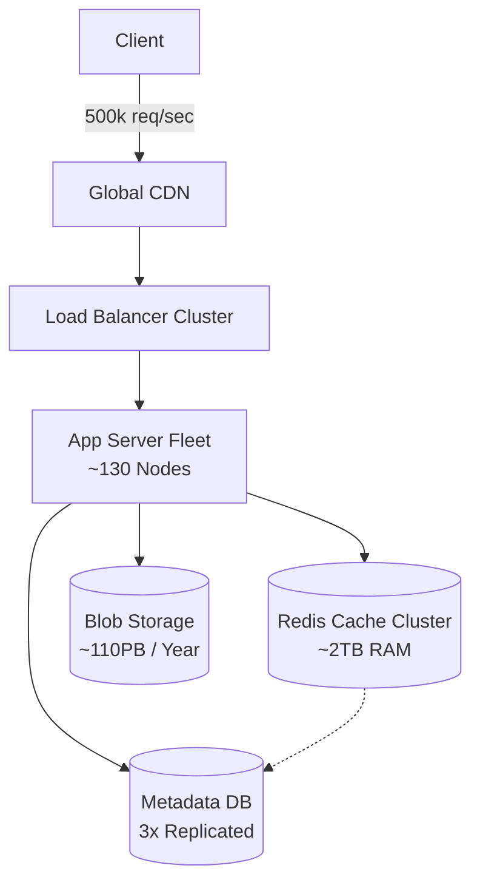

# 🧮 System Design: Facebook-Scale Capacity Planning

## 📝 Overview
A foundational guide to the art of **Capacity Planning** for hyper-scale systems. It focuses on the back-of-the-envelope calculations required to estimate storage, memory, network, and compute resources for platforms serving billions of daily active users, ensuring the infrastructure can handle both normal and peak loads without breaking the bank.

!!! abstract "Core Concepts"
    - **Back-of-the-Envelope Estimation:** Quick, rough mathematical calculations to determine if a system design is physically and economically feasible.
    - **80/20 Rule (Pareto Principle):** Assuming 80% of your read traffic is generated by 20% of your data, allowing for efficient, targeted cache sizing.
    - **Safety Margins:** Applying replication factors and buffer percentages (usually 20-30%) to account for hardware failures, network overhead, and unexpected traffic spikes.

---

## 🏭 The Scenario & Requirements

### 😡 The Problem (The Villain)
"The Under-Provisioned Outage." You launch a highly anticipated viral feature, but because you didn't run the math on write-amplification or storage bounds, the database disks fill up in 5 minutes, crashing the entire platform. Alternatively, you massively over-provision servers, burning millions of dollars in idle compute.

### 🦸 The Solution (The Hero)
"The Capacity Planner." By using foundational math to predict resource needs *before* a single line of code is written or server is rented, you define the correct horizontal scaling strategy, cache sizes, and storage tiers.

### 📜 Requirements
- **Functional Requirements:**
    1. Accurately estimate raw disk space for user-generated content over a multi-year horizon.
    2. Size distributed cache clusters based on predictable read-access patterns.
    3. Determine the baseline fleet size for application servers to meet throughput goals.
- **Non-Functional Requirements:**
    1. **Cost Efficiency:** Avoid massive over-provisioning while maintaining a strict performance buffer.
    2. **High Availability:** Calculations must include hardware fault tolerance (e.g., 3x replication).
    3. **Accuracy:** Estimates must be within a realistic order of magnitude (powers of 10) of actual production requirements.

!!! info "Capacity Estimation (Back-of-the-envelope)"
    *Assume a platform with 2 Billion Daily Active Users (DAU).*
    
    - **Compute / Servers:**
        - Peak traffic: **500,000 requests/sec**.
        - A standard web server handles **5,000 concurrent requests**.
        - Base servers: 500k / 5k = **100 servers**.
        - Add 30% safety margin: **~130 Web Servers**.
    - **Storage (Media):**
        - Users upload **500M photos/day** averaging **200KB** each.
        - Raw storage: 500M * 200KB = **100TB/day**.
        - High Availability (3x replication): 100TB * 3 = **300TB/day**.
        - Yearly storage: 300TB * 365 = **~110 PB/year**.
    - **Memory / Cache:**
        - Total daily metadata generated/read is **10TB**.
        - Applying the 80/20 rule, we want to cache 20% of the daily metadata.
        - RAM required: 10TB * 0.20 = **2TB of RAM** (spanning ~20 Redis nodes at 100GB each).

---

## 📊 API Design & Data Model

*(Modeling the Media Upload scenario used in the estimations above)*

=== "REST APIs"
    - **`POST /api/v1/media/upload`**
        - **Request:** `Multipart/form-data` (Image blob + `{ "user_id": "123", "caption": "Hello" }`)
        - **Response:** `{ "media_id": "m987", "url": "https://cdn.example.com/m987.jpg" }`
    - **`GET /api/v1/feed`**
        - **Query Params:** `?limit=20`
        - **Response:** `[ { "media_id": "...", "url": "...", "author": "..." }, ... ]`

=== "Database Schema"
    - **Table:** `media_metadata` (NoSQL / Cassandra)
        - `media_id` (String, PK)
        - `user_id` (String, Indexed)
        - `cdn_url` (String)
        - `created_at` (Timestamp)
    - **Storage:** `Blob Storage` (S3 / HDFS)
        - *Path:* `/{region}/{year}/{month}/{media_id}.jpg`
        - *Size:* ~200KB per object.

---

## 🏗️ High-Level Architecture

### Architecture Diagram
*(The infrastructure footprint dictated by our capacity math)*

### Component Walkthrough

1.  **Load Balancer Cluster:** Distributes the 500,000 peak requests per second evenly across the application fleet.
2.  **App Server Fleet (\~130 Nodes):** Horizontally scaled compute units. If CPU utilization hits 70%, an auto-scaler will provision more nodes to maintain the 30% safety margin.
3.  **Redis Cache Cluster (\~2TB RAM):** Stores the "hot" 20% of metadata. Partitioned across multiple nodes to prevent memory exhaustion and handle high read throughput.
4.  **Blob Storage (\~110PB/Year):** The massively scalable object store holding the actual 200KB photo files, distributed across physical racks with 3x replication to survive drive failures.

-----

## 🔬 Deep Dive & Scalability

### Handling Bottlenecks

  - **The Long Tail of Storage:** 99.9% of old photos are rarely accessed, but keeping 110PB of data on high-performance NVMe SSDs is financial suicide.
      - *Solution (Storage Tiering):* Shift data dynamically. "Hot" data (new uploads) stays in Cache/NVMe. "Warm" data (months old) moves to cheaper HDDs. "Cold" data (years old) is archived to cold storage (e.g., AWS Glacier).
  - **Network Bandwidth Saturation:** Pushing 100TB of photos a day through a single datacenter ingress will choke the network switches.
      - *Solution:* Utilize Edge compute and a Content Delivery Network (CDN). Clients upload directly to the nearest edge node, which asynchronously routes the data to the central storage over dedicated backbone links.

### ⚖️ Trade-offs

| Decision | Pros | Cons / Limitations |
| :--- | :--- | :--- |
| **3x Replication vs. Erasure Coding** | 3x replication is fast to read/write and simple to recover. | Extremely expensive (300TB used for 100TB of actual data). Erasure coding saves space but uses heavy CPU to reconstruct lost data. |
| **Over-provisioning vs. Auto-scaling** | Over-provisioning guarantees capacity for sudden, massive spikes (e.g., a viral event). | Wastes money on idle servers. Auto-scaling takes time to spin up new instances, risking brief timeouts. |
| **80/20 Caching vs. 90/10** | A 20% cache provides a massive buffer against cache misses and database load. | Requires double the RAM (and cost) compared to caching only the absolute hottest 10% of data. |

-----

## 🎤 Interview Toolkit

  - **Scale Question:** "Traffic suddenly spikes 10x during the Super Bowl. Your app fleet maxes out. What breaks first?" -\> *The Load Balancer or the API Gateway. If the compute fleet can't scale fast enough, the LB will start dropping connections or queuing them, leading to severe latency. You must implement aggressive Rate Limiting and Circuit Breakers to shed load and protect the DB.*
  - **Failure Probe:** "What happens if an entire datacenter hosting 1 PB of your data goes offline?" -\> *Assuming we used cross-region 3x replication, the DNS/Global Load Balancer seamlessly routes user requests to a secondary region. Latency might increase slightly, but data is safe.*
  - **Edge Case:** "How do you calculate cache needs if a single celebrity post gets 50 million views in an hour?" -\> *Standard 80/20 rules fail here. This is the "Hot Key" problem. You must estimate the capacity needed for a local, in-memory cache (like Guava or LRU on the App Server itself) to prevent millions of requests from overwhelming the shared Redis cluster.*

## 🔗 Related Architectures

  - [System Design: Twitter Feed](./TWITTER_HLD.md)— Excellent practice for read/write skew math.
  - [System Design: WhatsApp Lite](./WHATSAPP.md) — Great for calculating concurrent connection capacity.
  - [Infrastructure: Redis Rate Limiter](../../../infrastructure_challenges/redis_rate_limiter/PROBLEM.md) — Protecting your capacity limits.
