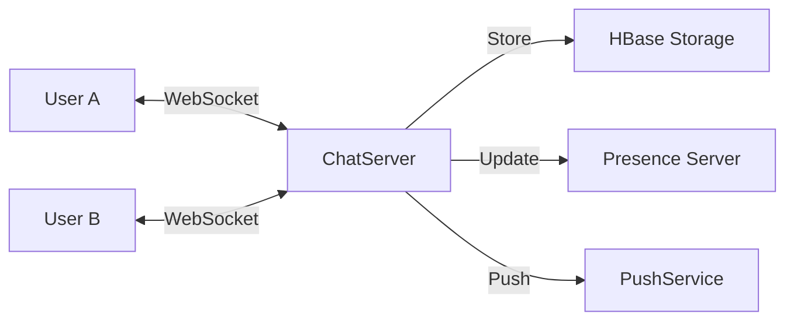

# Designing Facebook Messenger

## System Overview
A real-time instant messaging service supporting 1-on-1 and group chats. Key requirements are low latency, message ordering, and delivery acknowledgments.

## Protocol Selection
Standard HTTP is inefficient for real-time chat due to header overhead and request/response model.
*   **Polling**: Client asks server for updates periodically. Wasteful.
*   **Long-Polling**: Client holds connection open; server responds when data is available. Better, but still has overhead.
*   **WebSockets**: Full-duplex communication over a single TCP connection. Ideal for chat.

## Architecture
1.  **Chat Server**: Maintains WebSocket connections.
2.  **Presence Server**: Tracks user status (Online/Offline/Last Seen).
3.  **Message Store**: Database for storing chat history.

## Storage: HBase
We need a database that supports high write throughput and range scans (for fetching chat history).
*   **Why not SQL?**: Scaling vertically is expensive; large index sizes slow down writes.
*   **Why HBase?**:
    *    Modeled on Google BigTable.
    *   **Wide-Column Store**: Efficient for sparse data.
    *   **Range Scans**: Messages are stored with `ChatID + Timestamp` as the key, allowing fast retrieval of the last `N` messages.
    *   **LSM Tree**: Optimizes for heavy write loads.

## Message Handling
1.  **Ordering**: Use a sequence number generator or time-based UUIDs (like Snowflake) to ensure message order across devices.
2.  **Delivery**:
    *   *Sent*: Client sends to server.
    *   *Delivered*: Server pushes to recipient.
    *   *Read*: Recipient opens the chat; ack sent back to sender.

## Optimizations
*   **Push vs Pull**:
    *   *Active Users*: Push messages via WebSocket.
    *   *Inactive Users*: Store in DB; push notification via APNS/FCM.
*   **Group Chats**: Fan-out on write (for small groups) or Fan-out on read (for mega groups).
## 5. Practical Implementation

Explore the low-level networking and real-time messaging implementations:

* [Infrastructure: Socket Chat App](../../../infrastructure_challenges/socket_chat_app/PROBLEM.md)
* [Machine Coding: Kafka Lite](../distributed_storage/KAFKA_DEEP_DIVE.md)
* [System Design: WhatsApp Lite](./WHATSAPP.md)
