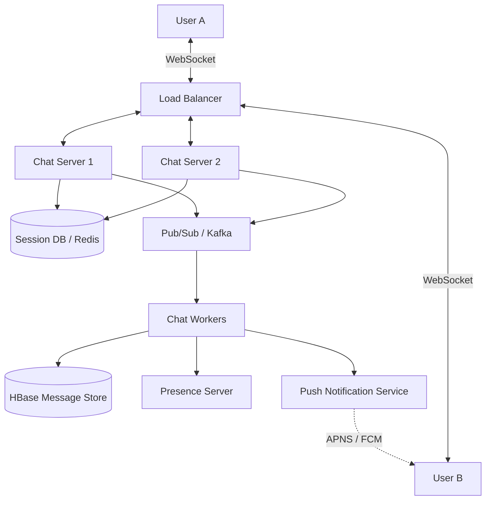

# 💬 System Design: Facebook Messenger

## 📝 Overview
Facebook Messenger is a highly scalable, real-time instant messaging platform supporting seamless 1-on-1 and group communication. The architecture is engineered to maintain billions of concurrent connections while guaranteeing strict message ordering, low-latency delivery, and reliable read acknowledgments.

!!! abstract "Core Concepts"
    - **WebSockets:** Full-duplex, persistent TCP connections for real-time bi-directional data transfer without HTTP overhead.
    - **Wide-Column Store (HBase):** A NoSQL database optimized for heavy write workloads and fast range scans (ideal for chat history).
    - **Presence Management:** Efficiently tracking and broadcasting the online/offline/last-seen status of millions of concurrent users.

---

## 🏭 The Scenario & Requirements

### 😡 The Problem (The Villain)
Standard HTTP is inherently stateless and request-driven. For a chat application, using HTTP means clients must constantly "poll" the server to ask if new messages have arrived. This creates massive header overhead, drains mobile batteries, introduces unacceptable latency, and wastes immense server resources on empty responses. 

### 🦸 The Solution (The Hero)
A persistent WebSocket architecture where clients maintain an open connection to dedicated Chat Servers. This allows the server to instantly push incoming messages to recipients. When combined with a write-optimized database like HBase, the system can effortlessly absorb massive message throughput while providing instant retrieval of chat histories.

### 📜 Requirements
- **Functional Requirements:**
    1. Users can send and receive text messages in real-time (1-on-1 and Group chats).
    2. Users can see message statuses (Sent, Delivered, Read).
    3. Users can see the online presence of their contacts.
- **Non-Functional Requirements:**
    1. **Low Latency:** Messages must be delivered in < 50ms if the recipient is online.
    2. **High Availability:** The chat service must be highly available, though strict message ordering is paramount.
    3. **Scalability:** Must support billions of concurrent connections and extreme write-heavy workloads.

!!! info "Capacity Estimation (Back-of-the-envelope)"
    - **Traffic:** 1 Billion Daily Active Users (DAU) sending an average of 50 messages/day -> **50 Billion messages/day** (~600,000 messages/sec peak).
    - **Storage:** 50 Billion messages * 100 bytes (average payload) = **5 TB/day** (~1.8 PB/year).
    - **Connections:** 1 Billion concurrent WebSocket connections. If one chat server handles 100,000 connections, the system requires a baseline of **10,000 Chat Servers**.
    - **Bandwidth:** 600,000 msgs/sec * 100 bytes = **~60 MB/sec** continuous ingress bandwidth.

---

## 📊 API Design & Data Model

=== "WebSocket Events (Real-time)"
    - **`SEND_MESSAGE` (Client -> Server)**
        - **Payload:** `{ "thread_id": "t123", "temp_id": "client_uuid", "text": "Hey!" }`
    - **`RECEIVE_MESSAGE` (Server -> Client)**
        - **Payload:** `{ "thread_id": "t123", "message_id": "18472938472", "text": "Hey!", "sender_id": "u456" }`
    - **`MESSAGE_ACK` (Client <-> Server)**
        - **Payload:** `{ "message_id": "18472938472", "status": "DELIVERED" }`

=== "Database Schema"
    - **Table:** `messages` (HBase / Wide-Column Store)
        - `RowKey:` `[thread_id]_[timestamp/sequence_id]` (e.g., `t123_1634567890`)
        - `ColumnFamily:data`
            - `sender_id` (String)
            - `content` (String)
        - `ColumnFamily:meta`
            - `status` (String - Sent/Delivered/Read)
    - **Table:** `user_threads` (RDBMS or NoSQL)
        - `user_id` (String, PK)
        - `thread_id` (String, PK)
        - `last_read_message_id` (BigInt)

---

## 🏗️ High-Level Architecture

### Architecture Diagram

### Component Walkthrough

1.  **Load Balancer:** Maintains long-lived TCP connections and routes clients to the most available Chat Server.
2.  **Chat Servers:** Highly optimized instances that do nothing but hold millions of open WebSocket connections. They are stateless regarding message history but stateful regarding active connections.
3.  **Session DB (Redis):** Acts as a directory. It stores a fast-lookup map of `user_id -> chat_server_ip` so the system knows exactly which server holds the active connection for any given user.
4.  **HBase Message Store:** The source of truth for chat history. Selected for its LSM-tree architecture, which effortlessly handles massive write-throughput and allows fast range queries (e.g., "fetch the last 50 messages for `thread_id`").
5.  **Presence Server:** Tracks user online/offline status via heartbeats.
6.  **Push Notification Service (APNS/FCM):** Triggered when a message is sent to a user who is currently disconnected (no active WebSocket session).

-----

## 🔬 Deep Dive & Scalability

### Handling Bottlenecks

#### The Delivery Routing Mechanism

When User A sends a message to User B, how does it physically reach User B?

1.  User A's message hits `Chat Server 1`.
2.  `Chat Server 1` queries the `Session DB` to find User B.
3.  The DB replies: "User B is connected to `Chat Server 2`".
4.  `Chat Server 1` forwards the message to `Chat Server 2` (often via a message broker like Kafka or direct RPC).
5.  `Chat Server 2` pushes the message down User B's open WebSocket.

#### Message Ordering & Sequencing

Clock synchronization across distributed servers is notoriously unreliable. To guarantee message order, Messenger uses an ID generator (like Twitter Snowflake) to assign a globally unique, chronologically sortable `message_id` before saving it to HBase. The client relies on this ID to sort the UI, not the local device time.

#### Group Chats (Fan-out)

  - **Small Groups (\< 100 users):** Fan-out on write. The backend iterates through all group members and routes the message to their respective Chat Servers.
  - **Massive Groups (e.g., thousands of users):** Hybrid approach. Fan-out to active online users via WebSockets, but delay DB writes and push notifications to prevent queue flooding.

### ⚖️ Trade-offs

| Decision | Pros | Cons / Limitations |
| :--- | :--- | :--- |
| **WebSockets vs. Long-Polling** | Full-duplex, minimal overhead, sub-10ms latency. | Requires highly tuned load balancers and infrastructure capable of handling millions of long-lived, sticky TCP connections. |
| **HBase vs. Relational SQL** | LSM Trees handle massive write volume efficiently. Range queries on RowKeys fetch chat history instantly. | Poor at complex relational queries. Requires a separate, specialized infrastructure (HDFS/ZooKeeper) to maintain. |
| **Push vs. Pull Group Chats** | Pushing instantly to active users provides the real-time feel expected of chat. | Massive fan-out overhead for highly active, large group chats. |

-----

## 🎤 Interview Toolkit

  - **Scale Question:** "How do you handle a user with a flaky 3G connection repeatedly disconnecting?" -\> *Implement a client-side local queue. Assign local temporary IDs to sent messages. When the WebSocket reconnects, the client flushes the queue. The server responds with the authoritative Snowflake `message_id` and the client reconciles the UI.*
  - **Failure Probe:** "What happens if a Chat Server holding 100k connections suddenly dies?" -\> *All 100k clients will experience a TCP drop. They must execute a randomized exponential backoff strategy before reconnecting to the Load Balancer to prevent a "Thundering Herd" from taking down the rest of the infrastructure. The clients will fetch any missed messages using their `last_read_message_id`.*
  - **Edge Case:** "How does the 'Delivered' checkmark work?" -\> *It's a reverse message. When User B's client receives the payload via WebSocket, it automatically fires an `ACK` packet back to the server. The server routes this `ACK` to User A's Chat Server, which pushes the UI update to User A.*

## 🔗 Related Architectures

  - [Infrastructure: Socket Chat App](../../../infrastructure_challenges/socket_chat_app/PROBLEM.md) — Hands-on implementation of low-level networking.
  - [Machine Coding: Kafka Lite](../../deep_dives/KAFKA_DEEP_DIVE.md) — Understanding the pub/sub event routing powering the backend.
  - [System Design: WhatsApp Lite](./WHATSAPP.md) — Very similar real-time constraints but with End-to-End Encryption considerations.
