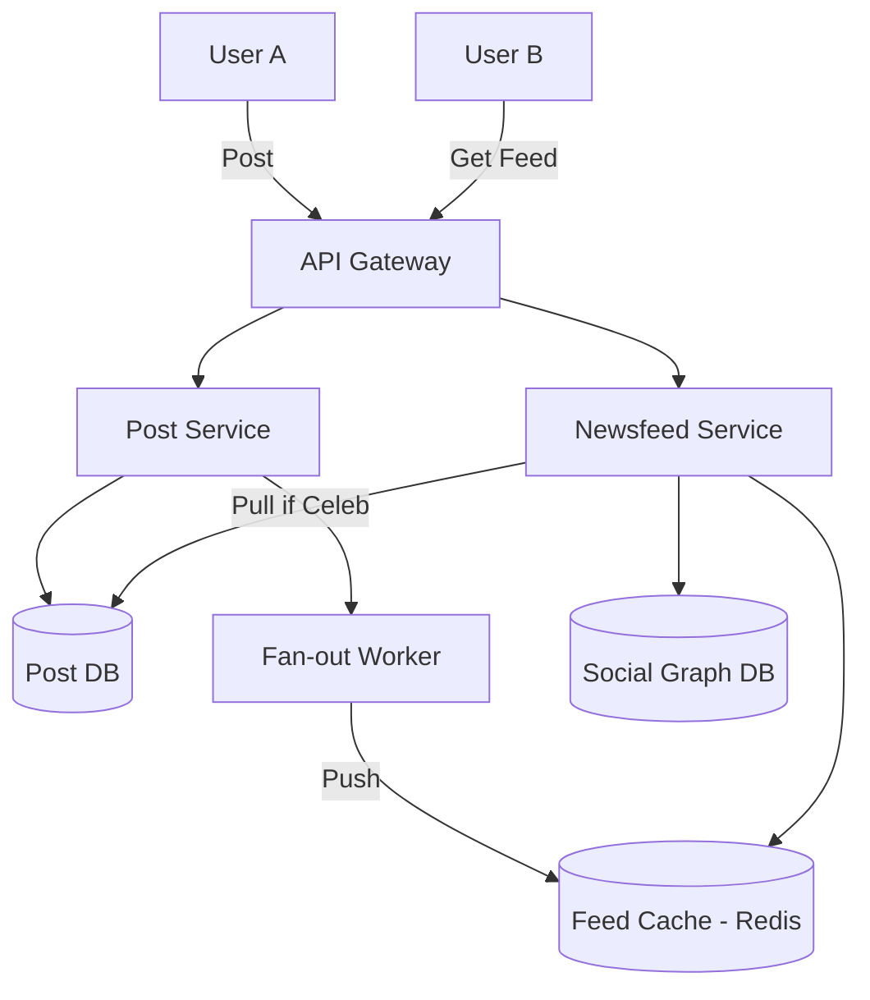

# 📱 System Design: Facebook Newsfeed

The Newsfeed is the core of any social network. The architectural challenge lies in aggregating content from hundreds of friends and ranking it chronologically or algorithmically in real-time, delivering a seamless experience to billions of users.

---

## 1. Capacity Estimation & Constraints

*   **Traffic:** 300 Million Daily Active Users (DAU) fetching their timeline 5 times a day results in **1.5 Billion requests/day** (~17,500 requests/sec).
*   **Latency:** Generating the feed for the end-user must take **< 2 seconds**. A new post should propagate to all followers within **< 5 seconds**.
*   **Memory (Cache):** To keep the top 500 posts in memory for quick fetching (assuming 1KB per post), the system needs 500KB per active user. For 300M DAU, this requires **150 TB of RAM** (spanning ~1,500 cache servers).

---

## 2. High-Level Architecture

The architecture separates the ingestion of new posts from the retrieval and ranking of the newsfeed.

---

## 3. Fan-out Models

### A. Fan-out on Read (Pull Model)
When a user opens their app, the server actively fetches the latest posts from all the people the user follows and merges them.
*   **Pros:** No wasted compute on inactive users.
*   **Cons:** Extremely slow read latency. Executing complex joins across hundreds of friends at runtime violates the 2-second latency requirement.

### B. Fan-out on Write (Push Model)
When a user publishes a post, the server immediately computes the newsfeed of all of their followers and pushes the `PostID` into their pre-computed Redis timelines.
*   **Pros:** Read latency is near zero. The timeline is already built and ready to serve.
*   **Cons:** The **"Celebrity Problem"**. If a celebrity with 50 million followers posts, the system must execute 50 million database writes instantly, overwhelming the queue and delaying normal posts.

### C. The Hybrid Solution (Recommended)
Facebook and Instagram utilize a hybrid approach to balance performance and scalability:
*   **Normal Users:** Use **Fan-out on Write (Push)**. Posts are pre-distributed to active followers' caches.
*   **Celebrities/Hot Users:** Posts are **NOT pushed** to followers. Instead, when a follower loads their feed, the system uses **Fan-out on Read (Pull)** to fetch the celebrity's latest posts and merge them into the pre-computed feed.

---

## 4. Ranking Engine & Feed Generation

A newsfeed is more than just a chronological list. The **Ranking Engine** determines the order of posts based on:
*   **Affinity:** How closely the user interacts with the creator (e.g., messaging, tagging).
*   **Weight:** The type of post (videos > photos > text) and its engagement (likes, comments).
*   **Time Decay:** Newer posts are prioritized over older ones.

**Pre-generation:** Background workers constantly update the feed cache for active users to ensure sub-millisecond response times upon request.

---

## 5. Practical Implementation

Explore low-level implementations of social media timelines and related patterns:

*   **OOP Implementation:** [Machine Coding: Instagram Feed](../../../machine_coding/systems/instagram/PROBLEM.md)
*   **Caching Strategies:** [System Design: Caching Strategies](../../pillars/CACHING.md)
*   **Capacity Planning:** [HLD: Facebook-Scale Capacity Planning](./FACEBOOK_CAPACITY.md)
