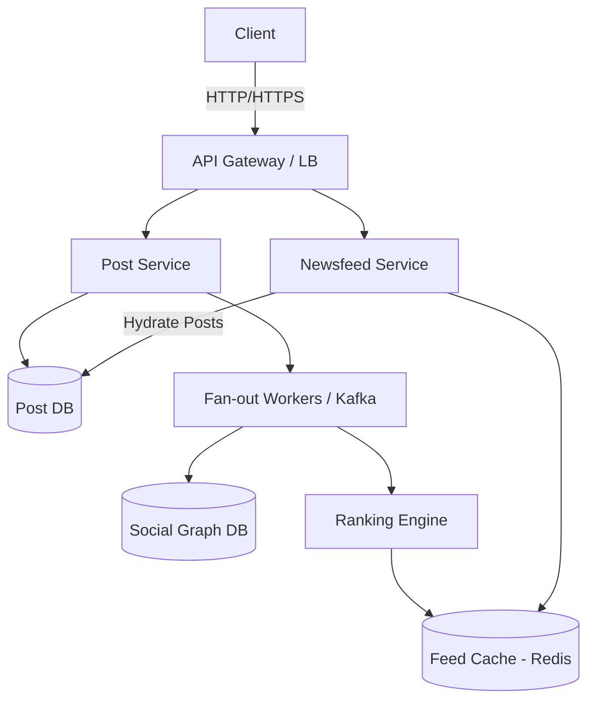

# 📱 System Design: Facebook Newsfeed

## 📝 Overview
The Facebook Newsfeed is a massively distributed content aggregator that curates and ranks updates from a user's social graph in real-time. It balances complex machine learning ranking algorithms with extreme read/write scale to deliver a personalized, low-latency feed to billions of users.

!!! abstract "Core Concepts"
    - **Fan-out Strategies (Push vs. Pull):** Managing how posts are distributed to followers (pre-computing vs. on-the-fly generation).
    - **Newsfeed Ranking:** Scoring and sorting posts based on complex variables like user affinity, content weight, and time decay (historically known as EdgeRank).

---

## 🏭 The Scenario & Requirements

### 😡 The Problem (The Villain)
Retrieving and ranking content from thousands of friends in real-time is computationally impossible at scale. If done purely on the read path, the database would melt under the weight of massive JOINs across the social graph and heavy ML model scoring for every single user request.

### 🦸 The Solution (The Hero)
An asynchronous pipeline that pre-computes and caches personalized newsfeeds for active users. By using a hybrid fan-out approach and background ranking workers, the system completely decouples the heavy lifting of feed generation from the user's critical read path.

### 📜 Requirements
- **Functional Requirements:**
    1. Users can publish posts (text, images, videos).
    2. Users can view a personalized, ranked newsfeed of posts from friends and pages they follow.
    3. The feed must continuously update as new posts are created.
- **Non-Functional Requirements:**
    1. **High Availability:** The system must never go down; eventual consistency is acceptable for feed updates (a new post can take a few seconds to appear).
    2. **Low Latency:** Generating the feed for the end-user must take **< 2 seconds** (ideally < 200ms from cache).
    3. **High Write Throughput:** A new post should propagate to all followers within **< 5 seconds**.

!!! info "Capacity Estimation (Back-of-the-envelope)"
    - **Traffic:** 300 Million Daily Active Users (DAU) fetching their timeline 5 times a day -> **1.5 Billion read requests/day** (~17,500 requests/sec).
    - **Storage:** Assume 10 Million new posts/day at 1KB per post (metadata) -> **10GB/day** (~3.6TB/year of text metadata, excluding media storage).
    - **Memory/Cache:** Keeping the top 500 posts in memory per active user requires ~500KB per user. For 300M DAU, this requires **~150 TB of RAM** (spanning ~1,500 cache servers at 100GB each).

---

## 📊 API Design & Data Model

=== "REST APIs"
    - **`POST /api/v1/posts`**
        - **Request:** `{ "author_id": "u123", "content": "Hello world!", "media_urls": [...] }`
        - **Response:** `{ "post_id": "p987", "status": "published" }`
    - **`GET /api/v1/feed`**
        - **Query Params:** `?cursor=p987&limit=20`
        - **Response:** `[ { "post_id": "p987", "author_name": "...", "content": "..." }, ... ]`

=== "Database Schema"
    - **Table:** `posts` (NoSQL / Cassandra)
        - `post_id` (String, PK)
        - `author_id` (String, Indexed)
        - `content` (Text)
        - `created_at` (Timestamp)
    - **Table:** `social_graph` (Graph DB / Sharded RDBMS)
        - `user_id` (String, PK)
        - `friend_id` (String, PK)
        - *Compound PK (user_id, friend_id)*
    - **Cache:** `feed_cache` (Redis)
        - `Key:` `feed:{user_id}`
        - `Value:` `List<post_id>` (Sorted by Rank/Timestamp, capped at 500 items)

---

## 🏗️ High-Level Architecture

### Architecture Diagram

### Component Walkthrough

1.  **API Gateway / Load Balancer:** Routes incoming read/write requests to the appropriate microservices and handles rate limiting/authentication.
2.  **Post Service:** Handles the ingress of new posts and persists the raw content to the Post DB.
3.  **Fan-out Workers (Asynchronous):** Background processors that fetch the author's social graph to determine who needs to see the new post.
4.  **Ranking Engine:** Evaluates the new post against the follower's preferences (affinity, post type) to determine its placement score before inserting it into the cache.
5.  **Feed Cache:** Redis clusters storing the pre-computed, ordered list of `post_id`s for active users.
6.  **Newsfeed Service:** Reads the pre-computed list of `post_id`s from Redis, fetches the actual post content from the Post DB (hydration), and returns the JSON payload to the client.

-----

## 🔬 Deep Dive & Scalability

### Handling Bottlenecks

#### The Fan-out Problem

Distributing a post to all friends/followers efficiently is the biggest hurdle.

  - **Fan-out on Read (Pull Model):** The server fetches the latest posts from all friends *when* the user opens the app.
      - *Bottleneck:* Unacceptable read latency. Executing complex joins across hundreds of friends at runtime violates the 2-second latency requirement.
  - **Fan-out on Write (Push Model):** The server instantly computes the newsfeed of all followers *when* a post is published, pushing the `post_id` into their Redis timelines.
      - *Bottleneck:* The **"Celebrity Problem"**. If a user with 50 million followers posts, the system must execute 50 million database writes instantly, overwhelming the queue.

#### The Hybrid Solution (Facebook/Instagram Model)

  - **Normal Users:** Use **Fan-out on Write (Push)**. Posts are pre-distributed to active followers' caches.
  - **Celebrities/Hot Users:** Posts are **NOT pushed**. Instead, when a follower loads their feed, the system uses **Fan-out on Read (Pull)** to fetch the celebrity's latest posts and merge them into the pre-computed feed in memory.

#### Ranking Engine & Feed Generation

A newsfeed is more than just a chronological list. The Ranking Engine runs asynchronously and determines the order of posts based on:

  - **Affinity:** How closely the user interacts with the creator (e.g., frequent messaging, tagging, or profile views).
  - **Weight:** The type of post (e.g., videos might be weighted higher than pure text) and its current engagement velocity (likes, comments).
  - **Time Decay:** Newer posts are inherently prioritized over older ones.

### ⚖️ Trade-offs

| Decision | Pros | Cons / Limitations |
| :--- | :--- | :--- |
| **Pre-computing feeds (Push)** | Read latency is near zero. The timeline is already built and ready to serve from Redis. | Massive write amplification and wasted compute if inactive users' feeds are continually updated. |
| **Caching only `post_id`s (not full posts)** | Drastically reduces Redis memory footprint. Single source of truth for post edits/deletes. | Requires a secondary "hydration" step to fetch post content from the DB on read. |
| **Evicting inactive users from cache** | Saves immense amounts of RAM (e.g., keeping only DAUs in memory). | Inactive users experience a slower, cold-start feed generation when they log back in. |

-----

## 🎤 Interview Toolkit

  - **Scale Question:** "How do you handle a scenario where a user follows 5,000 people?" -\> *Cap the Pull model. Only actively pull from a subset of 'close friends' or highly interacted users first, falling back to older or less relevant connections as the user paginates deeper.*
  - **Failure Probe:** "What happens if the Redis Feed Cache cluster dies?" -\> *The Newsfeed Service must failover to the Post DB, temporarily acting as a Fan-out on Read system. To prevent DB collapse, heavily rate-limit requests, degrade the ranking algorithm to simple chronological sorting, and aggressively rebuild the cache.*
  - **Edge Case:** "How do you prevent duplicate posts when merging a Push feed and a Pull feed?" -\> *Use a Hash Set or deduplication step in the Newsfeed Service during the final merge before sending the payload to the client.*

## 🔗 Related Architectures

  - [Design Instagram (Newsfeed)](./INSTAGRAM_HLD.md) — Highly visual, similar timeline aggregation.
  - [Machine Coding: Instagram Feed](../../../machine_coding/systems/instagram/PROBLEM.md)
  - [System Design: Caching Strategies](../../pillars/CACHING.md)
  - [HLD: Facebook-Scale Capacity Planning](./FACEBOOK_CAPACITY.md)
