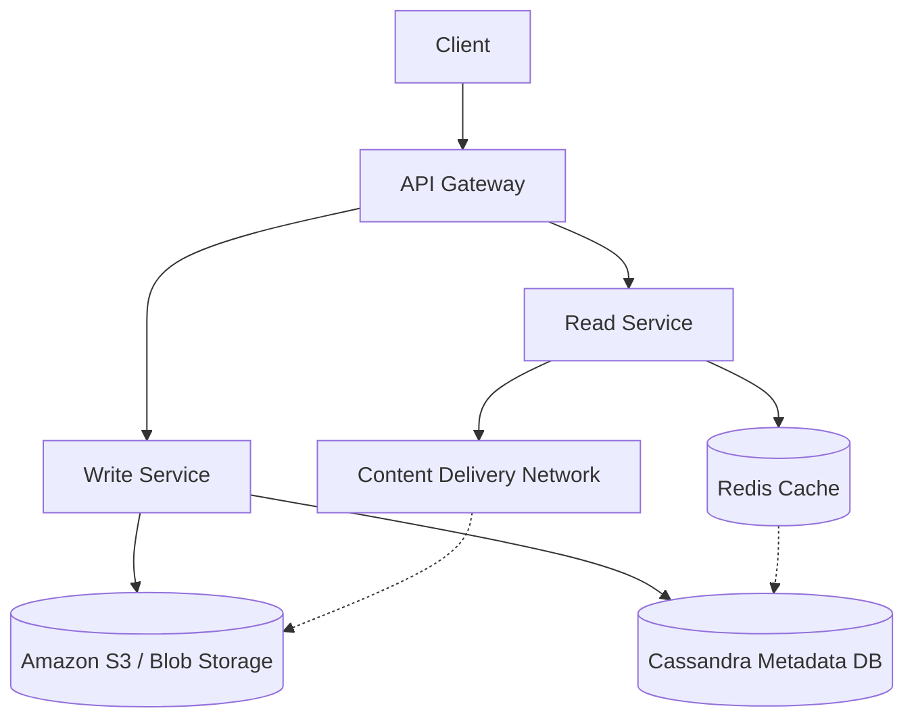

Design: Instagram / Media Sharing & Newsfeeds

Designing a visual social network requires handling heavy blob storage, optimizing global read latencies, and orchestrating massive asynchronous fan-out operations for newsfeed generation.

## 1. Capacity Estimation

**Read-Heavy System:** The Read:Write ratio is typically **200:1**.

**Storage:** Assuming **2 million new photos per day** at **200KB each**, the system requires **~400 GB/day**.  
**10 years of storage ≈ ~1.4 PB.**

**Global Access:** Because images are heavy, serving them directly from application servers in a single datacenter will result in unacceptable latency for global users.

---

## 2. Storage & Database Design

### Strict Data Segregation

Binary data and relational metadata must be kept strictly separated.

- **Blob Storage:** Photos and videos are stored directly in distributed file systems like **Amazon S3** or **HDFS**.
- **Metadata Storage:** A wide-column NoSQL store (like **Cassandra**) is used to store relationships (*User follows*) and media attributes.

### Cassandra Data Model

A **UserPhoto** table uses:
- **UserID** as the **Partition Key**
- **PhotoID** (or **Creation_Timestamp**) as the **Clustering Key**

This allows an entire user's photo timeline to be fetched in a single sequential disk seek.

---

## 3. Newsfeed Generation

The most computationally expensive operation in social media is generating the timeline. Executing **SQL JOIN operations across millions of followers at runtime is impossible.**

### Pre-Generating the Newsfeed

Newsfeeds are **pre-computed offline**. Dedicated worker nodes continuously generate timelines for active users and store them in a fast, in-memory **UserNewsFeed hash table** (e.g., **Redis**).

### Feed Publishing Models (The Fan-Out Problem)

When a user posts a photo, how do their followers get the update?

| Model | Mechanism | Trade-offs |
|------|-----------|-----------|
| Pull (Fan-out-on-load) | Followers pull the feed on a regular schedule. | Easier to implement for highly followed accounts. Difficult to find the right pull cadence; pulling too frequently wastes network/server resources with empty responses. |
| Push (Fan-out-on-write) | Server pushes post immediately to followers' feeds (via Long Polling). | Significantly reduces read operations. Fails for "Celebrity Users" (millions of pushes instantly crash the queue). |
| Hybrid | Push to normal users; Force Pull for celebrity accounts. | Optimal. Users with a few hundred followers use Push. Celebrity followers pull data on load. |

---

### Advanced Fan-Out Optimizations

**Push Frequency Caps:**  
Cap the frequency of server pushes, forcing users who follow a massive number of people to regularly pull data instead.

**Online-Only Fanout:**  
To optimize the fanout-on-write process, the system limits the fanout of a new post only to friends who are currently online, avoiding wasted writes to offline users' feeds.

**Push-to-Notify, Pull-to-Serve:**  
Balances real-time awareness with bandwidth conservation (crucial for mobile networks). The server pushes a lightweight notification indicating new posts are available. The client then issues a **"Pull to Refresh"** request to actually fetch the heavy feed data.

---

## 4. Performance Optimizations

**Caching (80/20 Rule):**  
20% of the photos generate 80% of the traffic. The **CDN** and **Redis** instances aggressively cache this hot 20%.

**Epoch-based IDs:**  
To sort feeds chronologically without maintaining a massive secondary index on **CreationTime**, the **PhotoID** is prefixed with the **Unix Epoch Timestamp**.

**Eventual Consistency:**  
In the interest of **Availability (AP)**, the system tolerates eventual consistency. If a user uploads a photo, it is acceptable if it takes a few seconds to appear in a follower's newsfeed.

---

## Practical Implementation

Explore the low-level OOP and data modeling implementations of a social media feed:

* [Machine Coding: Instagram Feed](../../../machine_coding/systems/instagram/PROBLEM.md)
* [Infrastructure: Redis Rate Limiter](../../../infrastructure_challenges/redis_rate_limiter/PROBLEM.md)
