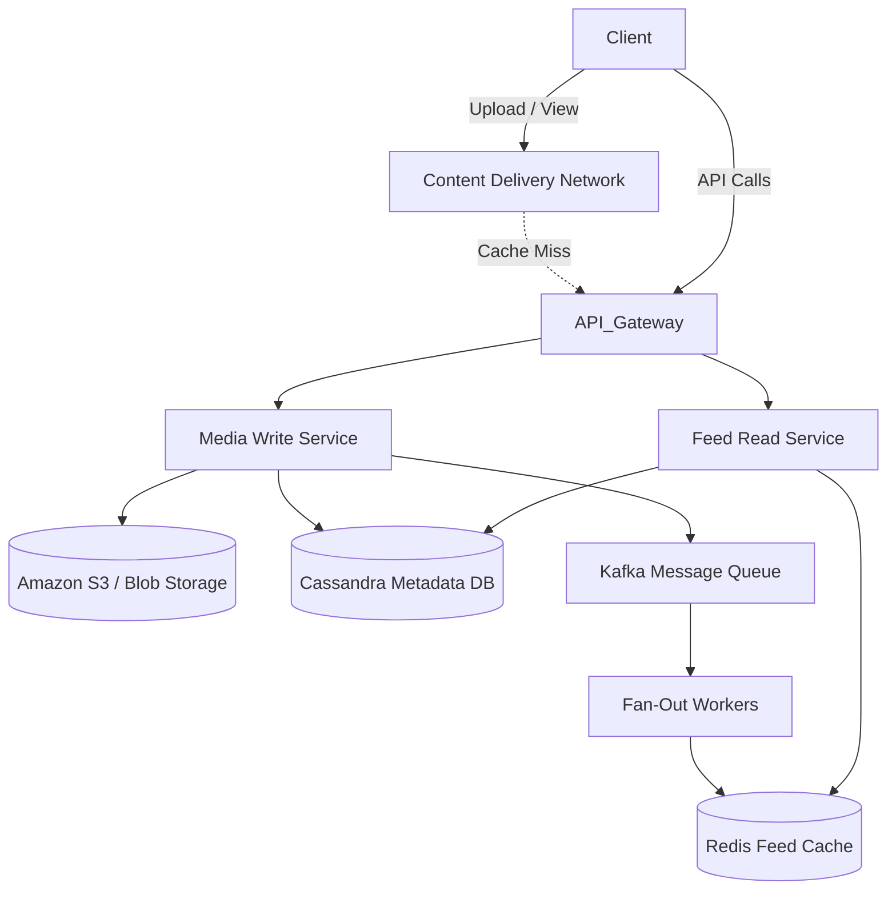

# 📸 System Design: Instagram (Photo Sharing & Newsfeed)

## 📝 Overview
A distributed, read-heavy visual social network designed to store massive media blobs (photos/videos) and orchestrate asynchronous, real-time newsfeed generation for millions of users globally. 

!!! abstract "Core Concepts"
    - **Data Segregation:** Separating heavy binary media (Blob Storage) from relational/metadata (NoSQL).
    - **Fan-Out Architecture:** Pushing/pulling feed updates to/from followers seamlessly.
    - **Eventual Consistency:** Prioritizing Availability (AP) over strict consistency for timeline updates.

---

## 🏭 The Scenario & Requirements

### 😡 The Problem (The Villain)
Storing and serving millions of heavy images globally from a single centralized relational database is impossibly slow. Furthermore, executing massive SQL `JOIN` operations at runtime to generate a newsfeed for a user following 1,000 people will immediately crash the database.

### 🦸 The Solution (The Hero)
A globally distributed system that strictly separates media blobs into Edge-cached CDNs and metadata into wide-column NoSQL stores. Timelines are pre-computed asynchronously by offline workers and stored in ultra-fast memory caches (Redis).

### 📜 Requirements
- **Functional Requirements:**
    1. Users can upload and share photos/videos.
    2. Users can follow other users.
    3. Users can view a personalized, chronologically sorted newsfeed.
- **Non-Functional Requirements:**
    1. **High Availability (AP):** The system must remain available even if some nodes fail.
    2. **Low Latency:** Newsfeeds must load in under 200ms globally.
    3. **Eventual Consistency:** It is acceptable if a post takes a few seconds to appear in followers' feeds.

!!! info "Capacity Estimation (Back-of-the-envelope)"
    - **Traffic Ratio:** Read-Heavy system, typically a **200:1** Read:Write ratio.
    - **Storage Volume:** Assuming 2 million new photos per day at ~200KB each: 
        - **Daily:** ~400 GB/day.
        - **Long-term:** ~1.4 PB for 10 years of storage.
    - **Bandwidth:** High outbound bandwidth requirements due to image/video payloads.

---

## 📊 API Design & Data Model

=== "REST APIs"
    - **`POST /api/v1/media`**
        - **Request:** `Multipart/form-data` (Image blob, caption, location)
        - **Response:** `{ "media_id": "1098432", "url": "https://cdn.instaclone.com/xyz.jpg" }`
    - **`GET /api/v1/feed`**
        - **Request:** `?limit=20&last_timestamp=1680000000`
        - **Response:** `[ { "media_id": "1098432", "url": "...", "author_id": "99", "caption": "..." } ]`
    - **`POST /api/v1/users/{user_id}/follow`**
        - **Response:** `200 OK`

=== "Database Schema"
    - **Blob Storage (S3):** Stores raw image/video files.
    - **Metadata Store (Cassandra):** Wide-column NoSQL database.
        - **Table:** `UserPhoto`
        - **Partition Key:** `UserID` (Ensures an entire user's photo timeline is on a single node).
        - **Clustering Key:** `Creation_Timestamp` or Epoch-prefixed `PhotoID` (Allows sequential disk reads for chronological sorting).

---

## 🏗️ High-Level Architecture

### Architecture Diagram

### Component Walkthrough

1.  **CDN (Content Delivery Network):** Globally distributed edge servers cache static media. Clients fetch images directly from the CDN, never hitting application servers.
2.  **Media Write Service:** Handles incoming image uploads, stores the raw file in S3, saves the URL/metadata in Cassandra, and drops an event into Kafka.
3.  **Fan-Out Workers:** Consume the upload event, fetch the user's followers, and pre-compute/update the followers' timelines in the Redis Feed Cache.
4.  **Feed Read Service:** Instantly fetches the pre-computed chronological feed list from Redis and serves it to the client.

-----

## 🔬 Deep Dive & Scalability

### Handling Bottlenecks

  - **Epoch-based IDs:** Sorting massive distributed tables by a secondary index (`CreationTime`) is expensive. Instead, the `PhotoID` is generated with the Unix Epoch Timestamp as its prefix (e.g., Snowflake ID), allowing natural chronological sorting via the ID itself.
  - **Push-to-Notify, Pull-to-Serve:** To conserve mobile bandwidth, the server pushes a lightweight notification ("New posts available\!"). The client app then initiates a "Pull to Refresh" to download the heavy feed payloads.
  - **Online-Only Fanout:** To save Redis memory and compute cycles, offline users do not receive active push updates. Their feeds are generated via pull when they log back in.

### ⚖️ Trade-offs: The Fan-Out Problem

How do followers get an update when a user posts?

| Fan-Out Model | Pros | Cons / Limitations |
| :--- | :--- | :--- |
| **Pull (Fan-out-on-load)** | Great for celebrity accounts; no wasted pushes. | High latency on read; pulling frequently wastes resources if no new posts exist. |
| **Push (Fan-out-on-write)** | Extremely fast read latency for followers. | Pushing a single post to 100 Million followers (Celebrity Problem) will instantly crash the async queues. |
| **Hybrid (The Winner)** | Balances both scenarios. | High architectural complexity. |

*Note on Hybrid:* Normal users utilize the **Push** model. Celebrity accounts (e.g., users with \> 1M followers) utilize the **Pull** model, forcing followers' feed services to fetch the celebrity data at read-time and merge it into the cached timeline.

-----

## 🎤 Interview Toolkit

  - **Scale Question:** (What happens to caching? -\> *Apply the 80/20 Rule: 20% of the photos generate 80% of the traffic. Aggressively scale the CDN and Redis capacities for this hot tier.*)
  - **Failure Probe:** (What if the Fan-Out Workers crash? -\> *Kafka safely retains the upload events. Once workers recover, they resume processing timeline updates without data loss. Feeds are just temporarily delayed (Eventual Consistency).* )
  - **Edge Case:** (How do you handle generating feeds for inactive users? -\> *Evict their feeds from Redis after 30 days of inactivity. If they log in, trigger an expensive synchronous rebuild of their feed using Cassandra data.*)

## 🔗 Related Architectures

  - [Machine Coding: Instagram Feed](../../../machine_coding/systems/instagram/PROBLEM.md) — Low-level Object-Oriented implementation of the feed service.
  - [Infrastructure: Redis Rate Limiter](../../../infrastructure_challenges/redis_rate_limiter/PROBLEM.md) — How to protect this API from DDoS attacks.
  - [Twitter / X Architecture](./TWITTER_HLD.md) — Solves an identical Fan-Out problem but optimized for text rather than heavy media blobs.
