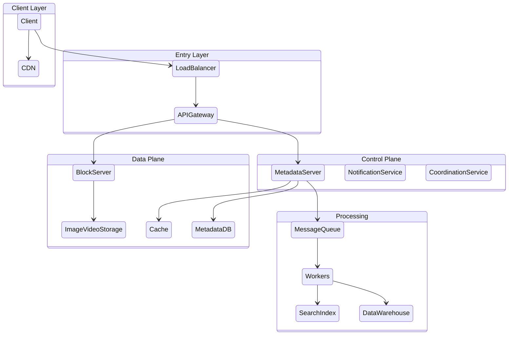

# Master Architecture Template

## Visual Architecture Overview
This template synthesizes the standard flow of a large-scale distributed system, covering the Control Plane, Data Plane, and Analytics Pipeline.

### 1. Client & Entry Point
The flow begins with the **Client** (Mobile/Web) connecting via a **Load Balancer**.
*   **Authentication/Authorization**: Handled at the gateway.
*   **CDN**: Serves static content (images, JS, CSS) to reduce latency.

### 2. API Gateway & Control Plane
The **API Gateway** acts as the traffic controller.
*   **Responsibilities**: Rate Limiting, Request Transformation, Reverse Proxy, Logging.
*   **Services**: Routes requests to specific microservices:
    *   **Notification Service**: Handles push notifications via a queue.
    *   **Metadata Server**: Manages user/content metadata (read/write) backed by a Metadata DB (Sharded).
    *   **Coordination Service**: (e.g., Zookeeper) manages distributed locks and configuration.

### 3. Data Plane & Storage
*   **Block Server**: Handles large file uploads (Videos/Images).
*   **Storage**:
    *   **Metadata DB**: SQL/NoSQL for structured data.
    *   **Block Storage**: Distributed File Storage (S3/HDFS) for media.
    *   **Cache**: Redis/Memcached layer for high-speed metadata access.

### 4. Analytics & Processing Pipeline
*   **Video Processing Service**: Consumes tasks from a queue (Encoding, Thumbnails). Workers process these tasks.
*   **Data Warehouse**: Collects logs and metrics for offline analysis (Hadoop/Spark).
*   **Search**: ElasticSearch index populated by an aggregator.

## System Flow Diagram

