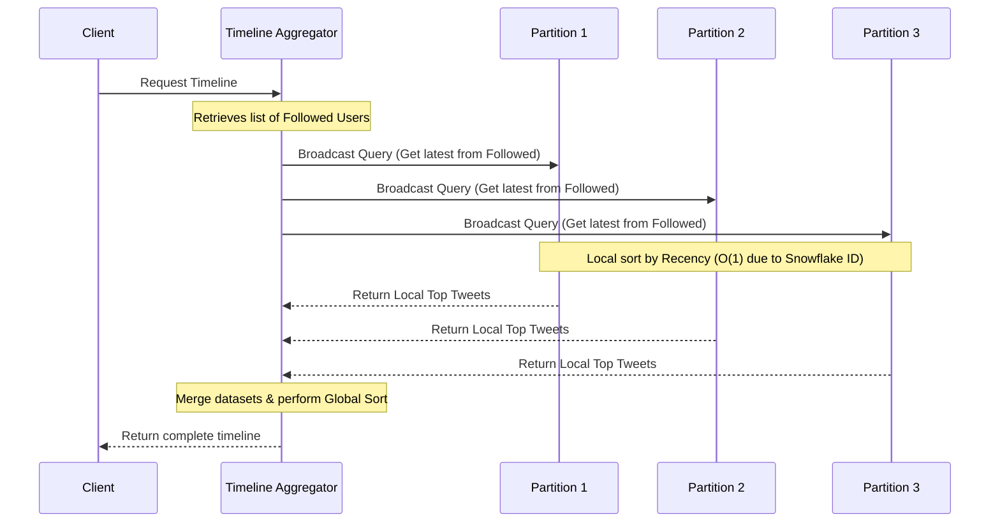

# Design: Twitter (Timeline Generation & Sharding)

Designing a massively distributed text-broadcasting system like Twitter requires solving the "Hot User" (celebrity) problem and managing extreme read-to-write disparities.

## 1. The Core Trade-off: Read Aggregation vs. Write Efficiency

When generating a timeline, the system must retrieve the most recent tweets from every user the client follows.

### Approach A: Sharding by UserID (The Flawed Approach)

If the database is partitioned by UserID, all of a single user's tweets are stored on the same physical server.

**The Downside (The Celebrity Problem):**  
If a celebrity with 50 million followers posts a tweet, millions of read requests will instantly hit the single server holding that UserID. This causes massive, concentrated load, leading to immediate resource starvation and server failure.

### Approach B: Sharding by TweetID (The Optimized Approach)

Twitter hashes the TweetID itself to determine which partition will store the data.

**The Upside:**  
This architecture completely neutralizes the "hot user" bottleneck. Both write traffic and read traffic are perfectly and uniformly distributed across the entire database cluster. No single machine is overwhelmed.

**The Downside (Scatter-Gather):**  
Because a single user's tweets are scattered across every partition, retrieving a timeline requires a complex network fanout operation.

### Fan-out Latency Trade-offs

| Feature | Push Model (Fan-out on Write) | Pull Model (Fan-out on Read) |
| :--- | :--- | :--- |
| **Write Latency** | High (updating all followers' feeds) | Low (just saving the tweet) |
| **Read Latency** | Low (pre-computed feed is ready) | High (aggregating feeds at runtime) |
| **Best For** | Standard users (many followers) | Celebrities (millions of followers) |

## 2. Chronological Sharding & 64-Bit TweetIDs

In a traditional database, you would assign a random ID to a tweet and maintain a separate `CreationDate` column. To fetch a user's latest tweets, the database requires a secondary index on that timestamp. However, maintaining secondary indices on write-heavy tables (1,150 new tweets/sec) severely degrades write performance because the database must update multiple tree structures for every insertion.

### The Snowflake Schema

Twitter eliminates the need for secondary indices by embedding the chronological data directly into the primary key itself using a 64-bit integer:

- **Timestamp (31 bits):** An epoch timestamp in the leading (most significant) bits. Because time occupies the leading bits, any list of TweetIDs sorted numerically is automatically sorted chronologically.
- **Sequence & Machine ID (17 bits):** Identifies the specific worker machine generating the ID and provides an auto-incrementing sequence to prevent collisions within the exact same millisecond.
- **Future-Proofing:** 31 bits + 17 bits = 48 bits (allowing 130,000 tweets per second). Expanding this to a full 64-bit integer allows the system to track time at a millisecond granularity for the next 100 years.

## 3. The Scatter-Gather Timeline Generation

When a client requests their timeline under the TweetID sharding model, the application server must execute a Scatter-Gather fanout.

## Scatter-Gather Timeline Steps

1. **Broadcast:**  
   The aggregator retrieves the user's "following" list and sends a query to all database servers simultaneously.

2. **Local Sorting:**  
   Each partition independently searches for matching tweets. Because the TweetID inherently contains the timestamp, this local search and sort by recency is incredibly fast.

3. **Global Aggregation:**  
   The centralized aggregator waits for all partitions to respond, merges these distributed datasets, and sorts them a final time to assemble the globally accurate timeline.
## 4. Practical Implementation

Explore low-level implementations of social media feeds and distributed ID generation:

* [Machine Coding: Instagram Feed](../../../machine_coding/systems/instagram/PROBLEM.md)
* [DSA: Design Twitter (K-Way Merge)](../../../dsa/09_heap_priority_queue/design_twitter/PROBLEM.md)
