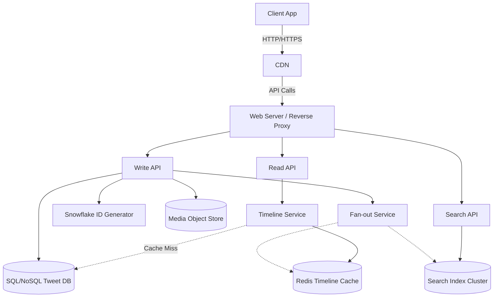

# 🐦 System Design: Twitter

## 📝 Overview
Twitter is a massive, globally distributed microblogging and social networking service defined by extreme read-heavy traffic and real-time data propagation. It enables users to broadcast short text messages and media to followers instantly, requiring a highly optimized architecture to solve the complex "celebrity problem" of viral distribution and fast keyword searching.

!!! abstract "Core Concepts"
    - **Scatter-Gather (Pull Model):** Aggregating a user's timeline at runtime by querying multiple database shards.
    - **Fan-out on Write (Push Model):** Pre-computing and pushing tweets to followers' cached timelines to ensure low read latency.
    - **Snowflake IDs:** Generating globally unique, chronologically sortable 64-bit integers without centralized bottlenecks.
    - **Active vs. Inactive Tiering:** Conserving memory by strictly caching timelines only for daily active users.

---

## 🏭 The Scenario & Requirements

### 😡 The Problem (The Villain)
Retrieving chronologically sorted feeds for a user who follows thousands of people requires massive database JOINs or multi-shard queries. Furthermore, when a "Hot User" (a celebrity with 50 million followers) posts, updating 50 million feeds simultaneously can melt traditional database and caching layers. Additionally, searching across billions of tweets in real-time is a massive indexing challenge.

### 🦸 The Solution (The Hero)
A hybrid fan-out architecture that pushes tweets to active followers for normal users, but forces clients to pull tweets dynamically from celebrities. This is paired with an ingenious 64-bit ID generation scheme (Snowflake) that embeds timestamps directly into the Tweet ID, eliminating the need for expensive secondary chronological indices. Finally, an in-memory search cluster scatter-gathers queries to provide real-time search results.

### 📜 Requirements
- **Functional Requirements:**
    1. Users can post tweets (text and media).
    2. Users can follow/unfollow other users.
    3. Users can view their Home Timeline (an aggregated, chronologically sorted feed of everyone they follow).
    4. Users can search tweets by keywords.
- **Non-Functional Requirements:**
    1. **High Availability:** The system must never go down (eventual consistency for timelines is acceptable).
    2. **Low Latency:** Home timeline generation and searches must render in under 200ms.
    3. **Scalability:** Must handle extreme read/write skew, heavy fan-out traffic, and viral load spikes gracefully.

!!! info "Capacity Estimation (Back-of-the-envelope)"
    - **Traffic:** 100 Million Active Users. 500 Million tweets/day (15 Billion/month). 250 Billion read requests/month. 10 Billion searches/month. 
    - **Throughput:**
        - Reads: 100,000 requests/sec.
        - Writes (Tweets): 6,000 requests/sec.
        - Fan-out Deliveries: 60,000 deliveries/sec (Assuming average fan-out of 10 deliveries per tweet).
        - Searches: 4,000 requests/sec.
    - **Storage Size per Tweet:** `tweet_id` (8 bytes) + `user_id` (32 bytes) + `text` (140 bytes) + `media` (~10 KB avg) = **~10 KB total**.
    - **Total Storage:** 10 KB * 500M tweets/day * 30 days = **150 TB/month** of new content (approx. **5.4 PB in 3 years**).

---

## 📊 API Design & Data Model

=== "REST APIs"
    - **`POST /api/v1/tweet`**
        - **Request:** `{ "user_id": "123", "auth_token": "ABC", "status": "Hello World!", "media_ids": ["ABC987"] }`
        - **Response:** `{ "tweet_id": "987", "created_at": "...", "status": "..." }`
    - **`GET /api/v1/home_timeline`**
        - **Query Params:** `?user_id=123&limit=20&max_id=987`
        - **Response:** `[ { "tweet_id": "...", "status": "...", "user_id": "..." }, ... ]`
    - **`GET /api/v1/search`**
        - **Query Params:** `?query=hello+world`
        - **Response:** `[ { "tweet_id": "...", "status": "...", "user_id": "..." }, ... ]`
    - **`POST /api/v1/users/{user_id}/follow`**
        - **Response:** `200 OK`

=== "Database Schema"
    - **Table:** `tweets` (SQL / Sharded RDBMS or Wide-Column Store)
        - `tweet_id` (BigInt, PK) - Snowflake ID
        - `user_id` (BigInt, Indexed)
        - `content` (Varchar/Text)
        - `created_at` (Timestamp)
    - **Table:** `follows` (RDBMS or Graph DB)
        - `follower_id` (BigInt, PK)
        - `followee_id` (BigInt, PK)
    - **Cache:** `user_timeline` (Redis Native List)
        - To optimize RAM, store only the bare minimum bytes in memory.
        - `Structure:` `| 8 bytes (tweet_id) | 8 bytes (user_id) | 1 byte (meta) |` (17 bytes total per tweet).
        - Limit: Keep only the most recent ~800 tweets per user.
    - **Storage:** `Media` (Object Store like Amazon S3)
    - **Index:** `Search` (Lucene/Elasticsearch Cluster)

---

## 🏗️ High-Level Architecture

### Architecture Diagram

### Component Walkthrough

1.  **Web Server / API Gateway:** Runs as a reverse proxy, routes traffic, and handles SSL termination.
2.  **Write API & Fan-out Service:** When a tweet is posted, it is saved to the DB, media goes to the Object Store, and the Fan-out Service pushes the 17-byte tweet references into followers' Redis home timeline caches (O(n) inserts).
3.  **Timeline Service & Read API:** Fetches the O(1) list of `tweet_id`s from the user's Redis Cache, then uses a `multiget` against a Tweet Info Service/DB to hydrate the full tweet data before returning it to the client.
4.  **Search API & Cluster:** Parses, tokenizes, and normalizes queries (fixing typos, stripping markup). It then scatter-gathers requests across a Lucene-based cluster to merge, rank, and return matched tweets.

-----

## 🔬 Deep Dive & Scalability

### Handling Bottlenecks

Given 100k reads/sec and 60k fan-outs/sec, specific components will choke without aggressive optimization:

  - **Database Overload (6k writes/sec):** A single SQL Write Master-Slave will be overwhelmed. The databases must be scaled using **Sharding** (hashing by `tweet_id`), **Federation**, or moving to a natively distributed **NoSQL Database** (like Cassandra) to handle massive write ingestion.
  - **Memory Cache Exhaustion:** Storing timelines for 100 million active users takes massive RAM.
      - **Optimization 1:** Limit Redis to only store a few hundred tweets per timeline.
      - **Optimization 2:** Cache *only active users*. If a user hasn't logged in over the past 30 days, evict them. When they return, rebuild their timeline dynamically by querying the User Graph and executing a scatter-gather against the DB.
  - **Memory vs Disk Latency:** Reading 1MB sequentially from memory takes \~250 microseconds. Reading from SSD is 4x slower, and disk is 80x slower. Therefore, timelines *must* be served from RAM (Redis) whenever possible.

### The Core Trade-off: Timeline Generation

| Decision | Pros | Cons / Limitations |
| :--- | :--- | :--- |
| **Push Model (Fan-out on Write)** | Instant timeline reads (O(1) cache lookup). Great for standard users. | Massive write amplification. Fanning out to a user with millions of followers can take minutes and cause race conditions. |
| **Pull Model (Fan-out on Read)** | Zero write amplification. Tweet is saved instantly. | High read latency and complex aggregation logic at runtime (Scatter-Gather). Overloads DB. |
| **Hybrid Approach** | Best of both worlds. Push for normal users, Pull for highly-followed users. | Increased system complexity. Requires tracking "hot" users, bypassing their fan-out, and dynamically merging their tweets into followers' feeds at read time. |

### Chronological Sharding & 64-Bit TweetIDs

Twitter eliminates the need for expensive secondary timestamp indices by embedding chronological data directly into the primary key (Snowflake ID):

  - **Timestamp (41 bits):** Epoch timestamp in millisecond precision.
  - **Machine ID (10 bits):** Identifies the specific worker machine.
  - **Sequence (12 bits):** Auto-incrementing sequence to prevent collisions within the same millisecond.
    *Because time occupies the leading bits, any list of TweetIDs sorted numerically is automatically sorted chronologically.*

-----

## 🎤 Interview Toolkit

  - **Scale Question:** "Justin Bieber posts a tweet. How do you prevent the system from crashing?" -\> *Use the Hybrid Fan-out. Bieber is marked as a 'celebrity'. His tweets are NOT pushed to followers' Redis queues. Instead, when a follower opens their app, the Timeline Service pulls their pre-computed Redis queue, separately pulls Bieber's recent tweets, merges them in memory, and returns the result.*
  - **Failure Probe:** "What happens if a Redis cache node containing 10,000 user timelines goes down?" -\> *Use Consistent Hashing to minimize reshuffling. Because Redis is strictly a cache here, rebuild the lost feeds asynchronously using the Scatter-Gather Pull model from the persistent Tweet DB upon the user's next request.*
  - **Edge Case:** "How do you handle pagination in a rapidly changing feed?" -\> *Never use offset-based pagination (`OFFSET 100`). New tweets will shift the offset, causing users to see duplicate tweets. Use cursor-based pagination using the chronological Snowflake `tweet_id` (e.g., `WHERE tweet_id < {last_seen_id}`).*

## 🔗 Related Architectures

  - [Design Instagram (Newsfeed)](./INSTAGRAM_HLD.md) — Highly visual, read-heavy, similar timeline aggregation.
  - [Design Facebook Newsfeed](./FACEBOOK_NEWSFEED.md) — EdgeRank algorithm heavy, complex privacy checks during fan-out.
  - [Machine Coding: Instagram Feed](../../../machine_coding/systems/instagram/PROBLEM.md)
  - [DSA: Design Twitter (K-Way Merge)](../../../dsa/09_heap_priority_queue/design_twitter/PROBLEM.md)
