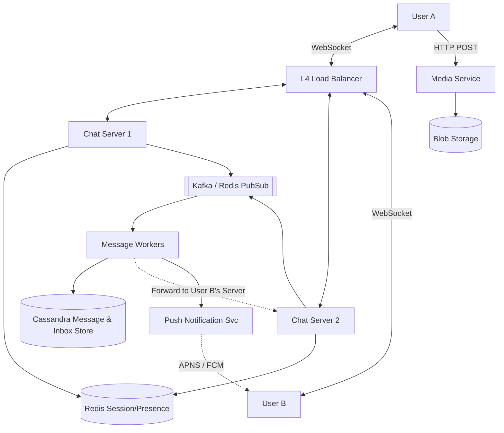

# 💬 System Design: Global Instant Messenger (WhatsApp Lite)

## 📝 Overview
A **Real-Time Messaging Platform** designed for instantaneous communication across millions of concurrent users. It prioritizes low-latency message delivery, real-time presence tracking, and reliable message ordering in a globally distributed, high-throughput environment.

!!! abstract "Core Concepts"
    - **WebSockets:** Maintaining persistent, bi-directional TCP connections to enable real-time server-side pushes.
    - **Presence Tracking:** Using high-performance TTL-based stores (Redis) to monitor user online/offline status at scale via heartbeats.
    - **Fan-out Architecture:** Efficiently distributing messages to multiple recipients in large group chats using Pub/Sub models.
    - **Offline Delivery (Inbox Pattern):** Storing messages securely in databases until clients reconnect and explicitly acknowledge receipt.

---

## 🏭 The Scenario & Requirements

### 😡 The Problem (The Villain)
"The Polling Storm." If 100 million active users continuously ask the server "Got any new messages?" via standard HTTP polling every 5 seconds, the API Gateway will melt under the weight of 20 million requests per second—most of which return empty. This wastes massive amounts of mobile battery, bandwidth, and server compute. Furthermore, managing the state of online and offline users across billions of devices is a massive routing challenge.

### 🦸 The Solution (The Hero)
"The Persistent WebSocket." A bi-directional pipe that allows the server to *push* messages to the user the exact millisecond they arrive. Combined with an asynchronous message routing layer, an "Inbox" for offline users, and a write-heavy optimized database, the system can reliably deliver billions of messages daily without dropping data.

### 📜 Requirements
- **Functional Requirements:**
    1. **One-to-One & Group Chat:** Instant message delivery with sub-200ms latency.
    2. **Presence Management:** Real-time "Last Seen" and online/offline status updates.
    3. **Message Reliability:** Support for Sent, Delivered, and Read receipts.
    4. **Offline Support:** Users should receive messages sent while they were offline (stored for up to 30 days).
    5. **Media:** Users should be able to send/receive media attachments in their messages.
- **Non-Functional Requirements:**
    1. **High Availability:** 99.99% uptime; messaging is a critical utility.
    2. **Low Latency:** Seamless, real-time conversational experience globally.
    3. **Message Ordering:** Guaranteeing messages are displayed in the correct chronological sequence.

!!! info "Capacity Estimation (Back-of-the-envelope)"
    - **Traffic:** 500 Million Daily Active Users (DAU) sending ~50 messages/day = **25 Billion messages/day**.
    - **Throughput:** 25 Billion / 86,400 seconds = **~300,000 messages/sec** on average (peaks can be 2-3x higher).
    - **Storage:** 25 Billion messages * 100 bytes (avg text payload) = **2.5 TB/day**. Over a year, this is roughly **~1 PB/year** of text data.
    - **Connections:** If 10% of users are concurrently online at peak, the system must hold **50 Million open WebSocket connections**. If one Chat Server handles 100,000 connections, we need **500 Chat Servers**.

---

## 📊 API Design & Data Model

=== "WebSocket Events"
    - **`CREATE_CHAT` (Client -> Server)**
        - **Payload:** `{ "participant_ids": ["u456", "u789"] }`
    - **`SEND_MESSAGE` (Client -> Server)**
        - **Payload:** `{ "chat_id": "c123", "msg_id": "m987", "text": "Hello!" }`
    - **`RECEIVE_MESSAGE` (Server -> Client)**
        - **Payload:** `{ "chat_id": "c123", "msg_id": "m987", "sender_id": "u456", "text": "Hello!" }`
    - **`MESSAGE_ACK` (Client <-> Server)**
        - **Payload:** `{ "msg_id": "m987", "status": "DELIVERED" }` (Acknowledges receipt so the server can delete it from the Inbox)
    - **`HEARTBEAT` (Client -> Server)**
        - **Payload:** `{ "user_id": "u123", "status": "ONLINE" }`

=== "Database Schema"
    - **Table:** `messages` (Cassandra / ScyllaDB / DynamoDB)
        - `chat_id` (String, Partition Key)
        - `msg_id` (TimeUUID / Snowflake, Clustering Key) - *Ensures chronological sorting*
        - `sender_id` (String)
        - `content` (Text or Encrypted Blob)
        - `status` (Int - Sent=1, Delivered=2, Read=3)
    - **Table:** `inbox` (Stores undelivered messages per client)
        - `client_id` (String, Partition Key)
        - `msg_id` (String, Sort Key)
        - `ttl` (Timestamp - expires after 30 days)
    - **Table:** `chat_participants`
        - `chat_id` (String, Partition Key)
        - `participant_id` (String, Sort Key)
    - **Cache:** `user_sessions` (Redis)
        - `Key:` `session:{user_id}`
        - `Value:` `{ "server_ip": "10.0.0.5", "last_active": "1697023849", "client_id": "device_1" }`
    - **Cache:** `presence` (Redis)
        - `Key:` `presence:{user_id}`
        - `Value:` `"ONLINE"` (with a 10-second TTL)

---

## 🏗️ High-Level Architecture

### Architecture Diagram

### Component Walkthrough

1.  **L4 Load Balancer:** Distributes incoming WebSocket connection requests to the least-loaded Chat Server. A Layer 4 (Network) load balancer is preferred here over Layer 7 because we just need a raw, persistent TCP connection mapped to a backend server.
2.  **Chat Servers:** Highly optimized, stateful servers (using non-blocking I/O like Go or Netty) that do nothing but hold millions of open TCP connections and route bytes.
3.  **Session & Presence Cache (Redis):** A critical routing table. When User A sends a message to User B, the system queries this cache to find exactly which Chat Server holds User B's active WebSocket connection.
4.  **Message Broker / PubSub (Kafka / Redis):** Decouples message ingestion from database writes and routes messages across thousands of stateless chat servers.
5.  **Cassandra/DynamoDB Message Store:** Selected for its exceptional write throughput and ability to effortlessly run range queries on the clustering key (e.g., "fetch the last 50 messages for `chat_id`").
6.  **Media Service:** Sending large photos and videos over WebSockets is extremely bandwidth-intensive. Media is uploaded to a separate HTTP service, stored in Blob Storage (like S3), and a URL is pushed through the WebSocket instead of the raw media file.

-----

## 🔬 Deep Dive & Scalability

### Delivering Messages (Online vs. Offline)
When a user sends a message, the system must guarantee delivery without losing data:
1. The sender transmits `SEND_MESSAGE` to their Chat Server.
2. The server queries the `chat_participants` and `user_sessions` tables to find all target clients.
3. The server durably writes the message to the `messages` table and creates an entry in the `inbox` table for *every* recipient client.
4. The server publishes the message to the routing broker (Kafka/Redis PubSub).
5. The recipient's Chat Server receives the event and pushes the message down the recipient's WebSocket.
6. **The crucial step:** The recipient's client explicitly sends an `MESSAGE_ACK` back to the server. Only upon receiving this does the server delete the message from the `inbox` table.
7. If a client is offline, the message waits safely in the `inbox`. When they eventually connect, the Chat Server queries their `inbox`, pulls the pending messages, delivers them, and waits for ACKs before deleting.

### Handling Bottlenecks

**The Fan-out Explosion (Group Chats)**
Sending a message to a 1-on-1 chat is simple. Sending a message to a group with 5,000 members during a global event creates a massive fan-out problem.
  - *Solution:* For large groups, use a Pub/Sub model. The Message Worker writes the message to the DB *once*, then publishes the `msg_id` to a topic. Chat Servers subscribed to that topic will receive the event and push the payload down the WebSockets of any connected group members they are currently hosting.

**Presence Management (The "Online" Indicator)**
Tracking the exact online status of 500 million users in real-time is highly resource-intensive.
  - *Solution:* The client app sends a lightweight "Heartbeat" ping over the WebSocket every 5 seconds. The Chat Server updates a Redis key (`presence:{user_id}`) with a Time-To-Live (TTL) of 10 seconds. If a user loses cell service, the heartbeats stop, the Redis TTL expires, and they are automatically marked as "Offline".

**Global Routing & Cross-Region Latency**
If User A (in Tokyo) messages User B (in New York), routing the message through a central US database adds hundreds of milliseconds of latency.
  - *Solution:* Deploy stateless Chat Servers globally. User A connects to a Tokyo server; User B to a New York server. The Tokyo server looks up User B's session, realizes they are connected to New York, and forwards the message across a dedicated, high-speed backbone directly to the New York Chat Server.

### ⚖️ Trade-offs: Pub/Sub Partitioning Strategy

| Strategy | Pros | Cons / Limitations |
| :--- | :--- | :--- |
| **Partition by User (Default)** | Highly efficient for 1:1 chats, which dominate WhatsApp traffic. Each server just subscribes to `channel:{userId}`. | Redundant publishes for massive group chats. Sending a message to a 100-person chat requires publishing to 100 individual Redis channels. |
| **Partition by Chat** | Efficient for massive groups. The server publishes to `channel:{chatId}` exactly once. | Overkill for 1:1 chats. It requires servers to maintain hundreds of redundant channel subscriptions for every user. |
| **Adaptive Partitioning (Optimal)** | We use user-channels for 1:1 and small groups. For groups larger than a threshold (e.g., >25 users), clients subscribe to a specific chat-channel. | Edge cases exist when chat sizes cross the threshold, requiring temporary dual-publishing to ensure no messages are dropped. |

-----

## 🎤 Interview Toolkit

  - **Failure Probe:** *"Redis Pub/Sub is 'at most once' delivery. What happens if a Redis node crashes during a publish, or a message is dropped?"* -> **Answer:** We never rely on Redis for durability. Because we always write the message to the database's `inbox` table *before* publishing to Redis, the message is safe. If Pub/Sub drops the message, the client will miss the real-time push, but periodic polling or their next connection initialization will retrieve the missed message from the `inbox`.
  - **Edge Case:** *"What happens if the user's mobile network drops, but the WebSocket connection stays technically 'open' on the server?"*
    -> **Answer:** TCP keepalives can take minutes to detect a severed connection, which is too slow. We must implement application-level heartbeats (ping/pong commands) to quickly detect "zombie" connections and clean them up.
  - **Scale Question:** *"What happens if a regional datacenter goes down?"*
    -> **Answer:** Because Chat Servers hold only transient WebSocket state, clients will automatically experience a TCP disconnect and reconnect to the next closest region via the Global Load Balancer. They will pull any missed messages from the globally replicated database.
  - **Duplicate Messages:** *"User A sends a message, but their network drops before receiving the server ACK. They hit send again. How do you prevent duplicate messages?"*
    -> **Answer:** The client must generate a unique `Idempotency Key` (e.g., a UUID) for every message intent. The server checks this ID; if it already exists in the DB, it simply returns a success ACK without re-saving or re-delivering the message.
  - **Message Ordering:** *"Due to network jitter, a user receives message #3 before message #2. How do you handle this?"*
    -> **Answer:** Never rely on the order messages arrive over the network. All Chat Servers sync their clocks via NTP (Network Time Protocol) and the server stamps the message with a globally unique, chronologically sortable `msg_id` (like a Snowflake ID). Clients sort their UI display based on this ID.

## 🔗 Related Architectures

  - [System Design: Facebook Capacity](./FACEBOOK_CAPACITY.md) — For deep dives into connection scaling math.
  - [Machine Coding: Kafka Lite](../../deep_dives/KAFKA_DEEP_DIVE.md) — Understanding the pub/sub event routing powering the group chat fan-out.
  - [Infrastructure: Socket Chat App](../../../infrastructure_challenges/socket_chat_app/PROBLEM.md) — Hands-on implementation of low-level WebSocket networking.
