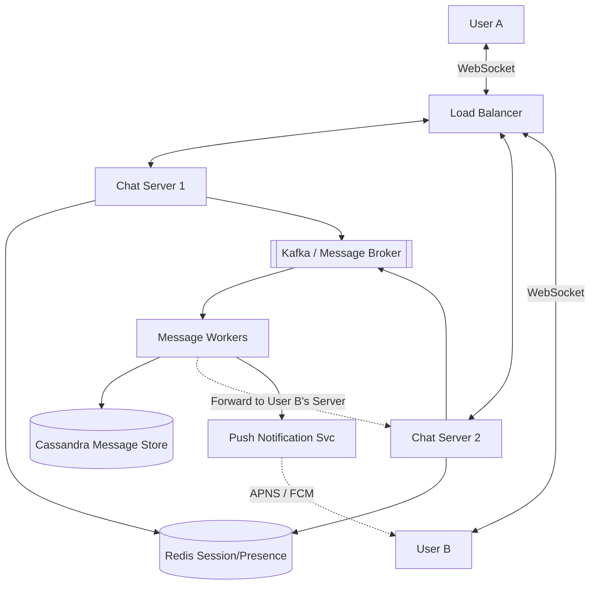

# 💬 System Design: Global Instant Messenger (WhatsApp Lite)

## 📝 Overview
A **Real-Time Messaging Platform** designed for instantaneous communication across millions of concurrent users. It prioritizes low-latency message delivery, real-time presence tracking, and reliable message ordering in a globally distributed, high-throughput environment.

!!! abstract "Core Concepts"
    - **WebSockets:** Maintaining persistent, bi-directional TCP connections to enable real-time server-side pushes.
    - **Presence Tracking:** Using high-performance TTL-based stores (Redis) to monitor user online/offline status at scale via heartbeats.
    - **Fan-out Architecture:** Efficiently distributing messages to multiple recipients in large group chats using Pub/Sub models.

---

## 🏭 The Scenario & Requirements

### 😡 The Problem (The Villain)
"The Polling Storm." If 100 million active users continuously ask the server "Got any new messages?" via standard HTTP polling every 5 seconds, the API Gateway will melt under the weight of 20 million requests per second—most of which return empty. This wastes massive amounts of mobile battery, bandwidth, and server compute.

### 🦸 The Solution (The Hero)
"The Persistent WebSocket." A bi-directional pipe that allows the server to *push* messages to the user the exact millisecond they arrive. Combined with an asynchronous message routing layer and a write-heavy optimized database, the system can reliably deliver billions of messages daily.

### 📜 Requirements
- **Functional Requirements:**
    1. **One-to-One & Group Chat:** Instant message delivery with sub-200ms latency.
    2. **Presence Management:** Real-time "Last Seen" and online/offline status updates.
    3. **Message Reliability:** Support for Sent, Delivered, and Read receipts.
- **Non-Functional Requirements:**
    1. **High Availability:** 99.99% uptime; messaging is a critical utility.
    2. **Low Latency:** Seamless, real-time conversational experience globally.
    3. **Message Ordering:** Guaranteeing messages are displayed in the correct chronological sequence.

!!! info "Capacity Estimation (Back-of-the-envelope)"
    - **Traffic:** 500 Million Daily Active Users (DAU) sending ~50 messages/day = **25 Billion messages/day**.
    - **Throughput:** 25 Billion / 86,400 seconds = **~300,000 messages/sec** on average (peaks can be 2-3x higher).
    - **Storage:** 25 Billion messages * 100 bytes (avg text payload) = **2.5 TB/day**. Over a year, this is roughly **~1 PB/year** of text data.
    - **Connections:** If 10% of users are concurrently online at peak, the system must hold **50 Million open WebSocket connections**. If one Chat Server handles 100,000 connections, we need **500 Chat Servers**.

---

## 📊 API Design & Data Model

=== "WebSocket Events"
    - **`SEND_MESSAGE` (Client -> Server)**
        - **Payload:** `{ "chat_id": "c123", "msg_id": "m987", "text": "Hello!" }`
    - **`RECEIVE_MESSAGE` (Server -> Client)**
        - **Payload:** `{ "chat_id": "c123", "msg_id": "m987", "sender_id": "u456", "text": "Hello!" }`
    - **`MESSAGE_ACK` (Client <-> Server)**
        - **Payload:** `{ "msg_id": "m987", "status": "DELIVERED" }`
    - **`HEARTBEAT` (Client -> Server)**
        - **Payload:** `{ "user_id": "u123", "status": "ONLINE" }`

=== "Database Schema"
    - **Table:** `messages` (Cassandra / ScyllaDB)
        - `chat_id` (String, Partition Key)
        - `msg_id` (TimeUUID / Snowflake, Clustering Key) - *Ensures chronological sorting*
        - `sender_id` (String)
        - `content` (Text or Encrypted Blob)
        - `status` (Int - Sent=1, Delivered=2, Read=3)
    - **Cache:** `user_sessions` (Redis)
        - `Key:` `session:{user_id}`
        - `Value:` `{ "server_ip": "10.0.0.5", "last_active": "1697023849" }`
    - **Cache:** `presence` (Redis)
        - `Key:` `presence:{user_id}`
        - `Value:` `"ONLINE"` (with a 10-second TTL)

---

## 🏗️ High-Level Architecture

### Architecture Diagram

### Component Walkthrough

1.  **Load Balancer:** Distributes incoming WebSocket connection requests to the least-loaded Chat Server.
2.  **Chat Servers:** Highly optimized, stateful servers (using non-blocking I/O like Go or Netty) that do nothing but hold millions of open TCP connections and route bytes.
3.  **Session & Presence Cache (Redis):** A critical routing table. When User A sends a message to User B, the system queries this cache to find exactly which Chat Server holds User B's active WebSocket connection.
4.  **Message Broker (Kafka):** Decouples message ingestion from database writes. Ensures messages are not lost if backend database writes slow down during peak traffic.
5.  **Cassandra Message Store:** Selected for its exceptional write throughput and ability to effortlessly run range queries on the clustering key (e.g., "fetch the last 50 messages for `chat_id`").

-----

## 🔬 Deep Dive & Scalability

### Handling Bottlenecks

**The Fan-out Explosion (Group Chats)**
Sending a message to a 1-on-1 chat is simple. Sending a message to a group with 5,000 members during a global event (like the World Cup) creates a massive fan-out problem.

  - *Solution:* For large groups, use a Pub/Sub model (like Kafka topics or Redis Pub/Sub). The Message Worker writes the message to the DB *once*, then publishes the `msg_id` to a topic. Chat Servers subscribed to that topic will receive the event and push the payload down the WebSockets of any connected group members they are currently hosting.

**Presence Management (The "Online" Indicator)**
Tracking the exact online status of 500 million users in real-time is highly resource-intensive.

  - *Solution:* The client app sends a lightweight "Heartbeat" ping over the WebSocket every 5 seconds. The Chat Server updates a Redis key (`presence:{user_id}`) with a Time-To-Live (TTL) of 10 seconds. If a user loses cell service, the heartbeats stop, the Redis TTL expires, and they are automatically marked as "Offline".

**Global Routing & Cross-Region Latency**
If User A (in Tokyo) messages User B (in New York), routing the message through a central US database adds hundreds of milliseconds of latency.

  - *Solution:* Deploy stateless Chat Servers globally. User A connects to a Tokyo server; User B to a New York server. The Tokyo server looks up User B's session, realizes they are connected to New York, and forwards the message across a dedicated, high-speed backbone directly to the New York Chat Server.

### ⚖️ Trade-offs

| Decision | Pros | Cons / Limitations |
| :--- | :--- | :--- |
| **WebSockets vs Long-Polling** | True bi-directional real-time push. Extremely low header overhead per message. | High infrastructure complexity. Requires stateful load balancing and careful connection draining during deployments. |
| **Cassandra vs RDBMS** | Masterless architecture handles 300k+ writes/sec easily. Native time-series/chronological sorting. | No complex JOINs. Cannot easily query "Show me all messages containing the word 'Hello' across all users." |
| **End-to-End Encryption (E2E)** | Maximum privacy. The database only stores encrypted blobs, protecting against data breaches. | The server cannot perform content moderation, server-side search, or push notifications with message previews easily. |

-----

## 🎤 Interview Toolkit

  - **Scale Question:** "What happens if a regional datacenter goes down?" -\> *Because Chat Servers hold only transient WebSocket state, clients will automatically experience a TCP disconnect and reconnect to the next closest region via the Global Load Balancer. They will pull any missed messages from the globally replicated Cassandra database.*
  - **Failure Probe:** "User A sends a message, but their network drops before receiving the server ACK. They hit send again. How do you prevent duplicate messages?" -\> *The client must generate a unique `Idempotency Key` (e.g., a UUID) for every message intent. The server checks this ID; if it already exists in the DB, it simply returns a success ACK without re-saving or re-delivering the message.*
  - **Edge Case:** "Due to network jitter, a user receives message \#3 before message \#2. How do you handle this?" -\> *Never rely on the order messages arrive over the network. The client UI must always sort incoming messages by their embedded `msg_id` (which should be a time-sortable Snowflake ID) before rendering the chat bubble.*

## 🔗 Related Architectures

  - [System Design: Facebook Capacity](./FACEBOOK_CAPACITY.md) — For deep dives into connection scaling math.
  - [Machine Coding: Kafka Lite](../../deep_dives/KAFKA_DEEP_DIVE.md) — Understanding the pub/sub event routing powering the group chat fan-out.
  - [Infrastructure: Socket Chat App](../../../infrastructure_challenges/socket_chat_app/PROBLEM.md) — Hands-on implementation of low-level WebSocket networking.
