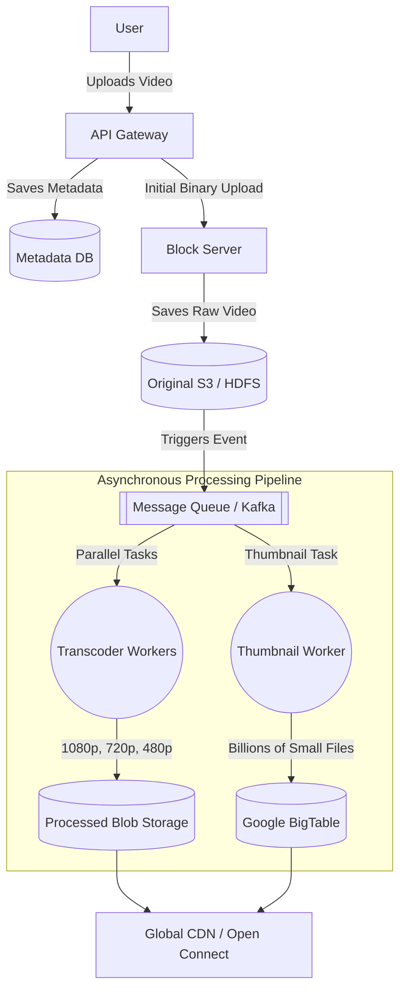

# 🎥 System Design: YouTube / Netflix Video Streaming

Designing a global video streaming platform requires handling massive binary payloads, orchestrating heavy transcoding pipelines, and utilizing localized caching to prevent global network congestion.

---

## 1. Capacity Estimation & Scale

*   **Asymmetry:** Video streaming is highly asymmetric. The Read:Write ratio is approximately **200:1**.
*   **Traffic:** ~800 Million Daily Active Users (DAU). At 5 views per user/day, the system processes **46K views/sec** and **230 uploads/sec**.
*   **Storage:** 500 hours of video are uploaded per minute. At 50MB/minute, this requires **1,500 GB/min** (25 GB/sec) of new storage constantly.
*   **Bandwidth:** Due to the 200:1 ratio, outgoing bandwidth scales to an astronomical **1 TB/s**.

---

## 2. High-Level Architecture

The architecture decouples the synchronous ingestion from the heavy asynchronous processing pipeline.

### Component Breakdown
*   **API Gateway:** Centralizes authentication, rate limiting, and request routing.
*   **Block Server:** Handles the heavy I/O of binary uploads and splits files into smaller chunks for parallel processing.
*   **Metadata DB:** Stores video info (title, tags, owner) and mapping to chunk locations.
*   **Transcoder Workers:** Convert raw video into multiple resolutions and bitrates.

---

## 3. Video Processing & Optimization

### Transcoding & Chunking
A raw 4K file is too large to stream directly. It is divided into **5-second segments (chunks)**. This allows:
*   **Parallel Processing:** Hundreds of workers can process different segments of the same video simultaneously.
*   **Adaptive Bitrate Streaming (ABR):** Protocols like **DASH** or **HLS** allow the client player to dynamically switch between bitrates (e.g., 1080p to 720p) mid-stream based on the user's current network speed.

### Inline Video Deduplication
To save PB of storage, the system runs matching algorithms (e.g., **Block Matching**) during upload. If a duplicate video is found, the system points the new metadata to the existing physical file in storage.

### Thumbnail Generation
Thumbnails present a unique scaling challenge (5+ images per video). Storing billions of 5KB files on standard disks causes high latency due to disk seeks. The design utilizes **[BigTable](../distributed_storage/BIGTABLE.md)**, which combines multiple small files into single blocks for rapid retrieval.

---

## 4. Edge Delivery (CDN)

Serving a 1TB/s stream from a central datacenter is impossible.
*   **ISP Localization:** Companies like Netflix (Open Connect) and YouTube push processed chunks to servers located physically inside the **ISP's own network**.
*   **Push vs. Pull:** Popular "hot" content is **pushed** to the edge proactively, while long-tail content is **pulled** on-demand when first requested.

---

## Practical Implementation

Explore the low-level implementations of distributed object storage and wide-column databases:

* [System Design: S3 Lite](../distributed_storage/S3_LITE.md)
* [System Design: Distributed Storage (GFS)](../distributed_storage/GFS.md)
* [System Design: NoSQL Database (BigTable)](../distributed_storage/BIGTABLE.md)
