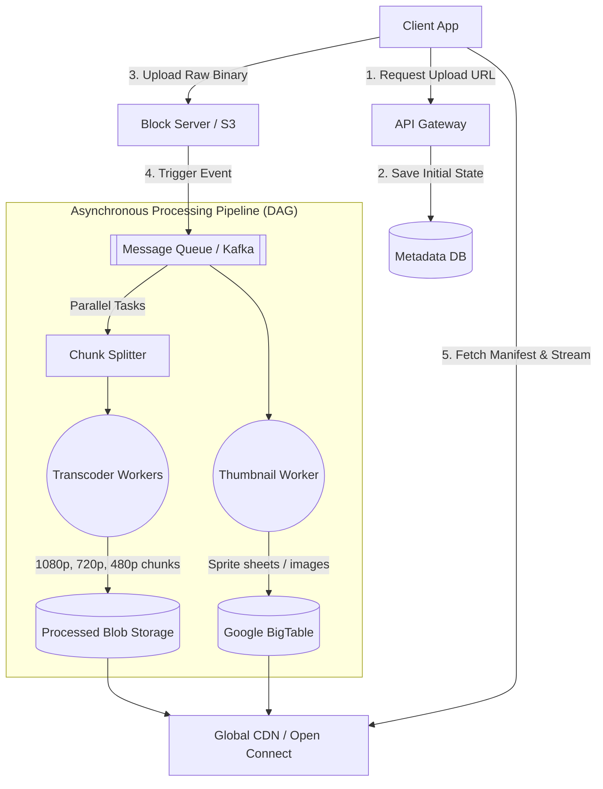

# 🎥 System Design: Video Streaming Service (YouTube / Netflix)

## 📝 Overview
A **Global Video Streaming Platform** designed to deliver high-quality content to millions of concurrent users worldwide. It focuses on low-latency content delivery via CDNs and utilizes adaptive bitrate streaming to ensure a smooth viewing experience across varying network conditions.

!!! abstract "Core Concepts"
    - **Adaptive Bitrate Streaming (ABR):** Dynamically adjusting the video quality (resolution and bitrate) mid-stream based on the client's current network bandwidth (HLS/DASH).
    - **Video Transcoding & Chunking:** Breaking a single massive video file into smaller time-based segments (chunks) and converting them into multiple formats/resolutions.
    - **Edge Delivery (CDN):** Caching video chunks physically close to the user (often inside their ISP's network) to drastically reduce latency and backbone network congestion.

---

## 🧠 The Engineering Story

### 😡 The Villain: "The Buffering Circle"
Raw 4K video files are massive (often >50GB). If 100M users try to watch a hit show like "Squid Game" simultaneously, and they all hit a central data center, the global internet backbone would melt. Users would experience constant buffering, high latency, and massive data consumption.

### 🦸 The Hero: "The Global CDN Architecture"
A decoupled architecture where video ingestion is separated from streaming. Uploaded videos are pushed into an asynchronous processing pipeline that chunks the video into 5-second segments and transcodes them into multiple resolutions. These lightweight chunks are pre-distributed to edge servers (Open Connect) located inside the ISP's own office, drastically reducing the distance data travels.

### 🎬 The Plot
1.  **Ingestion:** User uploads high-res source files to Block Storage (S3).
2.  **Transcoding:** A DAG-based pipeline generates 1,000+ variants (4K, 1080p, 720p for different devices/bandwidths).
3.  **Storage:** Tiered storage (Standard for hot movies, Glacier for archives).
4.  **Streaming:** The client player uses Adaptive Bitrate (ABR) to seamlessly switch between qualities based on network speed.

### 🔄 The Twist (Failure Scenario): "The Metadata Storm"
The video streams fine, but the "Play" button takes 10 seconds to load because the recommendation engine or metadata service is down. Mastery of **Heavy Asset Delivery** must be balanced with **High-Availability Microservices** for the control plane.

---

## 📜 Requirements

### Functional Requirements
1.  **Video Upload:** Fast and reliable ingestion of high-resolution source files.
2.  **Smooth Playback:** Users can search for and view videos with minimal startup time and no buffering.
3.  **Adaptive Quality:** The system automatically adjusts video quality based on the user's internet connection.

### Non-Functional Requirements
1.  **High Availability:** 99.99% uptime for the playback service.
2.  **Low Latency:** Time to First Frame (TTFF) < 200ms.
3.  **High Throughput:** Must support extreme egress bandwidth (serving millions of concurrent streams).

!!! info "Capacity Estimation (Back-of-the-envelope)"
    - **Traffic:** ~800 Million Daily Active Users (DAU) watching 5 videos per day = **4 Billion views/day** (~46,000 views/sec).
    - **Asymmetry:** Video streaming is highly asymmetric. Assume a Read:Write ratio of **200:1**, meaning ~230 uploads/sec.
    - **Storage (Ingress):** 500 hours of video are uploaded per minute. At ~50MB/minute, this requires **1,500 GB/min** (25 GB/sec) of continuous new storage. Over a year, this is roughly **~800 PB/year** of raw video.
    - **Bandwidth (Egress):** 46,000 views/sec * ~20 Mbps (average HD stream) = **~1 Tbps (Terabits per second)** sustained global egress bandwidth.

---

## 📊 API Design & Data Model

=== "REST APIs"
    - **`POST /api/v1/videos/upload/init`**
        - **Request:** `{ "title": "My Vlog", "file_size_bytes": 1048576000, "format": "mp4" }`
        - **Response:** `{ "video_id": "v123", "upload_url": "https://s3-presigned-url..." }` *(Clients upload directly to block storage, not through the API Gateway)*
    - **`GET /api/v1/videos/{video_id}/manifest`**
        - **Response:** Returns an M3U8 (HLS) or MPD (DASH) manifest file containing the CDN URLs for all available bitrates and audio tracks.
    - **`POST /api/v1/videos/{video_id}/view`**
        - **Request:** `{ "user_id": "u456", "watch_duration_sec": 30 }` *(Analytics/View count tracking)*

=== "Database Schema"
    - **Table:** `video_metadata` (Sharded RDBMS / Document DB)
        - `video_id` (String, PK)
        - `uploader_id` (String, Indexed)
        - `title` (String)
        - `processing_status` (Enum: UPLOADING, PROCESSING, READY)
        - `manifest_url` (String)
    - **Table:** `thumbnails` (Wide-Column Store / BigTable)
        - `RowKey:` `video_id`
        - `ColumnFamily:images` -> `default`, `high_res`, `animated_preview`
    - **Storage:** `Blob Storage` (S3 / HDFS)
        - *Path:* `/videos/{video_id}/1080p/chunk_001.ts`

---

## 🏗️ High-Level Architecture

### Architecture Diagram

### Component Walkthrough

1.  **API Gateway:** Centralizes authentication, rate limiting, and request routing for metadata operations. It does *not* handle the actual binary video stream.
2.  **Block Server (S3/HDFS):** Handles the heavy I/O of binary uploads. Clients use pre-signed URLs to upload large files directly here, bypassing the application servers.
3.  **Asynchronous Processing Pipeline:** Driven by Kafka, this Directed Acyclic Graph (DAG) of microservices processes the raw file. The *Chunk Splitter* divides the video into 5-second segments, which are then processed in parallel by *Transcoder Workers* into various resolutions (e.g., 1080p, 720p, 480p).
4.  **Thumbnail Worker & BigTable:** Thumbnails present a unique scaling challenge. Storing billions of tiny 5KB image files on standard disks causes high latency due to disk seeks. The design utilizes a wide-column store like BigTable to combine multiple small files into larger blocks for rapid retrieval.
5.  **CDN (Edge Delivery):** The final transcoded chunks and manifest files are pushed to Content Delivery Networks. The client's video player downloads chunks sequentially from the closest edge server.

-----

## 🔬 Deep Dive & Scalability

### Handling Bottlenecks

**Adaptive Bitrate Streaming (ABR) via DASH/HLS**
To prevent buffering, the video is not sent as a continuous stream. Instead, the client downloads a "Manifest" file that lists the URLs for every 5-second chunk in every available quality. The client's video player actively monitors its own download speed. If the network drops, the player seamlessly requests the next chunk from the 480p list instead of the 1080p list.

**Edge Delivery (ISP Localization)**
Serving a 1 Tbps stream from a central datacenter is impossible. Companies like Netflix build custom CDN appliances (Open Connect) and physically install them inside the internet service providers (ISPs) like Comcast or AT\&T. This means the heavy video data never actually travels across the broader internet backbone; it is served directly from a box down the street from the user.

**Inline Video Deduplication**
To save Petabytes of storage, the system runs hashing algorithms (like Block Matching or MD5) during the upload phase. If a duplicate video is found (e.g., a viral meme uploaded by thousands of users), the system safely discards the new binary and simply points the new metadata record to the existing physical file.

### ⚖️ Trade-offs

| Decision | Pros | Cons / Limitations |
| :--- | :--- | :--- |
| **TCP (HTTP-based streaming) vs UDP** | Reliable delivery. Easily cacheable by standard HTTP CDNs. Traverses firewalls easily. | TCP handshake and congestion control overhead. (Note: YouTube/Netflix use TCP, unlike live video conferencing like Zoom which uses UDP). |
| **Push vs Pull CDN Caching** | Pushing popular ("hot") content proactively guarantees zero cache misses for viral videos. | Pushing the entire long-tail catalog (billions of unwatched videos) wastes massive edge storage. Hybrid is required. |
| **Pre-Transcoding vs On-the-Fly** | Pre-transcoding saves CPU on read. The video is ready to stream instantly in any format. | Massive storage bloat (storing the same video 5+ times). Wasted compute if the video is never watched. |

-----

## 🎤 Interview Toolkit

  - **Scale Question:** "A highly anticipated movie trailer drops and gets 10 million views in 5 minutes. How does the system survive?" -\> *Because the video is static, it is heavily cached at the CDN Edge. The 10 million requests never hit the origin database or block storage. The only load on the central servers is the asynchronous view-count analytics, which are buffered in Kafka and batched to the DB.*
  - **Failure Probe:** "A transcoder worker node crashes halfway through processing a 2-hour 4K video. What happens?" -\> *Because the video was split into 5-second chunks before transcoding, the system doesn't lose much work. The Kafka consumer group simply detects the dead worker, un-acks the specific 5-second chunk message, and another worker picks it up.*
  - **Edge Case:** "How do you securely stream premium content (like Netflix movies) to prevent piracy?" -\> *Implement Digital Rights Management (DRM). The transcoded chunks are encrypted at rest using AES. The manifest file instructs the client to fetch a decryption key from a secure License Server, which verifies the user's active subscription before releasing the key.*

## 🔗 Related Architectures

  - [System Design: S3 Lite](../distributed_storage/S3_LITE.md) — Deep dive into the block storage underlying the video files.
  - [System Design: Distributed Storage (GFS)](../../deep_dives/GFS.md) — How massive files are physically stored across disk clusters.
  - [System Design: NoSQL Database (BigTable)](../../deep_dives/BIGTABLE.md) — How thumbnails and heavy metadata are optimized for read-heavy workloads.
