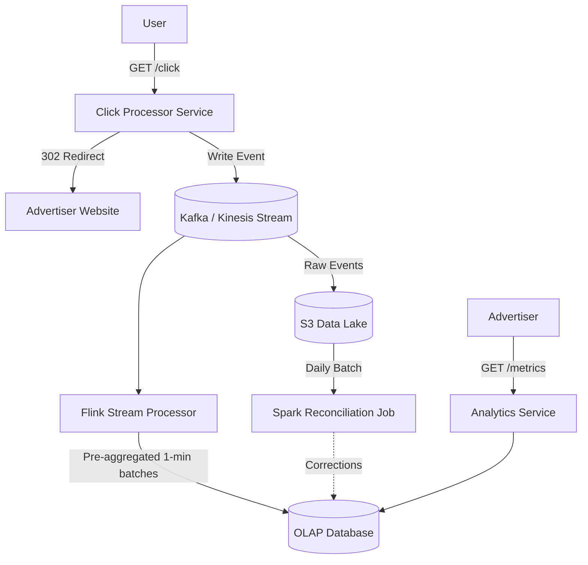

# 🖱️ System Design: Ad Click Aggregator

## 📝 Overview
An Ad Click Aggregator is a robust data processing system that collects and aggregates data on ad clicks, typically used by advertisers on platforms like Facebook to track ad performance and optimize campaigns. It operates as a high-throughput, write-heavy distributed system designed to process thousands of events per second while simultaneously providing low-latency analytics querying.

!!! abstract "Core Concepts"
    - **Scaling Writes:** Utilizing streams (like Kafka or Kinesis) and stream processors (like Flink) to buffer and pre-aggregate massive write volumes before they hit the database.
    - **Hot Shard Mitigation:** Appending random suffixes to partition keys to distribute the load of viral events across multiple shards.
    - **Lambda Architecture (Reconciliation):** Combining a real-time speed layer with a periodic batch layer to ensure data remains both fast and strictly accurate.
    - **OLAP vs. TSDB:** Choosing Online Analytical Processing (OLAP) databases for high-cardinality, multi-dimensional querying over Time Series Databases.

---

## 🏭 The Scenario & Requirements

### 😡 The Problem (The Villain)
If a system attempts to store every single ad click directly into a traditional database and then run `GROUP BY` aggregation queries on the fly, the database will quickly become a severe bottleneck. At peak loads, this naive approach leads to slow, inefficient queries, meaning advertisers cannot get the low-latency, real-time data they need, and the system risks dropping data during traffic spikes.

### 🦸 The Solution (The Hero)
A stream processing architecture that buffers raw clicks into a highly available queue, pre-aggregates the data in real-time using a stream processor, and stores the aggregated metrics in an OLAP database optimized for lightning-fast reads.

### 📜 Requirements
- **Functional Requirements:**
    1. Users can click on an ad and be redirected to the advertiser's website.
    2. Advertisers can query ad click metrics over time with a minimum granularity of 1 minute.
- **Non-Functional Requirements:**
    1. Scalable to support a peak of 10k clicks per second.
    2. Low latency analytics queries for advertisers (sub-second response time).
    3. Fault-tolerant and accurate data collection (zero data loss).
    4. As real-time as possible, so advertisers can query data immediately after the click.
    5. Idempotent click tracking to prevent counting the same click multiple times.
- **Out of Scope:** Ad targeting, ad serving, cross-device tracking, offline marketing integration, and fraud/spam detection.

!!! info "Capacity Estimation (Back-of-the-envelope)"
    - **Traffic:** Peak of 10,000 clicks per second, with an average of roughly 1,000 clicks per second.
    - **Total Daily Volume:** ~1,000 clicks * 86,400 seconds = ~100 million clicks per day.
    - **Scale:** 10 million active ads in the system.

---

## 📊 API Design & Data Model

=== "REST APIs"
    - **`GET /click`**
        - **Request:** `?adId=123&userId=456`
        - **Response:** `302 Found` Redirect to the advertiser's target URL.
    - **`GET /metrics`**
        - **Request:** `?adId=123&startTime=1640000000&endTime=1640003600&granularity=1m`
        - **Response:** `{ "adId": "123", "metrics": [ { "timestamp": 1640000000, "clicks": 100 }, ... ] }`

=== "Database Schema"
    - **Table:** `ad_metrics` (OLAP Database / Data Warehouse)
        - `ad_id` (String, Partition Key) - e.g., "123"
        - `minute_timestamp` (Timestamp, Sort Key) - e.g., 1640000000
        - `unique_clicks` (Integer) - e.g., 100

---

## 🏗️ High-Level Architecture

### Architecture Diagram

### Component Walkthrough
1. **Click Processor Service:** Horizontally scalable API nodes that receive the user's click, write the raw event to the stream, and issue a 302 redirect to the advertiser's site. 
2. **Message Stream (Kafka / Kinesis):** A distributed, fault-tolerant log that buffers the incoming click events to absorb massive write spikes and prevent data loss.
3. **Stream Processor (Flink):** Consumes raw events from the stream, groups them by `ad_id` and minute, and continuously pushes pre-aggregated metrics to the database.
4. **OLAP Database (Snowflake, BigQuery, ClickHouse):** A columnar storage database specifically optimized for lightning-fast read aggregations (COUNT, SUM) over millions of rows, powering the advertiser dashboards.
5. **Data Lake & Batch Processor (S3 + Spark):** Stores raw events indefinitely and runs periodic reconciliation jobs to ensure the fast real-time data is strictly accurate.

---

## 🔬 Deep Dive & Scalability

### Handling Bottlenecks & Hot Shards
Scaling to 10k clicks per second requires sharding the message stream (e.g., Kinesis shards limited to 1000 records/s) by `AdId`. However, this introduces the **Hot Shard** problem: if Nike launches a viral ad with LeBron James, all clicks for that `AdId` flood a single shard, overwhelming it and potentially causing data loss.
- **The Fix:** We append a random number suffix to the partition key for popular ads (e.g., `AdId:0-N`). This spreads the intense write load across multiple stream partitions. When Flink writes to the OLAP database, it strips the suffix and performs an upsert with a `SUM` aggregation, seamlessly combining the concurrent writes.

### Ensuring Zero Data Loss & Accuracy
Click data translates directly to money, so losing data is unacceptable.
- **Stream Retention:** Kafka and Kinesis are highly available and replicate data across multiple zones. We configure a 7-day retention policy so that if Flink crashes, it can replay the events it missed.
- **Checkpointing:** While Flink supports checkpointing its state to S3, an experienced engineer might note that for tiny 1-minute aggregation windows, simply replaying the last minute from the stream is often sufficient and avoids unnecessary checkpointing overhead.
- **Periodic Reconciliation (Lambda Architecture):** Real-time streams can suffer from out-of-order events or transient processing errors. To guarantee absolute correctness, we continuously dump raw events from Kafka to an S3 Data Lake (via Kafka Connect). A daily Spark batch job reads this raw truth, re-aggregates it, and corrects any discrepancies in the OLAP database.

### Low Latency Queries
While real-time stream processing ensures data is available within seconds, querying months of data can still be slow.
- **Pre-aggregation:** To keep advertiser queries fast across long time horizons, a nightly cron job pre-aggregates the 1-minute OLAP data into daily or weekly rollups. Advertisers query these higher-level tables for broad views and only drill down to the 1-minute tables when inspecting specific, narrow timeframes.

### ⚖️ Trade-offs
| Decision | Pros | Cons / Limitations |
| :--- | :--- | :--- |
| **OLAP vs. Time Series DB (TSDB)** | OLAP databases handle high-cardinality, multi-dimensional queries (device type, geography, campaign) effortlessly. | TSDBs (like InfluxDB) might be simpler if the *only* requirement was a basic time-range query on a single metric. |
| **Real-time Stream vs. Batch Processing** | Flink provides advertisers with up-to-the-minute data, crucial during ad launches. | Pure batch processing (e.g., running Spark every 5 minutes) is simpler to implement but introduces cascading delays during traffic spikes, delivering stale data. |

---

## 🎤 Interview Toolkit

- **Mid-Level Expectations:** Should confidently construct a high-level design separating raw event ingestion from querying. Expected to propose at least a batch processing solution (Spark) and handle basic probing about database choices and idempotency. 
- **Senior Expectations:** Must speed through the high-level design to focus on scaling. Expected to understand the trade-offs between batch and real-time (Flink) processing, justify OLAP vs TSDB choices, and propose robust fault-tolerance mechanisms.
- **Staff+ Expectations:** Expected to proactively identify complex edge cases like the "Hot Shard" problem and solve them without prompting. Should expertly discuss the Lambda Architecture (Reconciliation) and weigh the practical necessity of features like Flink checkpointing for 1-minute windows.

## 🔗 Related Architectures
<!-- - **Metrics Monitoring** — Shares a nearly identical ingestion-heavy stream processing architecture, prioritizing write scalability and time-windowed aggregations. -->
- [Top K (YouTube)](./YOUTUBE_TOP_K.md) — Utilizes a similar Flink streaming architecture for tumbling/sliding window aggregations over massive, real-time event firehoses.
