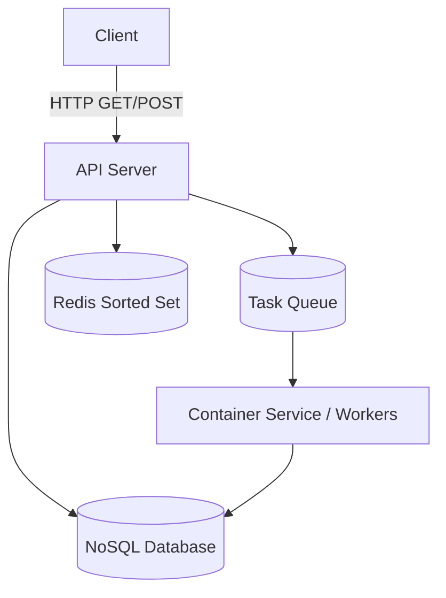

# 🧑‍💻 System Design: LeetCode

## 📝 Overview
LeetCode is a platform that helps software engineers prepare for coding interviews by offering a vast collection of coding problems. It supports secure, multi-language code execution, instant feedback on submissions, and live leaderboards for coding competitions.

!!! abstract "Core Concepts"
    - **Managing Long-Running Tasks:** Code execution can take several seconds, requiring asynchronous background workers (containers) to process jobs without timing out the API.
    - **Security & Isolation:** Running untrusted user code safely requires strict sandboxing, resource limitations, and restricted network access.
    - **Leaderboard Aggregation:** Efficiently ranking users in near real-time during high-traffic competitions.

---

## 🏭 The Scenario & Requirements

### 😡 The Problem (The Villain)
Engineers need a reliable way to practice coding algorithms, but evaluating untrusted code safely on a central server poses massive security and resource-exhaustion risks. Furthermore, calculating live competition ranks for thousands of concurrent participants can easily overwhelm a standard database. 

### 🦸 The Solution (The Hero)
An architecture that leverages isolated containerization for secure code execution and utilizes efficient caching (like Redis Sorted Sets) combined with periodic polling to deliver near real-time competition leaderboards without melting the database.

### 📜 Requirements
- **Functional Requirements:**
    1. Users should be able to view a list of coding problems.
    2. Users should be able to view a given problem and code a solution in multiple languages.
    3. Users should be able to submit their solution and get instant feedback.
    4. Users should be able to view a live leaderboard for competitions.
- **Non-Functional Requirements:**
    1. Prioritize availability over consistency.
    2. Support isolation and security when running untrusted user code.
    3. Return submission results within 5 seconds.
    4. Scale to support competitions with up to 100,000 users.
- **Out of Scope:** User authentication, payment processing, social features, and CI/CD pipelines.

!!! info "Capacity Estimation (Back-of-the-envelope)"
    - **Scale:** Relative to typical system design interviews, this is a small-scale system with a few hundred thousand total users and roughly 4,000 problems. 
    - **Peak Traffic:** Competitions handle spikes of around 100,000 concurrent users.

---

## 📊 API Design & Data Model

=== "REST APIs"
    - **`GET /problems?page=1&limit=100`**
        - **Response:** `Partial<Problem>[]` (Returns a subset of the problem entity like title, ID, level, and tags for pagination).
    - **`GET /problems/:id?language={language}`**
        - **Response:** `Problem` (Returns the full problem statement and language-specific code stub).
    - **`POST /submissions`**
        - **Request:** `{ "problemId": "123", "code": "def solve()...", "language": "python" }`
        - **Response:** Job ID or synchronous result of running the code against test cases.
    - **`GET /leaderboard/:competitionId?page=1&limit=100`**
        - **Response:** `Leaderboard` (Ranked list of users based on performance).

=== "Database Schema"
    - **Table:** `Problem` (NoSQL / DynamoDB)
        - `id` (String, PK)
        - `title`, `level`, `tags` (String)
        - `testCases` (List/Subdocument) - Nested directly to avoid complex joins.
        - `codeStubs` (Map of language to stub).
    - **Table:** `Submission`
        - `id` (String, PK)
        - `userId` (String)
        - `problemId` (String)
        - `competitionId` (String, Index)
        - `status` (String) - e.g., "Pass", "Fail"
    - **Table:** `Leaderboard`

---

## 🏗️ High-Level Architecture

### Architecture Diagram

### Component Walkthrough
1. **API Server:** Handles incoming requests for problem lists, fetching specific problems, and leaderboard queries. It handles pagination and routes code submissions.
2. **Database (NoSQL):** Stores problems (with nested test cases) and submission histories. DynamoDB is chosen because complex queries aren't necessary for problem retrieval.
3. **Queue:** Sits between the API Server and the Container Service. It buffers submissions during traffic spikes (like a competition) and enables retries if a container crashes.
4. **Container Service:** Isolated sandboxed environments (Docker containers) that execute the user's code, wait for completion, and read the output.
5. **Redis:** Caches the leaderboard using Sorted Sets to prevent expensive database aggregation queries on every request.

---

## 🔬 Deep Dive & Scalability

### 🛡️ Isolation and Security for User Code
Running untrusted user code is highly dangerous. To ensure isolation and meet the 5-second SLA, we employ several container-level restrictions:
- **Read-Only Filesystem:** The code directory is mounted as read-only. Outputs are written to a temporary directory that is deleted shortly after completion.
- **CPU and Memory Bounds:** Strict limits are placed on the container. If exceeded, the container is killed to prevent resource exhaustion.
- **Explicit Timeout:** The user's code is wrapped in a timeout mechanism that forcibly terminates the process if it runs longer than the 5-second limit.
- **Limit Network Access:** Network access inside the container is entirely disabled. In AWS, this is achieved using VPC Security Groups and NACLs to restrict outbound/inbound traffic.
- **No System Calls (Seccomp):** Seccomp is used to restrict the system calls the container can make, preventing host-system compromise.

### 🏆 Efficient Leaderboard Fetching
During a 100k-user competition, calculating the leaderboard directly from the database using a `GROUP BY` query (or a DynamoDB GSI query) for every request would overwhelm the database. 
Instead of introducing complex WebSockets (which are overkill for a 5-second acceptable delay), we utilize **Redis Sorted Sets with Periodic Polling**. 
The clients poll the `/leaderboard` endpoint every ~5 seconds. The API Server fetches the pre-sorted rankings from a Redis Sorted Set, striking a perfect balance between real-time updates and architectural simplicity. During the final minutes of a competition, this polling interval could progressively shorten (e.g., to 2 seconds).

### 📈 Handling Spikes with a Task Queue
While an API Server can easily handle 100k concurrent users, the code execution step is heavily CPU-intensive. A sudden spike in submissions could overwhelm the container workers. By introducing a queue (like Kafka, Redis, or SQS) between the API server and the Container Service, we buffer the load. This queue also provides a mechanism to seamlessly requeue and retry a submission if a container unexpectedly fails.

### 🧪 Standardizing Test Case Execution
We cannot write a unique set of test cases for every language. Instead, we write one set of serialized test cases.
For complex data structures like a Binary Tree, the input is serialized into an array using a level-order (BFS) traversal. A language-specific test harness is injected into the container alongside the user's code. This harness deserializes the array back into a `TreeNode` object, passes it to the user's function, and then compares the output to the serialized expected output.

---

## 🎤 Interview Toolkit

- **Mid-Level Expectations:** Clearly define the APIs and data model. Formulate a functional high-level design. Understand the need for security/isolation and propose a container, VM, or serverless approach.
- **Senior Expectations:** Speed through the high-level design to focus on the deep dives. Discuss the pros/cons of containers vs. VMs vs. Serverless. Break out of pure "box drawing" to explain the actual mechanics of running the test harnesses and serializing inputs.
- **Staff+ Expectations:** Drive the entire conversation. Proactively identify spikes and security flaws. Architect a clean, simple system free of over-engineering (e.g., explicitly dismissing WebSockets for Redis polling) but with a clear, bulletproof path to scale. 

## 🔗 Related Architectures
- [Job Scheduler](../../pillars/LONG_RUNNING_TASKS.md) — Shares the *Managing Long-Running Tasks* pattern, heavily utilizing message queues and background worker pools to execute arbitrary code or tasks safely.
