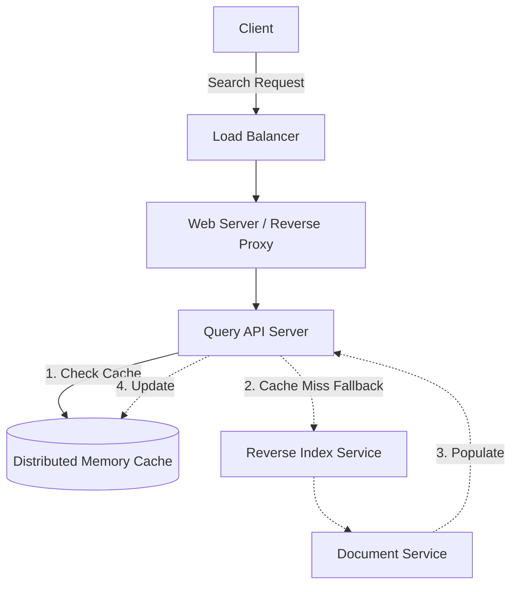

# 🗄️ System Design: Distributed Key-Value Cache (Search Results)

## 📝 Overview
A highly available, distributed in-memory key-value cache designed to store and serve the most recent and popular web server search queries. By intercepting repeated requests, it drastically reduces read latency and protects backend indexing services from heavy, redundant traffic.

!!! abstract "Core Concepts"
    - **LRU Eviction (Least Recently Used):** A memory management strategy utilizing a Hash Map and Doubly Linked List to $O(1)$ evict the oldest queries when RAM is full.
    - **Consistent Hashing:** A distributed systems algorithm used to predictably shard the massive 2.7 TB cache across multiple physical machines.
    - **Cache-Aside Pattern:** The application explicitly checks the cache before querying the database, updating the cache only on a miss.

---

## 🏭 The Scenario & Requirements

### 😡 The Problem (The Villain)
A search engine processes billions of queries a month. However, search traffic follows a power-law distribution—a small percentage of popular queries (e.g., trending news, weather) make up a massive percentage of total traffic. Forcing the `Reverse Index Service` and `Document Service` to re-compute the exact same search results thousands of times a second wastes expensive CPU cycles and causes severe read latency.

### 🦸 The Solution (The Hero)
An intelligent `Query API` that intercepts normalized search requests and checks a fast `Memory Cache` (like Redis or Memcached). By serving popular queries directly from RAM (~250 microseconds latency vs. disk-based lookups), the system easily handles traffic spikes. A distributed LRU policy ensures only the most relevant searches stay in memory.

### 📜 Requirements
- **Functional Requirements:**
    1. System must serve cached search results (Hits) in sub-millisecond time.
    2. System must gracefully fallback to the backend services on Cache Misses, then populate the cache.
    3. Cache must strictly bound its memory usage by expiring old or unpopular entries (LRU).
- **Non-Functional Requirements:**
    1. **High Availability:** The cache must survive node failures without bringing down the search engine.
    2. **Low Latency:** Network hops between the API and Cache cluster must be minimized.
    3. **Scalability:** The cache must horizontally scale to accommodate petabytes of potential query combinations.

!!! info "Capacity Estimation (Back-of-the-envelope)"
    - **Traffic:** 10 Million users. 10 Billion queries per month.
    - **Throughput:** 10 Billion / 2.5M seconds $\rightarrow$ **~4,000 requests/sec (QPS)**.
    - **Storage per Entry:** `query` string (50 bytes) + `title` (20 bytes) + `snippet` (200 bytes) = **~270 bytes**.
    - **Total Potential Memory:** 270 bytes * 10 Billion queries = **~2.7 TB/month**.
    - *Conclusion:* 2.7 TB of RAM is too large for a single machine. The cache *must* be partitioned/sharded, and aggressive LRU eviction is mandatory to cap hardware costs.

---

## 📊 API Design & Data Model

=== "REST APIs"
    - **`GET /api/v1/search`**
        - **Query Params:** `?q=system+design+interview`
        - **Response:** ```json
        {
            "query": "system design interview",
            "results": [
                {
                    "title": "System Design Primer",
                    "snippet": "Learn how to design large-scale systems..."
                }
            ],
            "cached": true 
        }
        ```

=== "Cache Schema"
    - **Data Structure:** Key-Value Store (Redis / Memcached)
        - `Key` (String): The fully normalized query string.
        - `Value` (JSON/Blob): The serialized array of search result objects (titles and snippets).
        - `TTL` (Integer): Time-To-Live in seconds to ensure data freshness.

---

## 🏗️ High-Level Architecture

### Architecture Diagram


### Component Walkthrough

1.  **Query API Server:** The brain of the operation. Before touching the cache, it parses the query (removes markup, fixes typos, normalizes capitalization, breaks into terms). This maximizes cache hit rates by ensuring `System Design` and `system design!` map to the exact same cache key.
2.  **Distributed Memory Cache:** A cluster of Redis or Memcached nodes storing the $O(1)$ lookup maps and managing the LRU eviction lists in RAM.
3.  **Reverse Index & Document Services:** The heavy lifting backend. Only invoked on a cache miss to rank results and extract text snippets.

-----

## 🔬 Deep Dive & Scalability

### Handling Bottlenecks: The 2.7 TB Memory Limit

Storing 2.7 TB of unique queries in RAM on a single machine is impossible. We must scale horizontally across a cluster of cache nodes. There are three approaches:

1.  **Local In-Memory Cache (Per API Server):** Fastest, but highly inefficient. Low cache hit rate because Query API Node A doesn't know what Query API Node B already cached.
2.  **Replicated Global Cache:** Every cache node holds a complete copy of the 2.7 TB data. Extremely wasteful memory utilization.
3.  **Sharded Global Cache (The Solution):** Partition the cache across multiple machines using a hash function. We use **Consistent Hashing** (`server_node = hash(query) % N`) to map specific queries to specific machines. This aggregates memory and prevents massive cache misses when adding or removing a cache node.

### Implementing the LRU Eviction

Behind the scenes, each cache node must evict data in $O(1)$ time when its local RAM is full.

  - It uses a **Doubly-Linked List** intertwined with a **Hash Map**.
  - On a `set()` or `get()`, the node is moved to the `head` of the linked list (Most Recently Used).
  - When capacity is reached, the node at the `tail` is popped, and its corresponding key is deleted from the Hash Map (Least Recently Used).

### Cache Invalidation & Freshness

Search results change frequently (new web pages, changing page ranks). The cache cannot hold stale data forever.

  - We utilize the **Cache-Aside** pattern paired with a **Time To Live (TTL)**.
  - When an item is stored, it is given a TTL (e.g., 1 hour). After 1 hour, it naturally expires, forcing the next request to hit the backend indexing service and fetch fresh results.

### ⚖️ Trade-offs

| Decision | Pros | Cons / Limitations |
| :--- | :--- | :--- |
| **Cache-Aside Pattern** | Resilient. If the cache goes down, the system simply bypasses it to the DB (though latency will spike). | Data inconsistency. The cache might serve stale results until the TTL expires. |
| **Consistent Hashing** | Minimizes reshuffling. Adding a new cache node only remaps $1/N$ of the keys. | Complex to implement. Requires maintaining a hash ring and handling virtual nodes for even distribution. |
| **Query Normalization** | Drastically improves cache hit rates by consolidating similar inputs into one key. | Adds CPU overhead to the API server before it can even check the cache. |

-----

## 🎤 Interview Toolkit

  - **Scale Probe:** "A breaking news event happens, and suddenly 1 million users search the exact same term in the same second. Your cache hasn't stored it yet. What happens?" -\> *This is a **Thundering Herd (Cache Stampede)** problem. The 1 million requests will all miss the cache simultaneously and crash the database. We solve this by using **Request Coalescing** (Mutex locks on the API server) so only the first request queries the DB, while the other 999,999 wait a few milliseconds for that single request to populate the cache.*
  - **Failure Probe:** "What happens if one of the Redis nodes in your Consistent Hash ring dies?" -\> *The requests mapped to that node will temporarily miss the cache and hit the backend, mapping to the next node on the ring. To prevent overwhelming the backend, we should use Replicated Cache Shards (Master-Slave Redis setup) so a replica takes over instantly.*
  - **Edge Case:** "How do you handle pagination in the cache? e.g., Page 2 of results?" -\> *Include the pagination parameters directly in the cache key. e.g., `key = "system_design:page:2"`. If users rarely visit page 2, the LRU policy will naturally evict it quickly.*

## 🔗 Related Architectures

  - [Machine Coding: LRU Cache](../../../machine_coding/systems/cache/PROBLEM.md) — Deep dive into the Doubly-Linked List and HashMap logic that powers the individual cache nodes.
  - [Architecture Patterns: Caching Strategies](../../pillars/CACHING.md) — Detailed breakdown of Cache-Aside, Write-Through, and Eviction policies.
