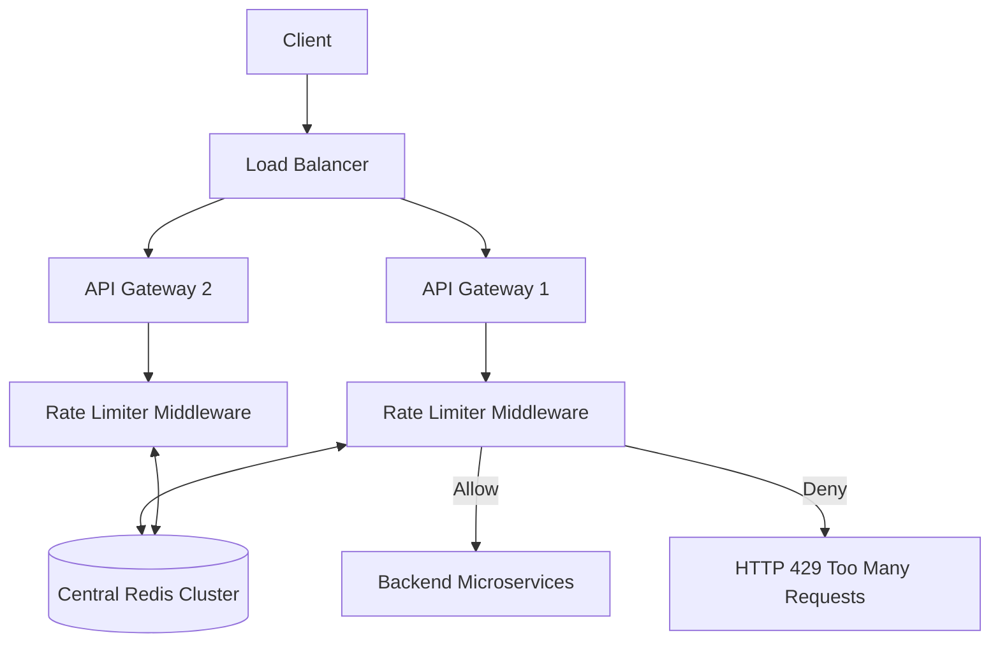

# Design: API Rate Limiter

A Rate Limiter restricts the number of requests an entity (User, IP, or Service) can send to an API within a specified time window. It prevents DoS attacks, limits infrastructure costs, and prevents resource starvation.

---

## 1. Rate Limiting Algorithms

There are several mathematical approaches to throttling traffic, each with distinct memory and accuracy trade-offs.

### A. Token Bucket
*   **Mechanism**: A bucket is assigned to a user and holds a maximum of $N$ tokens. Tokens are refilled at a constant rate. Each request consumes 1 token. If the bucket is empty, the request is dropped (HTTP 429).
*   **Pros**: Memory efficient. Allows for short bursts of traffic.
*   **Cons**: Tuning the bucket size and refill rate in a distributed environment can be complex.

### B. Fixed Window Counter
*   **Mechanism**: Counts requests in fixed time blocks (e.g., 10:00:00 to 10:01:00).
*   **Flaw (Spike at Edges)**: If the limit is 100 requests/minute, a user could send 100 requests at 10:00:59, and another 100 requests at 10:01:01. The server processes 200 requests in 2 seconds, bypassing the intended load limit.

### C. Sliding Window Log
*   **Mechanism**: Stores the exact Unix timestamp of every request in a Redis Sorted Set. Removes timestamps older than the current window.
*   **Pros**: 100% accurate rate limiting.
*   **Cons**: Extremely high memory footprint. Tracking 1 million users with a limit of 500 req/hour requires ~12GB of Redis memory.

### D. Sliding Window Counter (Hybrid)
*   **Mechanism**: Combines the Fixed Window and the Log. Calculates a weighted average of the previous window's count based on the overlap percentage of the current window.
*   **Pros**: Highly memory efficient (uses 86% less memory than the Log method) while successfully smoothing out edge spikes.

---

## 2. High-Level Architecture

In a distributed cluster, Rate Limiters must **synchronize state** to prevent a user from bypassing the limit by hitting different API gateways.

---

## 3. Distributed Challenges & Solutions

### Synchronization
Sticky sessions can avoid synchronization issues by routing a user to the same server, but this leads to unbalanced loads and is not scalable. A **centralized Redis cluster** is the preferred solution for sharing counters across stateless API gateways.

### Atomicity (Race Conditions)
When reading and updating counters in Redis concurrently, race conditions can occur.
*   **Problem:** Two servers read `counter = 10` simultaneously and both increment to `11`, effectively losing one request count.
*   **Solution:** Use **Redis INCR atomic operations** or **Lua Scripts** to ensure the read-and-increment operation is atomic.

### Latency & Caching
Reading from Redis on every request adds latency.
*   **Optimization:** API gateways often **cache recent rate-limit states locally** in memory for a short duration and use an **asynchronous Write-Back** strategy to update the central Redis cluster.

---

## 4. Throttling Strategies

| Type | Description |
| :--- | :--- |
| **Hard Throttling** | Strict limit. Requests beyond the limit are rejected immediately (HTTP 429). |
| **Soft Throttling** | Allows a small percentage of requests to exceed the limit for a short duration. |

---

## 5. Practical Implementation

Explore low-level code and infrastructure implementations of this architecture within this repository:

*   **Infrastructure Challenge**: [Redis Rate Limiter](../../../infrastructure_challenges/redis_rate_limiter/redis_rate_limiter.py)
*   **Machine Coding**: [Distributed Rate Limiter](../../../machine_coding/distributed/rate_limiter/rate_limiter.py)
