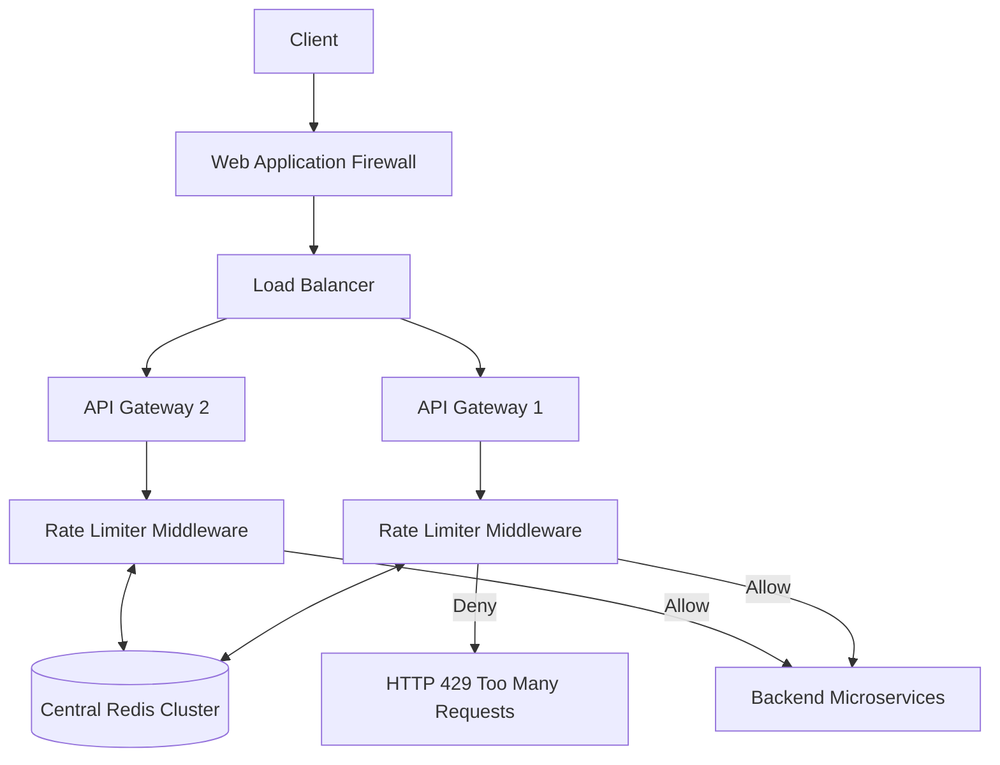

# 🚦 System Design: API Rate Limiter

## 📝 Overview
A Rate Limiter is a defensive middleware component that restricts the number of requests an entity (User, IP, or Service) can send to an API within a specified time window. It acts as a shield, preventing DoS attacks, capping expensive infrastructure costs, and ensuring fair resource allocation across distributed systems.

!!! abstract "Core Concepts"
    - **Token Bucket / Leaky Bucket:** Mathematical algorithms used to throttle traffic efficiently while allowing for controlled bursts.
    - **Sliding Window:** Time-based tracking algorithms designed to prevent request spikes at the exact edges of fixed time windows.
    - **Fail-Open vs. Fail-Closed:** The architectural decision of whether to allow or block all traffic if the rate-limiting infrastructure itself crashes.

---

## 🏭 The Scenario & Requirements

### 😡 The Problem (The Villain)
A malicious script, a brute-force bot, or even a runaway internal microservice sends 100,000 requests per second to your login API. Without limits, the database connection pool is instantly exhausted, CPU spikes to 100%, and the entire platform crashes for all legitimate users. 

### 🦸 The Solution (The Hero)
A distributed middleware layer sitting at the API Gateway that counts incoming requests against predefined tier quotas in a blazing-fast, centralized in-memory datastore (Redis). It instantly intercepts and drops excess traffic (returning an HTTP 429 status) before the load ever touches your delicate backend services.

### 📜 Requirements
- **Functional Requirements:**
    1. The system must Allow or Deny requests based on identifiers (UserID, IP address, or API Key).
    2. It must return clear `HTTP 429 Too Many Requests` responses, ideally with a `Retry-After` header.
    3. It must support different limiting rules for different tiers (e.g., Free users = **100 req/min**, Pro users = **10,000 req/min**).
- **Non-Functional Requirements:**
    1. **Ultra-Low Latency:** The rate limiter is in the critical path of every request. It must add **< 5ms** to the response time.
    2. **High Availability:** If the rate limiter fails, it should default to "Fail-Open" (allow requests through) rather than taking down the whole API.
    3. **Accuracy & Consistency:** Must prevent race conditions across concurrent, distributed API gateways.

!!! info "Capacity Estimation (Back-of-the-envelope)"
    - **Traffic:** 10 Million Active Users generating **50,000 requests per second (QPS)** globally.
    - **Latency Budget:** Network hop to Redis + Redis read/write must execute in under 2-3 milliseconds.
    - **Memory footprint:** - Using a *Sliding Window Log* for 1 million active users with a limit of 500 req/hour requires **~12GB** of Redis RAM (storing every timestamp). 
        - Using a *Token Bucket* or *Fixed Window* reduces this to just **~50MB**, as it only stores a few integers per user.

---

## 📊 API Design & Data Model

=== "REST APIs (Client-Facing Response)"
    - **`GET /api/v1/resource` (When limit is exceeded)**
        - **Status:** `429 Too Many Requests`
        - **Headers:**
            - `X-Ratelimit-Limit: 100`
            - `X-Ratelimit-Remaining: 0`
            - `Retry-After: 36` (Seconds until the client can retry)
        - **Response:** `{ "error": "Rate limit exceeded. Please try again later." }`

=== "Database Schema (Redis In-Memory)"
    - **Token Bucket (Hash):**
        - `Key:` `rate_limit:{user_id}` (e.g., `rate_limit:u123`)
        - `Value:` `{ "tokens": 45, "last_refill_timestamp": 1690000000 }`
    - **Sliding Window Log (Sorted Set):**
        - `Key:` `rate_log:{user_id}`
        - `Value:` `SortedSet<UnixTimestamps>` (Score and Value are both the exact millisecond timestamp of the request).
    - **Fixed Window Counter (String/Int):**
        - `Key:` `rate_count:{user_id}:{minute_timestamp}` (e.g., `rate_count:u123:1690000100`)
        - `Value:` `42` (Atomic integer)

---

## 🏗️ High-Level Architecture

### Architecture Diagram

### Component Walkthrough

1.  **API Gateway / Middleware:** Intercepts every incoming request. It extracts the unique identifier (IP or API Token) and queries the central rate-limiting datastore.
2.  **Central Redis Cluster:** A highly available, low-latency, in-memory datastore. It holds the counters and timestamps for every active user. Centralization is mandatory to prevent a user from bypassing limits by hitting different stateless API gateways round-robin.
3.  **Backend Microservices:** Completely shielded from the rate-limiting logic. If a request reaches them, it is guaranteed to be within the allowed quota.

-----

## 🔬 Deep Dive & Scalability

### Handling Bottlenecks

**1. Algorithm Selection**
There are several mathematical approaches to throttling traffic, each with distinct memory and accuracy trade-offs:

  - **Token Bucket:** A bucket is assigned to a user and holds a maximum of tokens. Tokens are refilled at a constant rate. Highly memory efficient and allows for short bursts of traffic.

  - **Fixed Window Counter:** Counts requests in fixed time blocks (e.g., 10:00 to 10:01). *Flaw:* A user could send 100 requests at 10:00:59, and another 100 at 10:01:01, processing 200 requests in 2 seconds and bypassing the load limit entirely.

  - **Sliding Window Log:** Stores the exact Unix timestamp of every request in a Redis Sorted Set, dropping old timestamps. 100% accurate, but has an extremely high memory footprint.

  - **Sliding Window Counter (Hybrid):** Combines Fixed Window and the Log. Calculates a weighted average of the previous window's count based on the overlap percentage of the current window. Smooths out edge spikes while using 86% less memory than the pure Log method.

**2. Atomicity (Race Conditions)**
When reading and updating counters in Redis concurrently across dozens of API gateways, race conditions will occur.

  - *Problem:* Two servers read `counter = 10` simultaneously and both increment it to `11`. A request count is lost, allowing the user to bypass the limit.
  - *Solution:* Never do a Read-Modify-Write in application code. Use **Redis INCR** atomic operations, or bundle complex logic (like Token Bucket math) into atomic **Lua Scripts** executed directly on the Redis server.

**3. Latency & Caching**
Making a synchronous network call to Redis for *every single API request* adds latency and creates a massive single point of failure.

  - *Solution:* API gateways often cache recent rate-limit states locally in memory for a short duration. They use an asynchronous "Write-Back" strategy to sync the batched counts to the central Redis cluster every few seconds. This sacrifices absolute accuracy for a massive boost in performance.

### ⚖️ Trade-offs

| Strategy | Pros | Cons / Limitations |
| :--- | :--- | :--- |
| **Hard Throttling** | Perfectly protects backend infrastructure. No exceptions made. | Harms user experience. A legitimate user performing a valid bulk operation is blocked with a 429. |
| **Soft Throttling** | Allows a small percentage of requests to exceed the limit temporarily, improving UX. | Requires more complex logic and monitoring to ensure backend queues aren't overwhelmed by the allowed burst. |
| **Local Gateway Throttling (No Redis)** | Zero network latency. Infinitely scalable. | Inaccurate. If a user is routed to Gateway A, then Gateway B, they effectively double their allowed limit. |

-----

## 🎤 Interview Toolkit

  - **Scale Question:** "Your Redis cluster is CPU-bound from executing millions of Lua scripts per second. How do you scale this?" -\> *Implement a two-tier architecture. The API Gateway maintains a fast, local in-memory counter (e.g., Guava Cache). It only syncs with the central Redis cluster asynchronously in batches (e.g., syncing every 100 requests or every 2 seconds). This drastically reduces Redis load at the cost of slight limit imprecision.*
  - **Failure Probe:** "The Redis cluster goes down completely. What happens to incoming API traffic?" -\> *The system must "Fail-Open." The API Gateway's middleware should catch the Redis timeout exception and automatically route the traffic to the backend services anyway. It's better to risk heavy load than to cause a 100% global outage for all users because the defensive shield broke.*
  - **Edge Case:** "In a Sliding Window Log, what happens if the clocks on your different API Gateway servers drift by a few seconds?" -\> *Clock drift will cause false positives and false negatives, as timestamps are evaluated inaccurately. To solve this, the Lua script should rely exclusively on the centralized Redis server's internal clock (`TIME` command) rather than the localized gateway clocks.*

## 🔗 Related Architectures

  - **Infrastructure Challenge:** [Redis Rate Limiter](../../../infrastructure_challenges/redis_rate_limiter/redis_rate_limiter.py)
  - **Machine Coding:** [Distributed Rate Limiter](../../../machine_coding/distributed/rate_limiter/rate_limiter.py)
