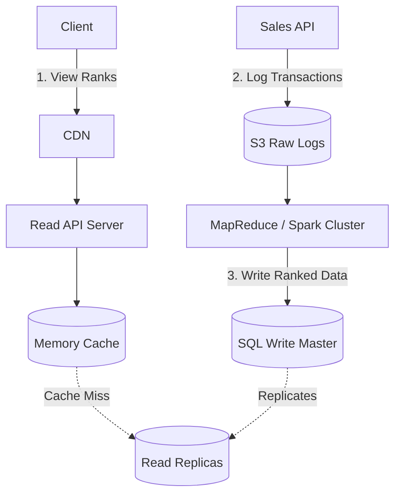

# 🛒 System Design: Amazon Sales Rank by Category

## 📝 Overview
A scalable distributed analytics pipeline that computes and serves "Best Sellers" rankings for thousands of e-commerce categories based on recent transaction history. The system isolates high-throughput transactional logging from extreme read-heavy frontend traffic by leveraging asynchronous batch processing.

!!! abstract "Core Concepts"
    - **Batch Processing (MapReduce):** Offloading heavy, billion-row aggregations and distributed sorting to offline workers rather than the primary database.
    - **Raw Log Ingestion:** Bypassing traditional database write bottlenecks by dumping raw transaction logs directly into an Object Store (S3).
    - **Pre-Computation & Caching:** Computing the rankings hourly and pushing them into a Redis cache to sustain massive read volumes (40,000+ RPS).

---

## 🏭 The Scenario & Requirements

### 😡 The Problem (The Villain)
An e-commerce platform processes billions of transactions. Attempting to dynamically query, aggregate, and sort the top-selling products across a rolling 7-day window for every single page load would require massive database `JOIN`s and `GROUP BY` operations. This would instantly overload the primary database and cause catastrophic read latency for end-users.

### 🦸 The Solution (The Hero)
An asynchronous data pipeline. The Sales API drops raw transactional logs into an Object Store (like Amazon S3). Periodically (e.g., hourly), a MapReduce cluster reads these logs, sums the quantities sold per category, performs a distributed sort, and writes the final ranked lists into a `sales_rank` table. A Memory Cache sits in front of the Read API to absorb the extreme user traffic.

### 📜 Requirements
- **Functional Requirements:**
    1. The system calculates the past week's most popular products, segmented by category.
    2. Users can view these category leaderboards.
    3. Results must be updated hourly (more popular categories might need faster updates).
    4. Items can exist in multiple categories simultaneously.
- **Non-Functional Requirements:**
    1. **High Availability:** Viewing the leaderboard must never fail.
    2. **Read-Heavy Scale:** Must support a 100:1 Read-to-Write ratio.

!!! info "Capacity Estimation (Back-of-the-envelope)"
    - **Traffic:** 1 Billion transactions/month. 100 Billion read requests/month.
    - **Throughput:** ~40,000 read requests/second (RPS). ~400 write transactions/second (TPS).
    - **Data Size:** 10 Million products, 1,000 categories.
    - **Storage (Transactions):** `timestamp` (5B) + `product_id` (8B) + `category_id` (4B) + `seller_id` (8B) + `buyer_id` (8B) + `quantity` (4B) + `total_price` (5B) = **~40 bytes/transaction**.
    - **Total Storage:** 40 bytes * 1 Billion = **40 GB of new data per month** (~1.44 TB over 3 years).

---

## 📊 API Design & Data Model

=== "REST APIs"
    - **`GET /api/v1/popular`**
        - **Query Params:** `?category_id=1234`
        - **Response:** ```json
          [
            {
              "id": "100",
              "category_id": "1234",
              "total_sold": "100000",
              "product_id": "50"
            },
            ...
          ]
          ```

=== "Database Schema"
    - **Raw Log Files** (Amazon S3)
        - Format: Tab-delimited
        - Columns: `timestamp \t product_id \t category_id \t qty \t total_price \t seller_id \t buyer_id`
    - **Table:** `sales_rank` (SQL or NoSQL Document Store)
        - `id` (Int, PK)
        - `category_id` (Int, Indexed)
        - `total_sold` (Int)
        - `product_id` (Int, Indexed)

---

## 🏗️ High-Level Architecture

### Architecture Diagram


### Component Walkthrough

1.  **Sales API & Object Store:** Instead of pushing 400 TPS of raw transaction data into a relational database (which might struggle during peak events like Black Friday), raw logs are dumped directly into S3.
2.  **MapReduce Cluster:** Runs hourly batch jobs to process the 7-day trailing window of S3 logs. It computes the totals and performs a distributed sort to rank the items.
3.  **Write DB & Read Replicas:** The MapReduce job bulk-inserts the small, pre-computed `sales_rank` data into the SQL Write Master, which replicates to the Read DBs.
4.  **Memory Cache (Redis/Memcached):** Serving 40,000 reads per second directly from a database is dangerous. The Read API queries the cache first. Popular categories naturally stay hot in the cache, guaranteeing sub-millisecond latency.

-----

## 🔬 Deep Dive & Scalability

### Handling Bottlenecks: The MapReduce Pipeline

Aggregating and sorting millions of transactions is CPU and memory-intensive. We break the MapReduce job into two distinct phases:

**Step 1: Aggregate Quantities**

  - **Mapper:** Reads log lines. If the `timestamp` is within the last 7 days, it emits a composite key of the category and product alongside the quantity. *If an item is in multiple categories, the mapper emits multiple keys.*
    $\rightarrow$ `Yield (category_id, product_id), quantity`
  - **Reducer:** Sums the quantities for each composite key.
    $\rightarrow$ `Yield (category_id, product_id), total_quantity`

**Step 2: Distributed Sort**

  - **Mapper (Sort):** Transforms the key to ensure Hadoop/Spark's internal shuffle-and-sort mechanism handles the heavy lifting. We move the `total_quantity` into the key.
    $\rightarrow$ `Yield (category_id, total_quantity), product_id`
  - **Reducer (Identity):** Simply outputs the final, perfectly sorted list, which is then written to the `sales_rank` database.

### Scaling the Read Path (40,000 RPS)

  - **Memory Cache Tuning:** Reading 1 MB from memory takes \~250 microseconds (80x faster than disk). To handle uneven traffic distribution, the `sales_rank` endpoints for highly popular categories (e.g., Electronics) are heavily cached using a Cache-Aside pattern.
  - **Analytics Database Pivot:** If the `sales_rank` table grows too large to query efficiently, or if internal teams need to run ad-hoc queries, the finalized data should be pushed to a Data Warehouse (Amazon Redshift / Google BigQuery) instead of a standard operational SQL DB.

### ⚖️ Trade-offs

| Decision | Pros | Cons / Limitations |
| :--- | :--- | :--- |
| **S3 for Raw Logs vs SQL** | Infinite scale for ingestion; completely isolates write traffic from the read database. | Requires a complex MapReduce/Spark pipeline to extract any meaningful data. |
| **Batch Processing (Hourly)** | Efficient, safe, and easy to orchestrate. Handles massive historical data cleanly. | **Stale Data:** Sales ranks are always up to 1 hour behind real-time. |
| **SQL vs NoSQL for Output** | SQL allows easy `ORDER BY` and pagination if the cache misses. | High volume `INSERT`s from the Hadoop cluster might lock tables momentarily. |

-----

## 🎤 Interview Toolkit

  - **Scale Question:** "Hourly updates are too slow for Black Friday. How do we make the ranking update in near real-time (minutes)?" -\> *Transition from a Batch architecture to a Streaming architecture (Lambda/Kappa). Push sales events into a Kafka queue, use Apache Flink or Spark Streaming to maintain rolling counts in memory, and continuously flush the sorted results to a NoSQL store like Cassandra or Redis Sorted Sets (ZSET).*
  - **Failure Probe:** "What happens if a Read Replica fails while the cache is also empty?" -\> *The system will route traffic to the remaining replicas. To prevent the remaining replicas from being crushed by the sudden 40,000 RPS load, the Read API must implement Circuit Breakers and Request Coalescing (Thundering Herd protection).*
  - **Edge Case:** "How do you handle a product changing categories mid-week?" -\> *Because the raw logs define the `category_id` at the exact moment of the transaction, the product's historical sales will remain attached to the old category in the MapReduce job. If business logic dictates it must migrate, the Mapper needs to perform a live lookup against the Product Catalog instead of trusting the log's category.*

## 🔗 Related Architectures

  - [System Design: Twitter Trending Topics](../social_media/TWITTER_HLD.md) — For real-time streaming aggregation using Heavy Hitters (Count-Min Sketch) algorithms.
  - [Architecture Patterns: MapReduce](../../pillars/ARCHITECTURE_PATTERNS.md) — A deep dive into Map, Shuffle, and Reduce mechanics for big data.
