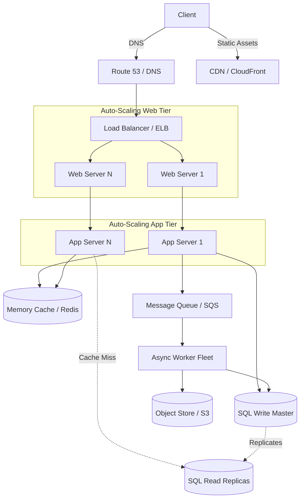

# 📈 System Design: Scaling to Millions of Users (AWS)

## 📝 Overview
Designing a system that scales from a single user to tens of millions of users is an exercise in iterative bottleneck resolution. This architecture evolves from a single monolithic server to a highly distributed, auto-scaling cloud environment capable of handling massive read-heavy workloads.

!!! abstract "Core Concepts"
    - **Iterative Profiling:** Scaling is a loop of: Benchmark/Load Test $\rightarrow$ Profile Bottlenecks $\rightarrow$ Evaluate Alternatives $\rightarrow$ Implement.
    - **Stateless Web Tier:** Removing session data from web servers to allow seamless horizontal scaling and auto-scaling.
    - **Read vs. Write Scaling:** Applying targeted solutions (Caches/Read Replicas) for read-heavy bottlenecks, and different solutions (Sharding/Queues) for write-heavy bottlenecks.
    - **Asynchronous Decoupling:** Moving heavy, non-real-time processing into background worker queues to keep the user-facing APIs fast.

---

## 🏭 The Scenario & Requirements

### 😡 The Problem (The Villain)
A startup launches its application on a single server. As traffic grows exponentially, the database runs out of memory, disk space fills up with user uploads, and the web server CPU hits 100% during peak hours, causing downtime and dropped requests. 

### 🦸 The Solution (The Hero)
An iteratively scaled cloud architecture. Static assets are offloaded to an Object Store and CDN. The database is moved to a dedicated, replicated cluster. A Load Balancer distributes traffic across a horizontally scaled, stateless fleet of auto-scaling Application Servers. A memory cache absorbs the read-heavy traffic, and message queues decouple heavy write operations.

### 📜 Requirements
- **Functional Requirements:**
    1. Users can make read and write requests for content/data.
    2. Service does processing, stores user data, and returns results.
    3. The system relies on relational data relationships.
- **Non-Functional Requirements:**
    1. **High Availability:** Must survive individual component failures (multi-AZ).
    2. **Elasticity:** Must scale up during peak U.S. business hours and down at night to save costs.
    3. **Scalability:** Must organically scale from 1 user to 10 Million users.

!!! info "Capacity Estimation (Back-of-the-envelope)"
    - **Traffic:** 10 Million users. 1 Billion writes/month. 100 Billion reads/month. $\rightarrow$ **100:1 Read/Write Ratio**.
    - **Throughput:** ~40,000 read requests/second (RPS). ~400 write requests/second (TPS).
    - **Storage Size:** ~1 KB of content per write.
    - **Total Storage:** 1 KB * 1 Billion writes = **1 TB of new content per month**. $\rightarrow$ **~36 TB in 3 years**.

---

## 📊 API Design & Data Model

=== "REST APIs"
    - **`POST /api/v1/content`**
        - **Request:** `{ "user_id": "123", "payload": "User generated content..." }`
        - **Response:** `{ "status": "processing", "content_id": "8765" }`
    - **`GET /api/v1/content/{content_id}`**
        - **Response:** `{ "content_id": "8765", "payload": "...", "metadata": {...} }`

=== "Database Schema"
    - **Table:** `user_content` (SQL RDBMS)
        - `id` (Int, PK)
        - `user_id` (Int, Indexed)
        - `content_metadata` (Varchar)
        - `asset_url` (Varchar) - Pointer to S3 Object
        - `created_at` (Datetime, Indexed)
    - **Object Store:** (Amazon S3)
        - Stores the heavy 1 KB+ payloads, images, and static assets (JS/CSS).
    - **Data Warehouse:** (Amazon Redshift)
        - Archives historical content to keep the primary SQL DB small.

---

## 🏗️ High-Level Architecture

### Architecture Diagram
*(The fully evolved "Millions of Users" architecture)*

### Component Walkthrough

1.  **CDN & Object Store:** CloudFront caches static assets globally. S3 stores user uploads securely and cheaply, keeping disk usage off the application servers.
2.  **Load Balancer (ELB):** Highly available ingress point. Terminates SSL and distributes traffic evenly across multiple Availability Zones.
3.  **Stateless App Servers:** Web servers act as reverse proxies to App servers. Because session data is stored in the cache, these servers can be spun up or destroyed instantly by an Auto-Scaling Group based on CPU/Latency metrics.
4.  **Memory Cache (Redis):** Absorbs the massive 40,000 RPS read load. Reading 1MB sequentially from memory is \~250 microseconds (80x faster than disk).
5.  **Message Queues (SQS) & Workers:** Heavy write tasks (e.g., processing an image upload) are pushed to a queue. Background workers pull tasks asynchronously to prevent blocking the HTTP response.

-----

## 🔬 Deep Dive & Scalability

### The Evolutionary Scaling Path (Handling Bottlenecks)

**Phase 1: The Single Box Bottleneck (Users+)**

  - *Symptom:* The single monolithic server runs out of disk space and RAM. Vertical scaling (buying a bigger box) becomes too expensive.
  - *Solution:* Split the tiers. Move the database to a managed service (Amazon RDS). Move static files (images, CSS) to an Object Store (S3).

**Phase 2: Web Tier Overload & SPOF (Users++)**

  - *Symptom:* The single web server crashes during traffic spikes, causing downtime (Single Point of Failure).
  - *Solution:* Introduce **Horizontal Scaling**. Place a Load Balancer in front of multiple Web Servers spread across multiple Availability Zones. Push static content to a CDN.

**Phase 3: The Database Read Bottleneck (Users+++)**

  - *Symptom:* At a 100:1 read-to-write ratio, the SQL database CPU pegs at 100% trying to serve queries.
  - *Solution:* Introduce a **Memory Cache** (Redis/Memcached) for frequent queries and session data. Add **MySQL Read Replicas** behind an internal load balancer to offload cache misses from the Write Master.

**Phase 4: Cost Optimization & Spiky Traffic (Users++++)**

  - *Symptom:* Paying for maximum server capacity 24/7 is too expensive when traffic drops at night.
  - *Solution:* Implement **Auto-Scaling**. Automate DevOps (Ansible/Terraform) to spin instances up/down based on CloudWatch metrics (CPU, Latency).

**Phase 5: Massive Write Scale & DB Bloat (Users+++++)**

  - *Symptom:* The SQL database exceeds 1 TB/month and queries slow down. 400 TPS writes overwhelm the single Write Master.
  - *Solution:* Archive old data to a Data Warehouse (Redshift). Apply SQL scaling patterns like **Federation** (splitting DB by function) or **Sharding** (partitioning users). Move heavy jobs to **Asynchronous Worker Queues**. Consider migrating suitable data to a **NoSQL Database** (DynamoDB).

### ⚖️ Trade-offs

| Decision | Pros | Cons / Limitations |
| :--- | :--- | :--- |
| **Vertical vs. Horizontal Scaling** | Vertical is incredibly simple (just reboot on a larger instance). | Vertical has a hard hardware ceiling and no failover redundancy. Horizontal adds significant network complexity. |
| **Auto-Scaling** | Massive cost savings during off-peak hours. | "Cold starts." It takes time to spin up new VMs, which might not be fast enough for sudden, extreme traffic spikes. |
| **Asynchronous Queues** | Protects the database and keeps UI latency low for users. | Eventual consistency. The user might refresh the page and not immediately see their processed content. |

-----

## 🎤 Interview Toolkit

  - **Scale Question:** "Traffic just spiked 10x due to a viral event, and Auto-Scaling hasn't spun up new instances fast enough. How do you survive?" -\> *Rely on the Load Balancer and Cache. If the App servers are drowning, use the LB to shed load (rate limiting). Serve stale data from the Cache to temporarily bypass the DB until Auto-Scaling catches up.*
  - **Failure Probe:** "What happens if the primary SQL Write Master fails?" -\> *If using a managed service like AWS RDS Multi-AZ, a synchronous standby replica in another zone automatically promotes itself to the new Master. There will be a brief (\~60-120 second) write unavailability, but no data loss.*
  - **Security Edge Case:** "How do you protect this architecture from bad actors?" -\> *Use a VPC. The Load Balancer sits in a Public Subnet. Everything else (Web Servers, App Servers, DBs, Caches) sits in a Private Subnet, completely inaccessible from the public internet. Use Security Groups to strictly whitelist internal port access.*

## 🔗 Related Architectures

  - [System Design: Ticket Booking System](./TICKET_BOOKING.md) — For a deep dive into handling Write Master bottlenecks and database concurrency.
  - [Architecture Patterns: Database Scaling](../../pillars/database_scaling/SCALING_STRATEGIES.md) — A deeper look into Federation, Sharding, and Denormalization.
