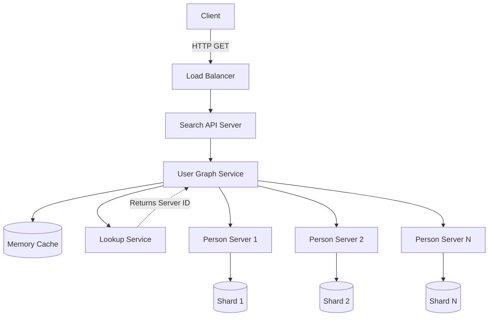

# 🕸️ System Design: Social Network Graph Search

## 📝 Overview
A distributed graph search service that calculates the shortest path (degrees of separation) between two users on a massive social network. Due to the sheer scale of the network, the graph cannot fit on a single machine and must be horizontally partitioned across a cluster of servers using traditional data stores.

!!! abstract "Core Concepts"
    - **Breadth-First Search (BFS):** The fundamental algorithm used to find the unweighted shortest path between two nodes in a graph.
    - **Distributed Graph Sharding:** Partitioning millions of vertices (users) and billions of edges (friendships) across multiple physical "Person Servers."
    - **Bidirectional Search:** Running simultaneous BFS traversals from both the source and destination nodes to drastically reduce the search space and execution time.

---

## 🏭 The Scenario & Requirements

### 😡 The Problem (The Villain)
Finding the shortest path between two users in a local, in-memory graph is a trivial BFS algorithm. However, when a social network grows to 100 million users and 5 billion connections, the graph cannot fit into the RAM of a single machine. Traversing connections now requires executing cross-network RPC calls to different servers. A standard BFS will quickly result in an exponential explosion of network hops, causing severe latency and bringing the system to a crawl.

### 🦸 The Solution (The Hero)
A distributed architecture that intelligently shards users across multiple "Person Servers" while utilizing a central "Lookup Service" for routing. To prevent network I/O bottlenecks, the system batches multi-node lookups, caches highly connected "celebrity" nodes, and leverages bidirectional BFS to meet in the middle, slashing the number of required network jumps.

### 📜 Requirements
- **Functional Requirements:**
    1. Users can search for another person and view the shortest path to them.
    2. Edges (friendships) are unweighted.
    3. The solution must use traditional systems (do not use dedicated graph databases like Neo4j or GraphQL).
- **Non-Functional Requirements:**
    1. **High Availability:** The search service must be highly available.
    2. **Scalability:** The graph data and search traffic must scale horizontally.
    3. **Performance:** Search queries must resolve quickly despite traversing a distributed system.

!!! info "Capacity Estimation (Back-of-the-envelope)"
    - **Data Scale:** 100 Million users. Average 50 friends per user $\rightarrow$ **5 Billion friend relationships (edges)**.
    - **Traffic:** 1 Billion searches per month.
    - **Throughput:** 1 Billion / 2.5M seconds $\rightarrow$ **~400 search requests/second**.
    - **Memory Constraint:** Even a highly optimized representation of 5 billion edges exceeds typical single-node RAM, necessitating sharding.

---

## 📊 API Design & Data Model

=== "REST APIs"
    - **`GET /api/v1/friend_search`**
        - **Query Params:** `?source_id=100&dest_id=1234`
        - **Response:** ```json
          [
              { "person_id": "100", "name": "Alice" },
              { "person_id": "53", "name": "Bob" },
              { "person_id": "1234", "name": "Charlie" }
          ]
          ```

=== "Database Schema"
    Because we cannot use a Graph DB, we rely on heavily sharded Key-Value or Document stores.
    
    - **Lookup Store** (Key-Value / Redis)
        - `person_id` (String, PK)
        - `server_id` (String) - The ID of the Person Server holding this user's data.
    - **Person Store** (NoSQL / Cassandra / DynamoDB - sharded across nodes)
        - `person_id` (String, PK)
        - `name` (String)
        - `friend_ids` (List of Strings) - The adjacency list.

---

## 🏗️ High-Level Architecture

### Architecture Diagram


### Component Walkthrough

1.  **Search API Server:** Accepts the search request and passes it to the core processing engine.
2.  **User Graph Service:** The orchestrator running the distributed BFS algorithm. It acts as the "client" to the various Person Servers.
3.  **Lookup Service:** A fast, heavily cached mapping service that tells the User Graph Service exactly which physical "Person Server" holds the adjacency list (`friend_ids`) for a given `person_id`.
4.  **Person Servers:** Stateless application servers wrapping specific shards of the database. They return the requested `Person` objects (including their connections).
5.  **Memory Cache (Redis):** Caches popular search paths, celebrity node adjacency lists, and lookup routings to bypass database hits.

-----

## 🔬 Deep Dive & Scalability

### Handling Bottlenecks: The Distributed BFS

If a standard BFS expands to just 3 degrees of separation where every user has 50 friends, the algorithm requires inspecting $50^3 = 125,000$ nodes. If each lookup is a separate network call to a Person Server, latency will be catastrophic.

  - **Optimization 1: Bidirectional BFS:** Instead of searching from Source to Destination, run two simultaneous BFS searches—one from the Source and one from the Destination. When the two searches intersect, merge the paths. This cuts the search depth in half, reducing the 125,000 lookups to roughly $2 \times 50^{1.5} \approx 700$ lookups.
  - **Optimization 2: Batching Jumps:** The User Graph Service should group `friend_ids` by their `server_id` (using the Lookup Service). Instead of making 50 individual RPC calls to `Person Server 1`, it makes a single batched RPC call asking for all 50 profiles at once.
  - **Optimization 3: Geo-Sharding:** People are highly likely to be friends with others in the same geographic location. By sharding users into Person Servers based on location/country, the vast majority of BFS hops will remain completely localized to a single server, drastically reducing inter-server network traffic.

### Circuit Breakers & Search Limits

Some users are completely unconnected. To prevent an infinite BFS that consumes massive CPU and memory:

  - Impose a strict **Time Limit** (e.g., 5 seconds) or a **Hop Limit** (e.g., 6 degrees of separation). If the target isn't found, terminate the search and ask the user if they wish to continue via a background job.

### ⚖️ Trade-offs

| Decision | Pros | Cons / Limitations |
| :--- | :--- | :--- |
| **Traditional DBs vs Graph DB** | Avoids the operational overhead of maintaining a specialized graph database cluster at petabyte scale. | Requires manually implementing complex, distributed graph traversal algorithms in the application layer. |
| **Geo-Sharding** | Massive reduction in cross-server network hops for localized friend groups. | Causes severe "Hot Spots" (e.g., New York server is overloaded while Wyoming server sits idle). Requires careful balancing. |
| **Pre-computing Paths** | $O(1)$ lookup time if paths are pre-computed offline via MapReduce. | Storage explosion. You cannot pre-compute paths between every possible pair of 100M users. Only viable for the most popular connections. |

-----

## 🎤 Interview Toolkit

  - **Scale Question:** "How do you handle a search involving a celebrity with 5 million followers?" -> *Celebrity nodes will explode the BFS queue and crash the User Graph Service's memory. You should prioritize searching FROM the celebrity outwards first, as they reduce the degrees of separation instantly. Additionally, keep celebrity adjacency lists permanently pinned in the Memory Cache.*
  - **Failure Probe:** "What happens if a Person Server goes down during a traversal?" -> *The User Graph Service should have timeouts. If a shard is unreachable, fallback to a Read Replica of that shard. If the entire replica set is down, gracefully return a partial path or notify the user the search is temporarily degraded.*
  - **Edge Case:** "What if user A blocks user B?" -> *The Person Server must filter the `friend_ids` adjacency list against a `blocked_users` list before returning the payload to the User Graph Service, ensuring blocked paths are never traversed.*

## 🔗 Related Architectures

  - [System Design: Twitter Feed](../social_media/TWITTER_HLD.md) — Deals with similar massive-scale social graph fan-out problems.
  - [Architecture Patterns: Data Partitioning](../../pillars/DATA_PARTITIONING.md) — Deep dive into the mechanics of sharding massive datasets (like Geo-sharding vs Consistent Hashing).
