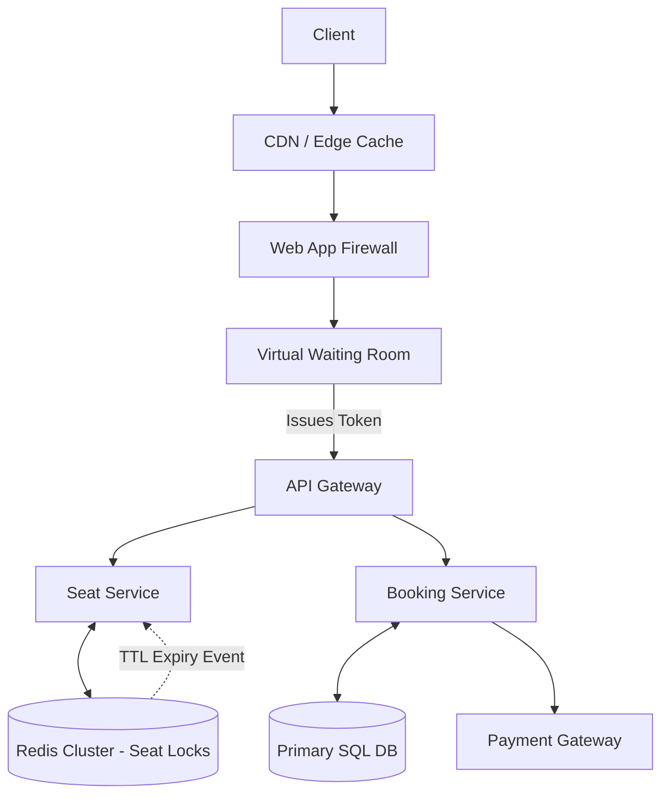

# 🎫 System Design: High-Concurrency Ticket Booking (Ticketmaster / BookMyShow)

## 📝 Overview
A highly concurrent ticket booking platform designed to manage extreme traffic spikes during flash sales for highly anticipated events. The system strictly guarantees data integrity and prevents double-booking through distributed locking and ACID-compliant database transactions, all while maintaining a smooth user experience under massive load.

!!! abstract "Core Concepts"
    - **Virtual Waiting Room:** Throttling massive inbound traffic to protect backend services from melting during a flash sale.
    - **Distributed Locking (TTL):** Reserving a seat temporarily (e.g., 10 minutes) in a high-speed cache while the user completes the checkout process.
    - **ACID Transactions:** Ensuring strict consistency at the database level so that a single seat can only ever be sold to one user.

---

## 🏭 The Scenario & Requirements

### 😡 The Problem (The Villain)
"The Thundering Herd." When tickets for a world-tour concert go on sale, 1 million fans might hit the "Buy" button at exactly 10:00:00 AM. If the system allows all 1 million requests to query and attempt to lock the same 50,000 database rows simultaneously, the database will experience catastrophic lock contention and crash. Additionally, if the locking mechanism is flawed, two users might successfully pay for the exact same seat (double-booking).

### 🦸 The Solution (The Hero)
A multi-tiered defense system. First, a "Virtual Waiting Room" acts as a shock absorber, pacing the entry of users into the booking flow. Once inside, the system uses ultra-fast distributed locks (Redis) to temporarily hold a seat. Finally, the actual purchase is cemented using strict, isolated SQL transactions, ensuring absolute mathematical certainty that the seat is uniquely assigned.

### 📜 Requirements
- **Functional Requirements:**
    1. Users can view real-time seat availability for an event.
    2. Users can select and temporarily hold a seat while completing payment.
    3. The system must release the hold if the user's payment fails or the session times out.
- **Non-Functional Requirements:**
    1. **Strict Consistency (ACID):** Zero tolerance for double-booking.
    2. **High Availability & Scalability:** The system must survive 100x traffic spikes during flash sales.
    3. **Fairness:** The system should process users in a roughly First-In-First-Out (FIFO) manner.

!!! info "Capacity Estimation (Back-of-the-envelope)"
    - **Inventory:** A large stadium holds ~50,000 seats.
    - **Traffic Spike:** 1 Million concurrent users attempting to buy at the exact same second.
    - **Read/Write Ratio:** Normally highly read-heavy (100:1) as users browse events. During a flash sale, it becomes heavily write-contended as everyone attempts to lock the same limited pool of seats.
    - **Throughput:** The database must handle 50,000 successful transactions within a few minutes, but the caching and queuing layers must absorb millions of read/hold attempts.

---

## 📊 API Design & Data Model

=== "REST APIs"
    - **`POST /api/v1/shows/{show_id}/seats/reserve`**
        - **Request:** `{ "seat_ids": ["A1", "A2"], "user_id": "u123" }`
        - **Response:** `{ "reservation_id": "r987", "expires_in_seconds": 600 }`
    - **`POST /api/v1/bookings/confirm`**
        - **Request:** `{ "reservation_id": "r987", "payment_token": "tok_xyz" }`
        - **Response:** `{ "booking_id": "b456", "status": "CONFIRMED" }`
    - **`GET /api/v1/shows/{show_id}/seats`**
        - **Response:** `[ { "seat_id": "A1", "status": "AVAILABLE" }, { "seat_id": "A2", "status": "HELD" } ]`

=== "Database Schema"
    - **Table:** `shows` (RDBMS)
        - `show_id` (UUID, PK)
        - `event_name` (String)
        - `start_time` (Timestamp)
    - **Table:** `show_seats` (RDBMS)
        - `seat_id` (String, PK)
        - `show_id` (UUID, PK)
        - `status` (Enum: AVAILABLE, HELD, BOOKED)
        - `version` (Int) - *For Optimistic Locking*
    - **Table:** `bookings` (RDBMS)
        - `booking_id` (UUID, PK)
        - `user_id` (String)
        - `seat_ids` (JSON / Array)
        - `status` (Enum: PENDING, CONFIRMED, CANCELLED)
    - **Cache:** `active_reservations` (Redis)
        - `Key:` `hold:{show_id}:{seat_id}`
        - `Value:` `{ "user_id": "u123" }` (With a 10-minute TTL)

---

## 🏗️ High-Level Architecture

### Architecture Diagram

### Component Walkthrough

1.  **CDN / Edge Cache:** Serves static content (venue maps, artist images) to reduce backend load.
2.  **Virtual Waiting Room:** Acts as a massive token bucket. It holds the 1 million users in a distributed queue and slowly drips them into the active booking flow (e.g., allowing 5,000 users per minute) to keep the backend operating within safe thresholds.
3.  **Seat Service & Redis:** Handles the high-velocity, temporary state. When a user selects a seat, a Redis key is created with a strict Time-To-Live (TTL). This acts as a distributed lock.
4.  **Booking Service & SQL DB:** Once the user successfully pays, this service finalizes the transaction in the relational database, transitioning the seat status from `HELD` to `BOOKED`.

-----

## 🔬 Deep Dive & Scalability

### Handling Bottlenecks

**Concurrency & Database Isolation**
When thousands of users click the exact same front-row seat, the system must definitively reject all but one.

  - **Pessimistic Locking (`SELECT FOR UPDATE`):** The database places an exclusive lock on the row. While User A is looking at the seat, User B's query is blocked. This prevents dirty reads but can severely bottleneck throughput if transactions aren't resolved instantly.
  - **Optimistic Locking (Versioning):** A better approach for high concurrency. The `show_seats` table includes a `version` column.
    `UPDATE show_seats SET status='BOOKED', version=2 WHERE seat_id='A1' AND version=1;`
    If User A and User B both read version 1, and User A updates it to version 2, User B's subsequent update will fail because version 1 no longer exists. User B is safely rejected without locking the database.

**The Phantom Seat (TTL Edge Cases)**
A user locks a seat, starts paying, but their browser crashes. The seat is now stuck in a `HELD` state.

  - *Solution:* The Redis lock is created with a strict 10-minute TTL. If the payment is not confirmed within that time, Redis automatically expires the key. A worker service listens for these expiration events and updates the database to revert the seat to `AVAILABLE`, notifying users waiting in the queue.

### ⚖️ Trade-offs

| Decision | Pros | Cons / Limitations |
| :--- | :--- | :--- |
| **Relational DB (SQL) vs NoSQL** | Guarantees ACID compliance, preventing double-booking through strict transaction isolation. | Harder to scale horizontally. Requires beefy primary nodes to handle peak write bursts. |
| **Optimistic vs Pessimistic Locking** | Optimistic locking allows much higher throughput since reads aren't blocked. | Wasted compute. If contention is extremely high, 99% of transactions will fail and require application-level retries or error handling. |
| **Virtual Waiting Room** | Protects the database from melting. Ensures the site stays online. | Degrades user experience. Users have to wait in a queue just to see if tickets are available. |

-----

## 🎤 Interview Toolkit

  - **Scale Question:** "How do you handle generating the seating map dynamically for 100,000 concurrent viewers?" -\> *Do not query the database. The `Seat Service` should maintain a binary or bitmap representation of the venue in Redis or in-memory (e.g., 1 = Available, 0 = Sold). This bitmap can be pushed to the CDN or clients via WebSockets efficiently.*
  - **Failure Probe:** "The user pays, the Payment Gateway succeeds, but your Booking Service crashes before updating the database. The seat's TTL expires and is sold to someone else." -\> *This is the classic distributed transaction problem. You must use Idempotency Keys and a Two-Phase Commit or Saga pattern. Alternatively, introduce a "Grace Period": the server sets a 10-minute TTL on the frontend, but an 11-minute TTL on the backend, giving it time to query the Payment Gateway for stranded successful transactions before releasing the seat.*
  - **Edge Case:** "Two users click the exact same seat at the exact same millisecond. Who gets it?" -\> *The one whose request hits Redis first. Redis is single-threaded. By using the `SETNX` (Set if Not eXists) command, Redis guarantees that only the first request will successfully acquire the lock, and the second request will immediately fail.*

## 🔗 Related Architectures

  - [Machine Coding: Parking Lot](../../../machine_coding/systems/parking_lot/PROBLEM.md) — Excellent practice for concurrent resource allocation.
  - [Machine Coding: E-Commerce Order System](../../../machine_coding/real_world_systems/e_commerce_order_system/PROBLEM.md) — For deep-diving into payment state machines and idempotency.
  - [System Design: API Rate Limiter](./RATE_LIMITER.md) — The fundamental concept powering the Virtual Waiting Room.
