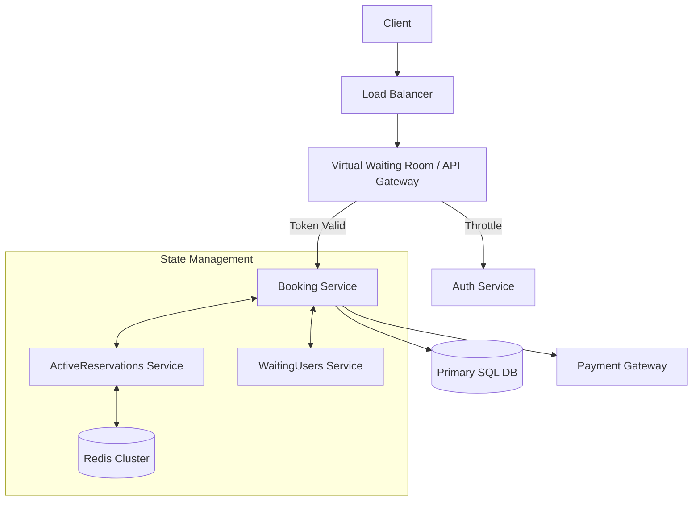
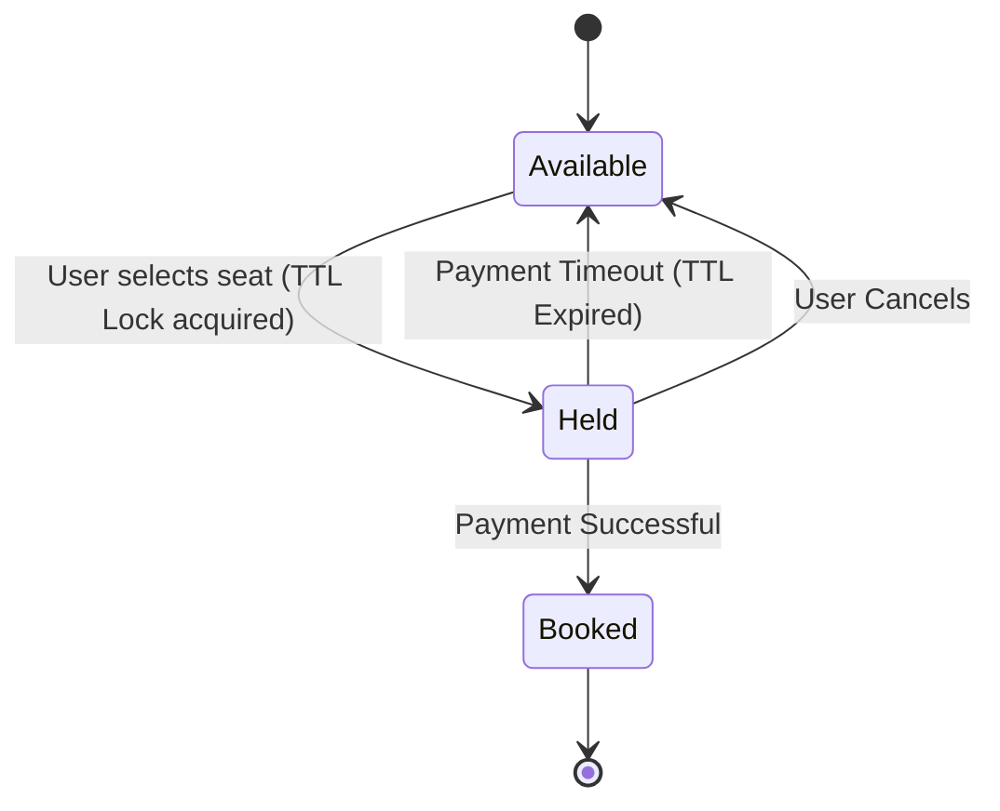

# 🎫 System Design: High-Concurrency Ticket Booking (Ticketmaster / BookMyShow)

Designing a highly concurrent ticketing system requires solving the **"Fast-Changing Temporary State"** problem. When tens of thousands of fans attempt to book the exact same highly anticipated concert seats simultaneously during a flash sale, the system must guarantee absolute data integrity (ACID properties), prevent double-booking, and avoid collapsing under the immense load.

---

## 1. Functional & Non-Functional Requirements

### Functional Requirements
* **Seat Reservation:** Implement a temporary lock (TTL) on a seat (e.g., 5-10 minutes) while the user completes payment.
* **Dynamic Inventory Updates:** Provide real-time feedback on seat availability to all users.
* **Secure Transactions:** Process payments reliably and finalize seat ownership.

### Non-Functional Requirements
* **Extreme Scalability:** Handle 100x traffic spikes during world-tour-level concert sales.
* **Data Integrity (ACID):** Zero tolerance for double-booking; every seat must be sold to exactly one user.
* **Low Latency:** High responsiveness during seat selection to minimize abandonment.

---

## 2. The Engineering Story

**The Villain:** "The Thundering Herd." 1M fans hit the "Buy" button at 10:00:00 AM, instantly melting the database with row-level locks on the same 1,000 seats.

**The Hero:** "The Virtual Waiting Room." A gateway or message queue that acts as a token/leaky bucket, throttling traffic and only letting a sustainable number of users (e.g., 5,000) into the booking flow at a time so internal services are not overwhelmed.

**The Plot:**
1.  **Waiting Room:** Queue users at the entry point and issue session-based tokens to control flow.
2.  **Seat Selection:** Use distributed/database locking to reserve a seat temporarily.
3.  **Payment:** Hand off to a payment service with unique idempotent keys to prevent double-charging.

**The Twist (Failure):** "The Phantom Seat." A user locks a seat, starts paying, but their internet dies. The seat remains "stuck" in a locked state, preventing other fans from buying it until the TTL expires.

---

## 3. High-Level Architecture

To handle massive concurrency, state management is offloaded to specialized microservices, protecting the primary database.

---

## 4. Concurrency & Database Isolation

To safely handle highly concurrent environments, the core reservation process relies on strict SQL database transactions to prevent two users from paying for the same seat. 

### The Write Lock & Transaction Isolation
The system utilizes the **SERIALIZABLE Transaction Isolation Level** or explicit pessimistic locking (`SELECT ... FOR UPDATE`). 

When a user attempts to hold a seat, the database initiates a transaction and queries the target rows to verify availability. Because the transaction operates at the highest isolation level, read rows are immediately secured with a **write lock (exclusive lock)**. While one user's transaction evaluates the seat, no other transaction can read, modify, or lock those exact rows. 

This inherently prevents catastrophic booking errors:
* **Dirty Reads:** Concurrent users cannot read uncommitted, intermediate hold statuses.
* **Non-Repeatable Reads:** The targeted seat's status cannot be altered by a concurrent transaction mid-evaluation.
* **Phantom Reads:** No new, conflicting records can be inserted into the transaction's read range.

### Optimistic Locking (Alternative/Secondary Measure)
Adding a `version` number to each seat row can act as another layer of defense.
* `UPDATE seats SET status='Booked', version=version+1 WHERE id=? AND version=current_version;`
* If the version changes between the read and write, the transaction fails safely.

Only if the initial transaction securely confirms the seats are free does it proceed to update the tables to finalize the temporary hold and **commit the transaction**.

---

## 5. Database Schema & Data Modeling

To support rapid state transitions, the database must clearly track the lifecycle of every seat and booking.

### Core Entities
* **Event:** EventID, Name, Date.
* **Show:** ShowID, EventID, VenueID, StartTime.

### Show_Seat Table
Tracks the physical seats for a specific show.
* **Fields:** `ShowID`, `SeatID`, `Status`
* **Status Codes:** Available (0), Reserved (1), Booked (2)

### Booking Table
Tracks the user's order and financial transaction.
* **Fields:** `BookingID`, `UserID`, `ShowID`, `SeatIDs`, `Status`, `CreationTimestamp`, `ExpiryTime`
* **Status Codes:** Pending, Confirmed, Expired, Cancelled

---

## 6. Decoupled Daemon Services & Workflows

Once the database transaction commits the temporary hold, state management is handed over to highly concurrent, in-memory daemon services. 

### Seat State Machine

### A. ActiveReservationsService
Strictly manages seats in a "Held" state awaiting payment.

* **In-Memory/Distributed Tracking:** Holds are maintained in a Redis Cluster or an in-memory `LinkedHashMap` for extremely fast TTL expiration tracking. The `LinkedHashMap` inherently maintains insertion order, easily identifying the oldest expired reservations at the head.
* **Database State:** Persisted in parallel within the `Booking` table (Status = Reserved).
* **Timeout Buffering:** Includes a **five-second buffer** on the server-side expiration timer to safeguard against slight network delays or out-of-sync UI timers, preventing the server from rigidly dropping a DB hold right as a payment goes through.

### B. WaitingUsersService
Tracks users attempting to book a currently held seat, ensuring a fair FIFO (First-In-First-Out) distributed queue system.

* **Queue Management:** Users clicking a Reserved seat are added to a distributed queue (e.g., Redis Queue).
* **Real-Time Notification:** If a hold expires, `ActiveReservationsService` broadcasts an alert. This service pops the longest-waiting customer from the queue and sends a WebSockets or push notification indicating the seat is available.

### C. Primary Workflows
* **Successful Booking:** The database Status updates to Booked (2), and the reservation is purged from the in-memory cache/Redis.
* **Expiration:** The `ActiveReservationsService` flags the timeout. The database booking is set to Expired, physical seats revert to Available (0), and the memory is purged.
* **Cancellation:** User abandons the cart, triggering an immediate early-expiration workflow without waiting for the TTL.

---

## 7. Key APIs

* `POST /v1/reservations`: Reserve a seat temporarily (returns TTL and ReservationID).
* `POST /v1/bookings/confirm`: Finalize the purchase with a payment token (Idempotent).

---

## 8. Practical Implementation

Explore these machine coding implementations related to concurrent resource allocation, SOLID principles, and e-commerce transactions:

* **Resource Allocation:** [Machine Coding: Parking Lot](../../../machine_coding/systems/parking_lot/PROBLEM.md)
* **Transactional Workflows:** [Machine Coding: E-Commerce Order System](../../../machine_coding/real_world_systems/e_commerce_order_system/PROBLEM.md)
* **Traffic Control:** [System Design: Rate Limiter](./RATE_LIMITER.md)
