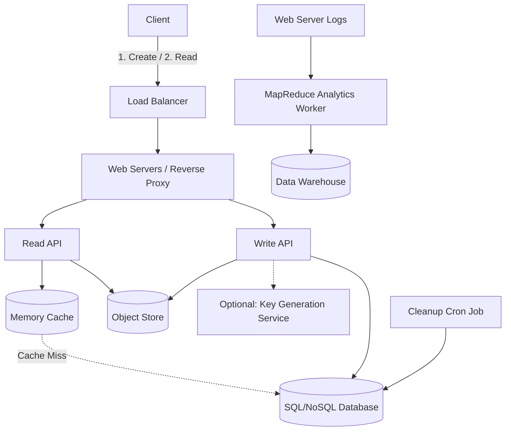

# 🔗 System Design: URL Shortener & Pastebin (Bitly / Pastebin)

## 📝 Overview
A distributed URL shortener or pastebin service creates short, unique aliases for long URLs or blocks of text. The system is characterized by an extreme read-heavy workload and must provide highly available, sub-millisecond redirections or text retrievals while preventing alias collisions at massive scale.

!!! abstract "Core Concepts"
    - **Base62 Encoding:** Converting hashes or numerical IDs into a short string of 62 alphanumeric characters (A-Z, a-z, 0-9) to create the shortest possible, URL-safe alias.
    - **Key Generation vs. Hash Encoding:** Choosing between pre-generating keys (KGS) or hashing user data (MD5 of IP + timestamp) on the fly to prevent database write collisions.
    - **Offline Analytics (MapReduce):** Processing massive web server access logs asynchronously to generate read/hit statistics without impacting the critical read path.
    - **Read-Heavy Caching:** Aggressively caching popular URL mappings using LRU (Least Recently Used) eviction to protect the primary database from viral traffic spikes.

---

## 🏭 The Scenario & Requirements

### 😡 The Problem (The Villain)
Standard URLs are often hundreds of characters long, breaking easily when copy-pasted and consuming too many characters for SMS limits. Similarly, sharing large blocks of code or text in chat applications is messy. Furthermore, generating millions of unique, random 7-character strings on the fly for every user request leads to expensive database collision checks, severe write latency, and storage bloat from stale, expired links.

### 🦸 The Solution (The Hero)
A highly available service that maps short, 7-character Base62 aliases to long URLs or object storage paths (for text files). By relying on aggressive Redis caching, the system guarantees low-latency reads. Asynchronous worker processes handle the heavy lifting: tracking analytics via MapReduce and routinely purging expired links from the database.

### 📜 Requirements
- **Functional Requirements:**
    1. Users can submit a long URL or a block of text and receive a randomly generated short link.
    2. Clicking the short link instantly redirects to the original URL or displays the text.
    3. Users can optionally set a timed expiration (default is no expiration).
    4. Service tracks monthly page view analytics.
    5. Service deletes expired links/pastes.
- **Non-Functional Requirements:**
    1. **High Availability:** The redirection service must never go down.
    2. **Low Latency:** Redirection/Reads must happen fast (reading from memory takes ~250 microseconds vs. disk taking 80x longer).
    3. **Analytics:** Page view stats do not need to be real-time.

!!! info "Capacity Estimation (Back-of-the-envelope)"
    - **Traffic:** 10 Million users. 10 Million writes/month. 100 Million reads/month $\rightarrow$ **10:1 Read/Write ratio**.
    - **Throughput:** 4 writes/sec average. 40 reads/sec average.
    - **Storage Size (Pastebin):** 1 KB text + 7 bytes `shortlink` + 4 bytes `expiration` + 5 bytes `created_at` + 255 bytes `paste_path` = **~1.27 KB per record**.
    - **Storage Total:** 1.27 KB * 10M pastes = 12.7 GB/month $\rightarrow$ **~450 GB in 3 years**.
    - **Alias Capacity:** A 7-character Base62 string provides $62^7$ (~3.5 trillion) combinations, vastly exceeding the required 360 million shortlinks over 3 years.

---

## 📊 API Design & Data Model

=== "REST APIs"
    - **`POST /api/v1/paste`** (or `/shorten`)
        - **Request:** `{ "expiration_length_in_minutes": "60", "paste_contents": "Hello World!", "long_url": "..." }`
        - **Response:** `{ "shortlink": "xyz123a" }`
    - **`GET /api/v1/paste?shortlink=xyz123a`**
        - **Response:** `{ "paste_contents": "Hello World", "created_at": "YYYY-MM-DD...", "expiration_length_in_minutes": "60" }`
    - **`GET /{alias}`** (URL Shortener specific)
        - **Response:** `301 Moved Permanently` (Location: `https://...`)

=== "Database Schema"
    - **Table:** `pastes` / `urls` (SQL or NoSQL KV Store)
        - `shortlink` (Char(7), PK) - Indexed for uniqueness
        - `expiration_length_in_minutes` (Int)
        - `created_at` (Datetime) - Indexed to speed up lookups and cleanup
        - `paste_path` (Varchar 255) - Path to S3 object, OR
        - `original_url` (Varchar) - For standard URL shortening
    - **Object Store:** (e.g., Amazon S3)
        - Stores the actual 1KB+ text content for Pastebin use cases.
    - **Analytics Database:** (Amazon Redshift / Google BigQuery)
        - Stores aggregated hit counts by year/month and URL.

---

## 🏗️ High-Level Architecture

### Architecture Diagram

### Component Walkthrough

1. **Web Servers & APIs:** Web servers act as a reverse proxy forwarding requests to specific Read or Write APIs. 
2. **Object Store (S3):** Comfortably handles the 12.7 GB/month of text payload storage, keeping the primary database lean.
3. **Primary Database & Cache:** The DB stores the `shortlink` to `paste_path` (or `original_url`) mapping. A Memory Cache (Redis/Memcached) sits in front to handle the 40+ reads/sec and traffic spikes, ensuring sub-millisecond lookups.
4. **MapReduce Analytics:** A background process that parses access logs, extracts the year/month and URL, and aggregates hit counts into a Data Warehouse.
5. **Cleanup Worker:** An asynchronous cron job that scans the DB for records where `created_at` + `expiration_length` is in the past, purging them to free up space.

---

## 🔬 Deep Dive & Scalability

### Handling Bottlenecks: Generating the Shortlink
To avoid write collisions when generating the 7-character string, we have two primary approaches:

**Approach A: On-the-fly Hashing (MD5 + Base62)**
Take the MD5 hash of the user's IP Address + a Timestamp. MD5 produces a 128-bit hash. We Base62 encode this hash (which perfectly maps to URL-safe characters `[a-zA-Z0-9]`) and take the first 7 characters.
- *Pros:* Deterministic, stateless, requires no centralized coordination.
- *Cons:* Small chance of collision (requires checking the DB and regenerating if it exists).

**Approach B: Key Generation Service (KGS)**
A background daemon pre-computes millions of random 6-7 character Base62 strings, storing them in an `unused_keys` database. App servers load batches of these keys into RAM and pop them in $O(1)$ time.
- *Pros:* Zero collisions, guaranteed $O(1)$ write time without DB retry loops.
- *Cons:* Introduces a new system component; lost keys if an App Server crashes (acceptable trade-off).

### Analytics via MapReduce

Since real-time analytics aren't required, we MapReduce the web server logs. 
- **Mapper:** Parses each log line, extracting the `period` (e.g., 2026-03) and `url`. Yields key-value pairs: `((2026-03, url1), 1)`.
- **Reducer:** Sums the values for each key: `yield key, sum(values)`.

### Scaling the Database
While a single SQL Write Master-Slave can handle the average 4 writes/sec, viral spikes will require more.
- **Read Replicas:** Easily handle cache misses for the read-heavy workload.
- **Write Scaling:** If writes exceed single-node capacity, we apply **Federation** (splitting by function), **Sharding** (partitioning by the first character of the `shortlink`), or migrating the mapping table to a highly scalable **NoSQL Key-Value Store**.

### ⚖️ Trade-offs

| Decision | Pros | Cons / Limitations |
| :--- | :--- | :--- |
| **SQL vs NoSQL (Key-Value)** | SQL provides easy secondary indexes (like sorting by `created_at` for expiration cleanup). | NoSQL scales horizontally natively for massive read/write volumes. |
| **301 vs 302 HTTP Redirect** | **301 (Permanent)** caches the redirect in the user's browser, vastly reducing server load. | 301 destroys your ability to track analytics (hit counts). Use **302 (Temporary)** if analytics are a core requirement. |
| **Base62 vs Base64** | Base62 (`A-Z, a-z, 0-9`) requires no escaping in URLs. | Base64 includes `+` and `/` characters, which can break URL routing if not strictly URL-safe encoded. |

---

## 🎤 Interview Toolkit

- **Scale Question:** "A short link belonging to a celebrity goes viral and is clicked 100,000 times a second. How do you survive?" -> *Rely on the Memory Cache. A properly tuned Redis cluster can handle hundreds of thousands of reads per second. Ensure the Load Balancer routes traffic effectively, and use an L1 in-memory cache on the Web Servers for extreme hot-keys.*
- **Failure Probe:** "What happens if the Key Generation Service (KGS) crashes?" -> *Since App Servers keep a batch of thousands of keys in their local RAM, they can continue serving write requests for several minutes/hours while the KGS is restarted.*
- **Edge Case:** "How do you handle a malicious user submitting a URL that redirects back to your own shortener, creating an infinite redirect loop?" -> *Implement loop detection at the App Server level. Check if the submitted domain matches your own (e.g., `sho.rt`). If it does, reject the request.*

## 🔗 Related Architectures
- [Machine Coding: Cache System](../../../machine_coding/systems/cache/PROBLEM.md) — Excellent for understanding the LRU mechanisms protecting the DB.
- [System Design: Twitter Feed (Snowflake ID)](../social_media/TWITTER_HLD.md) — Alternative method for generating unique IDs in distributed systems.
