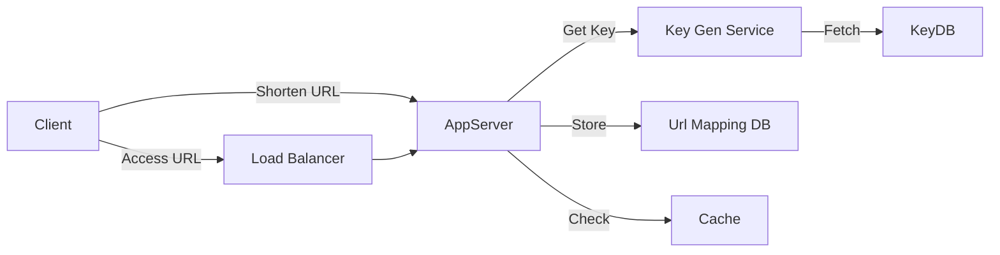

# Designing a URL Shortener (TinyURL)

## System Overview
A URL shortener service creates short aliases for long URLs (e.g., `tinyurl.com/xyz` -> `example.com/very/long/path`). The system must be highly available and provide low-latency redirections.

## Functional Requirements
1.  Generate a unique short alias for a given URL.
2.  Redirect the short alias to the original URL.
3.  Optional: Custom aliases and expiration times.

## Database Schema
We require a scalable NoSQL store (e.g., DynamoDB, Cassandra) or a sharded RDBMS to handle billions of mappings.

| Table | Columns |
| :--- | :--- |
| **URL Mapping** | `ShortKey` (PK), `OriginalURL`, `CreationDate`, `ExpirationDate`, `UserID` |
| **User** | `UserID` (PK), `Name`, `Email`, `CreationDate` |

## Key Generation Service (KGS)
To ensure uniqueness and avoid collision checking on every write, we pre-generate keys.
*   **Offline Generation**: A standalone service generates random 6-character strings (base64) and stores them in a `Key-DB`.
*   **Concurrency**: Servers fetch a batch of keys into memory. Used keys are marked in the DB.

## High-Level Architecture

## Optimizations
1.  **Caching**: Cache the most frequently accessed URLs (20% of URLs generate 80% of traffic). Use LRU eviction.
2.  **301 vs 302 Redirect**:
    *   **301 (Permanent)**: Browser caches the redirect. Reduces server load but invalidates analytics.
    *   **302 (Temporary)**: Request always hits the server. Good for analytics.
3.  **Cleanup**: Lazy cleanup. Delete expired links only when accessed or via a scheduled background job.
## 4. Practical Implementation

Explore low-level implementations of high-performance caches and unique ID generation:

* [Machine Coding: Cache System](../../../machine_coding/systems/cache_system/PROBLEM.md)
* [System Design: Twitter Feed (Snowflake ID)](../social_media/TWITTER_HLD.md)
